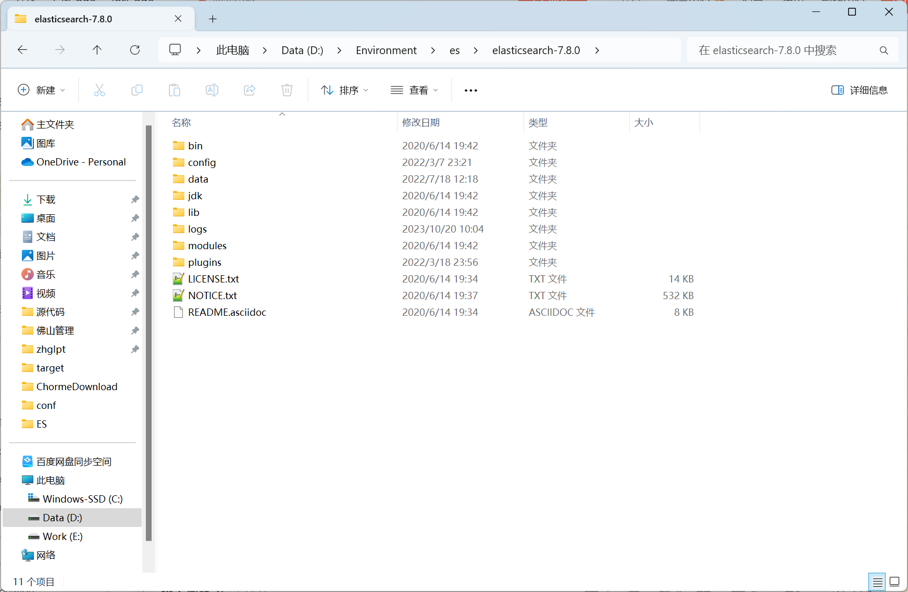

本系列 ES 教程详细参考了 尚硅谷 的 ES 教材文档, 后续文章不再说明.

CSDN地址：http://t.csdnimg.cn/aRQfo

# 一. 为什么要用 ES

Elaticsearch，简称为 ES， ES 是一个开源的高扩展的分布式全文搜索引擎，是整个 Elastic Stack 技术栈的核心。它可以近乎实时的存储、检索数据；本身扩展性很好，可以扩展到上 百台服务器，处理PB 级别的数据。

一般传统数据库，全文检索都实现的很鸡肋，因为一般也没人用数据库存文本字段。进行全文检索需要扫描整个表， 如果数据量大的话即使对 SQL 的语法优化，也收效甚微。 建 立了索引，但是维护起来也很麻烦，对于 insert 和 update 操作都会重新构建索引。

全文搜索引擎指的是目前广泛应用的主流搜索引擎。它的工作原理是计算机索引程序通过扫描文章中的每一个词，对每一个词建立一个索引，指明该词在文章中出现的 次数和位置，当用户查询时，检索程序就根据事先建立的索引进行查找，并将查找的结果反 馈给用户的检索方式。 这个过程类似于通过字典中的检索字表查字的过程

## 一.一 ES 与 Solr 对比


总结他们的每个属性。

1. 由于易于使用，Elasticsearch 在新开发者中更受欢迎。一个下载和一个命令就可以启动 一切。
2. 如果除了搜索文本之外还需要它来处理分析查询，Elasticsearch 是更好的选择
3. 如果需要分布式索引，则需要选择 Elasticsearch。对于需要良好可伸缩性和以及性能分布式环境，Elasticsearch 是更好的选择。
4. Elasticsearch 在开源日志管理用例中占据主导地位，许多组织在 Elasticsearch 中索引它们的日志以使其可搜索。
5. 如果你喜欢监控和指标，那么请使用 Elasticsearch，因为相对于 Solr，Elasticsearch 暴露了更多的关键指标

# 二. 下载安装和使用

## 二.一 下载

官方网址是: https://www.elastic.co/cn/

下载地址是: https://www.elastic.co/cn/downloads/past-releases#elasticsearch

我们使用 7.8.0 的版本

下载地址是: https://www.elastic.co/cn/downloads/past-releases/elasticsearch-7-8-0

下载其它版本的话，将后面的版本号修改一下即可.

老蝴蝶这儿，下载 Windows 版本的.


## 二.二 安装和目录介绍

将下载的文件进行解压即可， 解压后即安装完毕.



目录结构:

| 目录    | 含义                                                         |
| ------- | ------------------------------------------------------------ |
| bin     | 可执行脚本文件， 启动脚本是: elasticsearch.bat               |
| config  | 配置目录 主要是: elasticsearch.yml jvm.options               |
| data    | es 数据目录 里面有 nodes 目录存储数据                        |
| jdk     | 内置的 JDK 目录， 如果 本地 配置了 JAVE_HOME, 会优先使用本地的. |
| lib     | 程序运行的类库                                               |
| logs    | 日志目录                                                     |
| modules | 模块目录                                                     |
| plugins | 插件目录， 如 ik 分词器 要放在这下面                         |

## 二.三 启动验证

进入 bin 文件夹目录， 点击 elasticsearch.bat 文件即可启动 ES 服务


启动过程中:


9300 端口为Elasticsearch 集群间组件的通信端口， 9200 端口为浏览器访问的 http 协议RESTful 端口

打开浏览器， http://localhost:9200/


### 二.三.一 启动小问题解决

1. Elasticsearch 是使用 java 开发的，且 7.8 版本的 ES 需要 JDK版本 1.8 以上，默认安装 包带有 jdk 环境，如果系统配置 JAVA_HOME，那么使用系统默认的 JDK，如果没有配置使用自带的JDK，一般建议使用系统配置的 JDK

2. 双击启动闪退， 提示空间不足:
   找到 config/jvm.options 配置文件

   ```
   # 设置 JVM 初始内存为 1G。此值可以设置与-Xmx 相同，以避免每次垃圾回收完成后 JVM 重新分配内存 
   # Xms represents the initial size of total heap space # 设置 JVM 最大可用内存为 1G
   # Xmx represents the maximum size of total heap space
   -Xms1g 
   -Xmx1g
   ```

# 三. ES 的常用概念与 Mysql 等关系型数据库的对应

核心概念有 ， 索引 ，类型， 文档， 字段， 映射， 分片，副本， 分配等.

## 三.一 概念

### 三.一.一 索引 （Index）

一个索引就是一个拥有几分相似特征的文档的集合。比如说，你可以有一个客户数据的索引，另一个产品目录的索引，还有一个订单数据的索引。

一个索引由一个名字来标识（必须全部是小写字母），并且当我们要对这个索引中的文档进行索引、搜索、更新和删除的时 候，都要使用到这个名字。

在一个集群中，可以定义任意多的索引。能搜索的数据必须索引，这样的好处是可以提高查询速度，比如：新华字典前面的目录就是索引的意思，目录可以提高查询速度。

**Elasticsearch 索引的精髓：一切设计都是为了提高搜索的性能。**

### 三.一.二 类型 （Type）

在一个索引中，你可以定义一种或多种类型。

一个类型是你的索引的一个逻辑上的分类/分区，其语义完全由你来定。通常，会为具有一组共同字段的文档定义一个类型。不同的版本，类型发生了不同的变化

你可以理解为， 关系型数据库的表.

| 版本 | Type                                           |
| ---- | ---------------------------------------------- |
| 5.x  | 支持多种 type                                  |
| 6.x  | 只能有一种 type                                |
| 7.x  | 默认不再支持自定义索引类型（默认类型为：_doc） |

### 三.一.三 文档 (Document)

一个文档是一个可被索引的基础信息单元，也就是一条数据

比如：你可以拥有某一个客户的文档，某一个产品的一个文档，当然，也可以拥有某个订单的一个文档。

文档以 JSON（Javascript Object Notation）格式来表示，而 JSON是一个到处存在的互联网数据交互格式。

在一个 index/type 里面，你可以存储任意多的文档。

### 三.一.四 字段 Field

相当于是数据表的字段，对文档数据根据不同属性进行的分类标识。

### 三.一.五 映射 Mapping

一个索引库里面的文档，可以是不同格式的，包括字段也可以不同，但最好加一些映射关系，指定数据类型等，便于更快的查询。

mapping 是处理数据的方式和规则方面做一些限制，如：某个字段的数据类型、默认值、分析器、是否被索引等等这些都是映射里面可以设置的，其它就是处理ES 里面数据的一 些使用规则设置也叫做映射，按着最优规则处理数据对性能提高很大，因此才需要建立映射， 并且需要思考如何建立映射才能对性能更好

### 三.一.六 分片 Shards

一个索引可以存储超出单个节点硬件限制的大量数据。比如，一个具有 10 亿文档数据的索引占据 1TB 的磁盘空间，而任一节点都可能没有这样大的磁盘空间。或者单个节点处理搜索请求，响应太慢。

为了解决这个问题，Elasticsearch 提供了将索引划分成多份的能力，每一份就称之为分片。

当你创建一个索引的时候，你可以指定你想要的分片的数量。每个分片本身也是一个功能完善并且独立的“索引”，这个“索引”可以被放置到集群中的任何节点上

分片很重要，主要有两方面的原因：

​	1）允许你水平分割 / 扩展你的内容容量。

​	2）允许你在分片之上进行分布式的、并行的操作，进而提高性能/吞吐量。

至于一个分片怎样分布，它的文档怎样聚合和搜索请求，是完全由 Elasticsearch 管理的，对于作为用户的你来说，这些都是透明的，无需过分关心。被混淆的概念是，一个 Lucene 索引我们在 Elasticsearch 称作 分片 。 一个Elasticsearch 索引是分片的集合。

当 Elasticsearch 在索引中搜索的时候， 他发送查询到每一个属于索引的分片(Lucene 索引)，然后合并每个分片的结果到一个全局的结果集

### 三.一.七 副本 Replicas

在一个网络 / 云的环境里，失败随时都可能发生，在某个分片/节点不知怎么的就处于离线状态，或者由于任何原因消失了，这种情况下，有一个故障转移机制是非常有用并且是强烈推荐的。

为此目的，Elasticsearch 允许你创建分片的一份或多份拷贝，这些拷贝叫做复制分片(副本)。

复制分片之所以重要，有两个主要原因：

1. 在分片/节点失败的情况下，提供了高可用性。因为这个原因，注意到复制分片从不 与 原/主要（original/primary）分片置于同一节点上是非常重要的。
2. 扩展你的搜索量/吞吐量，因为搜索可以在所有的副本上并行运行。

总之，每个索引可以被分成多个分片。一个索引也可以被复制 0 次（意思是没有复制）或多次。一旦复制了，每个索引就有了主分片（作为复制源的原来的分片）和复制分片（主 分片的拷贝）之别。

分片和复制的数量可以在索引创建的时候指定。在索引创建之后，你可以在任何时候动态地改变复制的数量，但是你事后不能改变分片的数量。

默认情况下， Elasticsearch 中的每个索引被分片 1 个主分片和 1 个复制，这意味着，如果你的集群中至少 有两个节点，你的索引将会有 1 个主分片和另外 1 个复制分片（1 个完全拷贝），这样的话每个索引总共就有 2 个分片，我们需要根据索引需要确定分片个数

### 三.一.八 分配 Allocation

将分片分配给某个节点的过程，包括分配主分片或者副本。如果是副本，还包含从主分片复制数据的过程。这个过程是由master 节点完成的。

## 三.二 与关系型 数据库的类比


