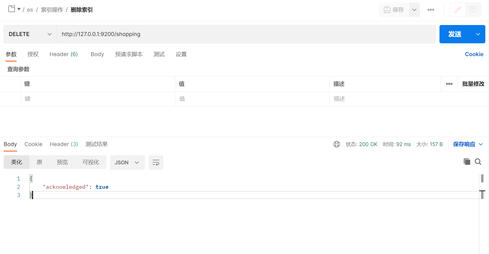

# 一. 索引操作

索引可以创建， 查看， 和删除操作.

## 一.一 创建索引

PUT 请求， 后跟索引的名称。 如， 创建 一个 shopping 商店 的索引

```
http://localhost:9200/shopping
```


| 响应字段            | 信息                                   |
| ------------------- | -------------------------------------- |
| acknowledged        | 响应结果， true 为成功                 |
| shards_acknowledged | 分片结果， true 为分片成功， 默认是1片 |
| index               | 索引名称                               |

如果 索引已经存在，重复添加的话，会报错 resource_already_exists_exception


## 一.二 查看所有的索引

_cat/indices?v indices 是 index 的复数

```
http://localhost:9200/_cat/indices?v
```


| 表头           | 含义                                                         |
| -------------- | ------------------------------------------------------------ |
| health         | 当前服务器健康状态：green(集群完整) yellow(单点正常、集群不完整) red(单点不正常) |
| status         | 索引打开、关闭状态                                           |
| index          | 索引名                                                       |
| uuid           | 索引统一编号                                                 |
| pri            | 主分片数量                                                   |
| rep            | 副本数量                                                     |
| docs.count     | 可用文档数量                                                 |
| docs.deleted   | 文档删除状态（逻辑删除）                                     |
| store.size     | 主分片和副分片整体占空间大小                                 |
| pri.store.size | 主分片占空间大小                                             |

## 一.三 查看单个索引

使用 Get 请求

```
http://localhost:9200/shopping
```


| 响应字段                          | 信息                 |
| --------------------------------- | -------------------- |
| shopping                          | 索引名称             |
| aliases                           | 别名                 |
| mappings                          | 映射信息             |
| settings                          | 设置                 |
| settings.index                    | 设置—> 索引          |
| settings.index.creation_date      | 创建时间，为时间戳   |
| settings.index.number_of_shards   | 主分片数量， 默认为1 |
| settings.index.number_of_replicas | 副分片数量， 默认为1 |
| settings.index.uuid               | 唯一标识             |
| settings.index.version            | 版本                 |
| settings.index.provided_name      | 索引名称             |

## 一.四 删除索引

使用 Delete 请求

```
http://localhost:9200/shopping
```

删除一个不存在的索引时， 会抛出异常 index_not_found_exception


# 二. 文档操作

文档要在索引里面， 在创建文档时，要指定索引。

再次点击 创建 shopping 索引的操作， 先创建一下索引.

## 二.一 创建文档

### 二.一.一 不指定id

往里面插入一个 手机的记录信息

先 /索引名/类型名， 表名默认是 _doc ， 最好是指定具体的类型名 (表名) ， phone

```
POST    http://localhost:9200/shopping/phone
```

```json
{
  "title":"小米手机",
  "category":"小米", 
  "images":"www.yueshushu.top", 
  "price":2000.00
}
```


| 响应字段          | 信息                                                         |
| ----------------- | ------------------------------------------------------------ |
| _index            | 索引名称                                                     |
| _type             | 类型_文档                                                    |
| _id               | 记录的唯一标识id, 相当于主键                                 |
| _version          | 版本， 会依次递增                                            |
| result            | 结果， created 为创建成功 , updated 为更新成功 ,deleted 为删除成功 |
| _shards           | 分片信息                                                     |
| _shards.total     | 分片–总数                                                    |
| _shards.successfu | 分片成功数                                                   |
| _shards.failed    | 分片失败数                                                   |
| _seq_no           | 序列号                                                       |
| _primary_term     | 主键术语                                                     |

### 二.一.二 创建文档时，指定id

后面跟着 id 的数字， 如指定 id 为 1

```
POST    http://localhost:9200/shopping/phone/1
```


_id 变成了指定的id, 为1

如果增加文档时，明确了数据主键， 那么请求方式也可以为 PUT

```
PUT  http://localhost:9200/shopping/phone/2
```


## 二.二 查看单个文档

使用 Get 请求

```
GET   http://localhost:9200/shopping/phone/1
```


| 响应字段      | 信息                                            |
| ------------- | ----------------------------------------------- |
| _index        | 索引名称                                        |
| _type         | 类型_文档                                       |
| _id           | 记录的唯一标识id, 相当于主键                    |
| _version      | 版本， 会依次递增                               |
| _seq_no       | 序列号                                          |
| _primary_term | 主键术语                                        |
| found         | 查询结果， true 表示查询到， false 表示未查询到 |
| _source       | 文档源信息， 以 json 形式展示                   |


如果查询不到， 如 查询 _id = 100


## 二.三 全部查询

后面跟 _search

```
GET    http://localhost:9200/shopping/_search
```

查询参数:

```json
{
  "query":{
    "match_all":{}
  }
}
```


关于 查询， 后面老蝴蝶会在下一章节详细讲解

## 二.四 修改文档

### 二.四.一 更新文档全部字段

使用 POST 请求 , 修改时要 指定 id

POST     http://localhost:9200/shopping/phone/2
1
如， 将价格修改成 5000


查询时， 价格就变成了 5000 result 为 updated

如果 更新时，未传入 images 和 category 字段呢?


修改成功后，进行查看:


发现，文档里面已经没有 images 和 category 字段了.

二.四.二 更新部分字段
/索引/类型/id/_update

url 请求后面 追加 _update , 请求体内容也变一下

目前的 1 的文档内容是:

{
        "title": "小米手机",
        "category": "小米",
        "images": "www.yueshushu.top",
        "price": 3000.00
    }
1
2
3
4
5
6
只修改 price 价格为 5000

{
    "doc":{
         "price":5000.00
    }
}
1
2
3
4
5
只传入 price 价格， 修改


查看， images, category 保持不变.


如果更新的内容与之前的内容一样，则不会进行更新操作。


二.五 删除文档
删除一个文档不会立即从磁盘上移除，它只是被标记成已删除（逻辑删除）

如 删除文档 2

DELETE   http://localhost:9200/shopping/phone/2
1


进行查看， 发现 查询不出数据了. result 为 ： deleted


如果试图删除一个不存在的文档， 会 not_found


二.六 条件删除文档
一般删除数据都是根据文档的唯一性标识进行删除，实际操作时，也可以根据条件对多条数 据进行删除

使用 _delete_by_query , 通过 查询删除

全部查询， 目前的文档信息是:


两个价格都是 2000 , 根据价格进行删除

DELETE  http://localhost:9200/shopping/phone/_delete_by_query
1
请求体:

{
    "query":{ 
        "match":{
                "price":"2000"
                }
        }
}
1
2
3
4
5
6
7
进行操作:


再次查看， 会发现， 文档都已经被删除了.


三. 映射
有了索引库，等于有了数据库中的 database。

接下来就需要建索引库(index)中的映射了，类似于数据库(database)中的表结构(table)。创建数据库表需要设置字段名称，类型，长度，约束等；

索引库也一样，需要知道这个类型 下有哪些字段，每个字段有哪些约束信息，这就叫做映射(mapping)。

shopping 索引不要进行处理， 我们创建一个 student 的索引库


三.一 创建映射关系
创建映射关系:

PUT    http://localhost:9200/student/_mapping
1
{
    "properties":{
        "name":{
            "type":"text",   
            "index":true
        },
        "sex":{
            "type":"text",
            "index":true
        },
        "age":{
            "type":"long",
            "index":true
        }
    }
}

1
2
3
4
5
6
7
8
9
10
11
12
13
14
15
16
其中， name, sex, age 为字段名，

type 为类型, index 为是否添加为索引， store 是否独立存储, analyzer 为分词器


再查看索引时， 就会展示出映射关系


三.二 索引映射属性
三.二.一 type 类型
描述	取值类型
字符串 类型 String	分两种， text , 可以进行分词， keyword 不可分词，会做为完整字段进行匹配
数值类型 Numerical	基本类型， 常用的有 long, integer, short, double, float . 浮点数高精度: scaled_float
日期类型 Date	Date
数组类型 Array	数组类型
对象 Object	Object
三.二.二 index 索引
默认为 true, 也就是不进行任何配置， 所有字段都会被索引

true：字段会被索引，则可以用来进行搜索

false：字段不会被索引，不能用来搜索

三.二.三 store 是否独立存储
是否将数据进行独立存储，默认为 false

原始的文本会存储在_source 里面，默认情况下其他提取出来的字段都不是独立存储 的，是从_source 里面提取出来的。

当然你也可以独立的存储某个字段，只要设置 “store”: true 即可，获取独立存储的字段要比从_source 中解析快得多，

但是也会占用 更多的空间，所以要根据实际业务需求来设置。

三.二.四 analyzer 分词器
会使用到 ik 分词器

三.三 查看映射
Get 请求

Get   http://localhost:9200/student/_mapping
1