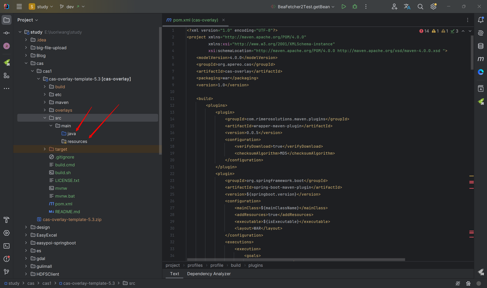
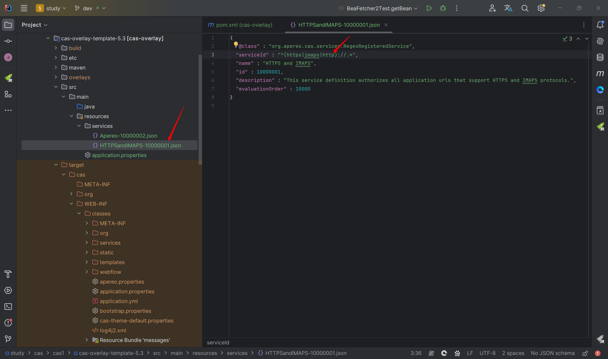

## 一、教学讲解视频

教学讲解视频地址：https://www.bilibili.com/video/BV1Es4y1Z7Xw

参考博客：https://blog.csdn.net/dgfdhgghd/article/details/129321234

## 二、前言

因为CAS支持HTTP请求访问，而我们是快速入门上手视频，所以这期教程就不教大家如何配置HTTPS了，如果需要使用HTTPS，可以参考其他博客去云服务器申请证书或者使用JDK自行生成一个证书。

## 三、准备工作

**下载CAS Server（直接下载压缩包就可以）**
这里我们用的是5.3版本的服务端，5.3之前的服务端都是maven项目，大于5.3的服务端就是gradle项目

下载链接：https://github.com/apereo/cas-overlay-template/tree/5.3


## 四、CAS Server服务端搭建

1. 解压我们前面下载好的压缩包。

2. 然后进入解压好的目录，打开cmd窗口，输入命令：`bulid.cmd run`，看到`BUILD SUCCESS`就可以关掉这个cmd窗口了。

   

3. 接下来用我们idea打开这个解压好的目录，拉取maven依赖
   因为我们5.3版本是maven项目，因此先让他去下载依赖，耐心等待依赖加载完成~

4. 拉取完依赖后，创建对应java目录和resources目录

   

5. 在resources目录中，我们把target目录下的services文件夹和application.properties文件拷贝到我们的resources目录下

   

6. 打开HTTPSandIMAPS-10000001这个文件，在里面加上http，让他支持http请求访问

   

7. 然后打开我们application.properties文件，把这三行注释掉，这是给配置证书情况下使用的，也就是要给配置https使用的。我们这里暂时不用

   

8. 接下来我们需要在我们的pom.xml文件中加上支持数据库链接的依赖，因为我们不需要用他的默认账号和密码，我们要用我自己数据库中的数据登录

   注意这里MySQL驱动包的版本要和自己MySQL版本对应上

   ```xml
   <dependency>
       <groupId>org.apereo.cas</groupId>
       <artifactId>cas-server-support-jdbc</artifactId>
       <version>${cas.version}</version>
   </dependency>
   <dependency>
       <groupId>mysql</groupId>
       <artifactId>mysql-connector-java</artifactId>
       <version>5.1.21</version>
   </dependency>
   ```

   这里我们要检查下这个jar包有没有下载下来，判断依据如下图

   如果没下载下来的话，点下面链接下载这个jar包
   jar包下载链接：https://build.shibboleth.net/maven/releases/net/shibboleth/tool/xmlsectool/2.0.0/
   点击下载

   

   然后把这个jar包放到本地仓库的对应目录下

   


9. 然后我们还需要在application.properties文件中加上一些配置，具体说明看下图

   

   ```properties
   #允许http
   cas.tgc.secure=false
   cas.serviceRegistry.initFromJson=true
   #查询账号密码sql，必须包含密码字段
   cas.authn.jdbc.query[0].sql=select * from user where username = ?
   #指定上面的sql查询字段名（必须）
   cas.authn.jdbc.query[0].fieldPassword=password
   #指定过期字段，1为过期，若过期需要修改密码
   cas.authn.jdbc.query[0].fieldExpired=expired
   #为不可用字段段，1为不可用，
   cas.authn.jdbc.query[0].fieldDisabled=disabled
   #数据库方言hibernate的知识
   cas.authn.jdbc.query[0].dialect=org.hibernate.dialect.MySQLDialect
   #数据库驱动
   cas.authn.jdbc.query[0].driverClass=com.mysql.jdbc.Driver
   #数据库连接
   cas.authn.jdbc.query[0].url=jdbc:mysql://localhost:3306/db_user2?useUnicode=true&characterEncoding=UTF-8
   #数据库用户名
   cas.authn.jdbc.query[0].user=root
   #数据库密码
   cas.authn.jdbc.query[0].password=
   #默认加密策略，通过encodingAlgorithm来指定算法，默认NONE不加密
   cas.authn.jdbc.query[0].passwordEncoder.type=DEFAULT
   cas.authn.jdbc.query[0].passwordEncoder.characterEncoding=UTF-8
   cas.authn.jdbc.query[0].passwordEncoder.encodingAlgorithm=MD5
   ```

   注意下，这里我们配置文件中写了对密码进行MD5加密，因此我们数据库中存储的密码必须是MD5加密过的，不然的话登录不进去

   可以这样去获取对应明文密码的MD5加密密码，然后存回数据库中的password字段中

   

10. 然后我们idea中配置Tomcat，就可以启动项目访问我们的服务端了

    这时候，我们就可以用我们数据库中的账号和密码进行登录了

    

    


## 五、CAS Client客户端搭建

1. 先用我们的idea创建一个SpringBoot项目，然后在pom.xml文件中，引入对应的依赖，这边我直接贴上我客户端pom.xml里面的代码

   ```xml
   <?xml version="1.0" encoding="UTF-8"?>
   <project xmlns="http://maven.apache.org/POM/4.0.0"
            xmlns:xsi="http://www.w3.org/2001/XMLSchema-instance"
            xsi:schemaLocation="http://maven.apache.org/POM/4.0.0 http://maven.apache.org/xsd/maven-4.0.0.xsd">
       <modelVersion>4.0.0</modelVersion>
   
       <parent>
           <groupId>org.springframework.boot</groupId>
           <artifactId>spring-boot-starter-parent</artifactId>
           <version>2.5.0</version>
       </parent>
   
       <groupId>org.example</groupId>
       <artifactId>cas-client</artifactId>
       <version>1.0-SNAPSHOT</version>
   
       <properties>
           <maven.compiler.source>8</maven.compiler.source>
           <maven.compiler.target>8</maven.compiler.target>
           <project.build.sourceEncoding>UTF-8</project.build.sourceEncoding>
       </properties>
   
       <dependencies>
           <!-- 整合web开发依赖 -->
           <dependency>
               <groupId>org.springframework.boot</groupId>
               <artifactId>spring-boot-starter-web</artifactId>
           </dependency>
           <!-- 引入mysql连接依赖 -->
           <dependency>
               <groupId>mysql</groupId>
               <artifactId>mysql-connector-java</artifactId>
           </dependency>
           <!--引入阿里巴巴druid连接池-->
           <dependency>
               <groupId>com.alibaba</groupId>
               <artifactId>druid</artifactId>
               <version>1.1.19</version>
           </dependency>
   
           <dependency>
               <groupId>net.unicon.cas</groupId>
               <artifactId>cas-client-autoconfig-support</artifactId>
               <version>2.3.0-GA</version>
           </dependency>
       </dependencies>
   
       <build>
           <pluginManagement>
               <plugins>
                   <plugin>
                       <groupId>org.springframework.boot</groupId>
                       <artifactId>spring-boot-maven-plugin</artifactId>
                   </plugin>
               </plugins>
           </pluginManagement>
       </build>
   
   </project>
   ```

2. 然后我们要在这里加上对应配置文件代码，主要就是指明**server端的地址**以及**当前客户端的地址**

   ```properties
   server.port=8089
   
   #cas服务端的地址
   cas.server-url-prefix=http://localhost:8081/cas
   #cas服务端的登录地址
   cas.server-login-url=http://localhost:8081/cas/login
   #客户端访问地址
   cas.client-host-url=http://localhost:8089
   #验证的协议
   cas.validation-type=CAS3
   ```

   

3. 然后在我们的启动类上要加上这个`@EnableCasClient`注解

4. 接下来就是对CAS过滤器进行配置
   首先是配置CASUtil.java文件，这个主要用来获取当前登录用户信息

   ```java
   package org.example.util;
   
   import org.jasig.cas.client.authentication.AttributePrincipal;
   import org.jasig.cas.client.util.AbstractCasFilter;
   import org.jasig.cas.client.validation.Assertion;
   
   import javax.servlet.http.HttpServletRequest;
   
   public class CASUtil {
   
       public static String getLoginNameFromCas(HttpServletRequest request) {
           Assertion assertion = (Assertion) request.getSession().getAttribute(AbstractCasFilter.CONST_CAS_ASSERTION);
           if (assertion != null) {
               AttributePrincipal principal = assertion.getPrincipal();
               return principal.getName();
           } else {
               return null;
           }
       }
   }
   ```

   然后是LoginUserInfoFilter.java文件的配置，这里主要配置自定义的登录用户信息拦截器

   ```java
   package org.example.filter;
   
   import org.example.util.CASUtil;
   import org.slf4j.Logger;
   import org.slf4j.LoggerFactory;
   import org.springframework.util.StringUtils;
   
   import javax.servlet.Filter;
   import javax.servlet.FilterChain;
   import javax.servlet.ServletException;
   import javax.servlet.ServletRequest;
   import javax.servlet.ServletResponse;
   import javax.servlet.http.HttpServletRequest;
   import java.io.IOException;
   
   public class LoginUserInfoFilter implements Filter {
   
       Logger logger = LoggerFactory.getLogger(LoginUserInfoFilter.class);
   
       @Override
       public void doFilter(ServletRequest request, ServletResponse response, FilterChain chain) throws IOException, ServletException {
           HttpServletRequest request_ = (HttpServletRequest) request;
           String loginName = CASUtil.getLoginNameFromCas(request_);
           if (!StringUtils.isEmpty(loginName)) {
               logger.info("访问者 ：" + loginName);
               request_.getSession().setAttribute("loginName", loginName);
           }
   
           chain.doFilter(request, response);
   
       }
   }
   ```

    最后就是配置我们的CAS过滤器CASFilterConfig.java文件了
   ```java
   package org.example.config;
   
   import org.example.filter.LoginUserInfoFilter;
   import org.jasig.cas.client.authentication.AuthenticationFilter;
   import org.jasig.cas.client.session.SingleSignOutFilter;
   import org.jasig.cas.client.session.SingleSignOutHttpSessionListener;
   import org.jasig.cas.client.util.HttpServletRequestWrapperFilter;
   import org.jasig.cas.client.validation.Cas30ProxyReceivingTicketValidationFilter;
   import org.springframework.beans.factory.annotation.Value;
   import org.springframework.boot.web.servlet.FilterRegistrationBean;
   import org.springframework.boot.web.servlet.ServletListenerRegistrationBean;
   import org.springframework.context.annotation.Bean;
   import org.springframework.context.annotation.Configuration;
   import org.springframework.core.Ordered;
   
   @Configuration
   public class CASFilterConfig {
   
       @Value("${cas.server-url-prefix}")
       private String CAS_URL;
       @Value("${cas.client-host-url}")
       private String APP_URL;
   
       /**
        * 配置监听器
        */
       @Bean
       public ServletListenerRegistrationBean servletListenerRegistrationBean() {
           ServletListenerRegistrationBean listenerRegistrationBean = new ServletListenerRegistrationBean();
           listenerRegistrationBean.setListener(new SingleSignOutHttpSessionListener());
           listenerRegistrationBean.setOrder(Ordered.HIGHEST_PRECEDENCE);
           return listenerRegistrationBean;
       }
   
       /**
        * 单点登录退出
        */
       @Bean
       public FilterRegistrationBean singleSignOutFilter() {
           FilterRegistrationBean registrationBean = new FilterRegistrationBean();
           registrationBean.setFilter(new SingleSignOutFilter());
           registrationBean.addUrlPatterns("/*");
           registrationBean.addInitParameter("casServerUrlPrefix", CAS_URL);
           registrationBean.setName("CAS Single Sign Out Filter");
           registrationBean.setOrder(2);
           return registrationBean;
       }
   
       /**
        * 单点登录认证
        */
       @Bean
       public FilterRegistrationBean AuthenticationFilter() {
           FilterRegistrationBean registrationBean = new FilterRegistrationBean();
           registrationBean.setFilter(new AuthenticationFilter());
           registrationBean.addUrlPatterns("/*");
           registrationBean.setName("CAS Filter");
           registrationBean.addInitParameter("casServerLoginUrl", CAS_URL);
           registrationBean.addInitParameter("serverName", APP_URL);
           registrationBean.setOrder(3);
           return registrationBean;
       }
   
       /**
        * 单点登录校验
        */
       @Bean
       public FilterRegistrationBean cas30ProxyReceivingTicketValidationFilter() {
           FilterRegistrationBean registrationBean = new FilterRegistrationBean();
           registrationBean.setFilter(new Cas30ProxyReceivingTicketValidationFilter());
           registrationBean.addUrlPatterns("/*");
           registrationBean.setName("CAS Validation Filter");
           registrationBean.addInitParameter("casServerUrlPrefix", CAS_URL);
           registrationBean.addInitParameter("serverName", APP_URL);
           registrationBean.setOrder(4);
           return registrationBean;
       }
   
       /**
        * 单点登录请求包装
        */
       @Bean
       public FilterRegistrationBean httpServletRequestWrapperFilter() {
           FilterRegistrationBean registrationBean = new FilterRegistrationBean();
           registrationBean.setFilter(new HttpServletRequestWrapperFilter());
           registrationBean.addUrlPatterns("/*");
           registrationBean.setName("CAS HttpServletRequest Wrapper Filter");
           registrationBean.setOrder(5);
           return registrationBean;
       }
   
       /**
        * 获取当前登录用户信息
        */
       @Bean
       public FilterRegistrationBean getLoginUserInfoFilter() {
           FilterRegistrationBean registrationBean = new FilterRegistrationBean();
           registrationBean.setFilter(new LoginUserInfoFilter());
           registrationBean.addUrlPatterns("/*");
           registrationBean.setName("loginUserInfoFilter");
           registrationBean.setOrder(6);
           return registrationBean;
       }
   }
   ```

5. 然后就是写我们的测试文件，来测试下我们单点登录和登出了
   TestController.java文件的代码

   ```java
   package org.example.controller;
   
   import org.springframework.web.bind.annotation.GetMapping;
   import org.springframework.web.bind.annotation.RequestMapping;
   import org.springframework.web.bind.annotation.ResponseBody;
   import org.springframework.web.bind.annotation.RestController;
   
   import javax.servlet.http.HttpSession;
   
   @RestController
   public class TestController {
   
       @GetMapping("/hello")
       @ResponseBody
       public String hello() {
           return "word";
       }
   
       //登出
       @RequestMapping("/logout")
       public String logout(HttpSession session) {
           session.invalidate();
           return "redirect:http://localhost:8081/cas/logout";
       }
   }
   ```

   运行我们客户端的SpringBoot的项目，当我们输入http://localhost:8089/hello时候，它会自动跳到我们服务端的登录界面

   

   当我们输入完账号密码登录后，再输入http://localhost:8089/hello时候就能正常访问内容了

   

   当我们输入http://localhost:8089/logout时候，可以发现能正常退出，再输入http://localhost:8089/hello时候需要重新登录了

   

## 六、多个客户端

多个客户端，只需要一个客户端登录，其他客户端无需再登录

1. 再启动一个客户端，端口为8090

   

   

   

2. 当我们输入http://localhost:8089/hello时候，它会自动跳到我们服务端的登录界面，当我们输入http://localhost:8090/hello时候，它会自动跳到我们服务端的登录界面；

3. 8089窗口数据用户名密码，正常访问；8090窗口刷新，我们发现也能正常访问

4. 当我们输入http://localhost:8089/logout时候，可以发现能正常退出，再切换到8090窗口，刷新，发现自动退出了系统并跳转到了登录界面

   
