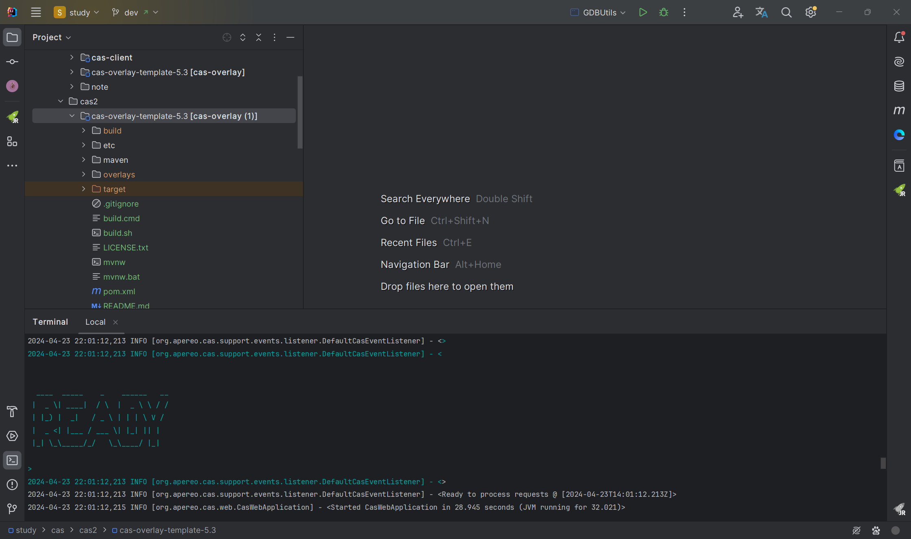
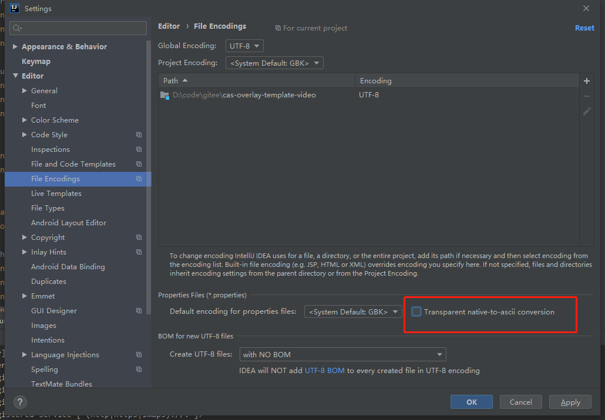

视频教程地址：https://www.bilibili.com/video/BV1iR4y1M7Ci


## CAS介绍和cas-server的安装

### 1.cas介绍

cas： central authentication service，中央认证服务，包含cas-server和cas-client

cas-server:  赋予权限，颁发ticket给使用cas的客户端

cas-client： 验证ticket


### 2.cas部署

https://github.com/apereo/cas-overlay-template/tree/5.3

#### 2.1 cas创建keystore

执行命令：

```bash
.\build.cmd gencert
```

需要注意的是：
 (1) 由于配置的项目路径**CAS_DIR**是 \etc\cas，在Windows环境下，会将证书文件生成到当前盘符目录的对应文件夹下。如项目文件在F盘某个目录，那么文件会生成到F:\etc\cas目录下。
 (2) 生成证书的时候，会出现warning：JKS 密钥库使用专用格式。建议使用 "keytool -importkeystore -srckeystore \etc\cas\thekeystore -destkeystore \etc\cas\thekeystore -deststoretype pkcs12" 迁移到行业标准格式 PKCS12。因为仅做演示，可以不进行此操作。


#### 2.2 启动cas

调试模式：

```bash
.\build.cmd debug
```

正常模式：

```bash
.\build.cmd run
```



#### 2.3 访问项目

项目启动后，访问 https://localhost:8443/cas/login


默认用户登录：
casuser
Mellon


### 备注

#### 1.认证协议

some authentication protocol (e.g. CAS, SAML, OAuth)

#### 2.参考链接

https://blog.csdn.net/cpongo3/article/details/88881512

https://www.jianshu.com/p/987fc147cc9b


## cas参数介绍

- 在项目中添加`src/main/java`和`src/main/resources`目录，并将`src/main/java`设置为代码文件根目录，将`src/main/resources`设置为资源文件根目录。例如要修改默认的登录用户名和密码（默认为casuser/Mellon），只需要将overlays目录下的`WEB-INF/classes/`目录中的`application.properties`文件复制到`src/main/resources`中，并修改最后一行配置`cas.authn.accept.users=casuser::Mellon`为`cas.authn.accept.users=test::demo`即可，让后重新执行`mvn install`并重新部署`target/cas.war`包即可验证。
- overlays中的`WEB-INF/classes/`目录下的所有文件均可被覆盖，只需要将该目录下的文件复制到`src/main/resources`中，然后修改后重新打包部署（clean、run），即可。


更换端口，禁用https

```
#更换端口，禁用https
server.context-path=/cas
server.port=18083
server.ssl.enabled=false
```


## cas-server集成数据库

### 1.初始化mysql脚本

```
CREATE TABLE `user`  (
  `id` int(11) NOT NULL AUTO_INCREMENT,
  `name` varchar(255) CHARACTER SET utf8mb4 COLLATE utf8mb4_bin NULL DEFAULT NULL,
  `password` varchar(255) CHARACTER SET utf8mb4 COLLATE utf8mb4_bin NULL DEFAULT NULL,
  PRIMARY KEY (`id`) USING BTREE
) ENGINE = InnoDB AUTO_INCREMENT = 2 CHARACTER SET = utf8mb4 COLLATE = utf8mb4_bin ROW_FORMAT = Dynamic;

INSERT INTO `user` VALUES (1, 'bob', '123456');
```

### 2.添加依赖

设置ali镜像私服，发现maven官网的cas-server-support-jdbc版本过老

```xml
    <dependencies>
        <dependency>
            <groupId>org.apereo.cas</groupId>
            <artifactId>cas-server-support-jdbc</artifactId>
            <version>${cas.version}</version>
        </dependency>
        <dependency>
            <groupId>org.apereo.cas</groupId>
            <artifactId>cas-server-support-jdbc-drivers</artifactId>
            <version>${cas.version}</version>
        </dependency>
    </dependencies>
```

### 3. 修改cas.properties配置

```properties
cas.authn.jdbc.query[0].user=root
cas.authn.jdbc.query[0].password=iflytek
cas.authn.jdbc.query[0].driverClass=com.mysql.cj.jdbc.Driver
cas.authn.jdbc.query[0].url=jdbc:mysql://localhost:3306/cas
cas.authn.jdbc.query[0].dialect=org.hibernate.dialect.MySQL5Dialect
cas.authn.jdbc.query[0].sql=SELECT * FROM user WHERE name=?
cas.authn.jdbc.query[0].fieldPassword=password
logging.level.org.apereo=DEBUG
cas.authn.accept.users=
cas.authn.jdbc.query[0].password-encoder.type=NONE
cas.jdbc.showSql=true
```

### 4.启动项目 

```bash
.\build.cmd run
```

### 5.查看日志

```
2021-09-18 10:29:11,508 DEBUG [org.apereo.cas.adaptors.jdbc.config.CasJdbcAuthenticationConfiguration] - <Created and mapped principal attributes [{}] for [jdbc:mysql://localhost:3306/demo_test]...>
2021-09-18 10:29:11,709 DEBUG [org.apereo.cas.authentication.support.password.PasswordEncoderUtils] - <No password encoder shall be created given the requested encoder type [NONE]>
2021-09-18 10:29:11,722 DEBUG [org.apereo.cas.adaptors.jdbc.config.CasJdbcAuthenticationConfiguration] - <Created authentication handler [QueryDatabaseAuthenticationHandler] to handle database url at [jdbc:
mysql://localhost:3306/demo_test]>
```

当在log中发现有相关数据库的配置，则表示配置生效

### 6.访问项目

https://localhost:8443/cas/login

bob/123456


如果访问失败，可能是

a. 数据库url或者账号密码有问题

b. 登录的用户/密码有问题

c. sql写的有问题


## springboot项目集成CAS

### cas调整

cas的application.properties设置

```
server.context-path=/cas
server.port=18083
cas.tgc.secure=false
cas.serviceRegistry.initFromJson=true
server.ssl.enabled=true
```

同时，在resources/services下新建文件，文件名为HTTPSandIMAPS-10000001.json

内容如下：

```
{
  "@class" : "org.apereo.cas.services.RegexRegisteredService",
  "serviceId" : "^(https|http|imaps)://.*",
  "name" : "Apereo",
  "theme" : "apereo",
  "id" : 10000002,
  "description" : "Apereo foundation sample service",
  "evaluationOrder" : 1
}
```

cas改造成https,application.properties全部文件如下

```
##
# CAS Server Context Configuration
#
server.context-path=/cas
server.port=18083

server.ssl.key-store=file:/etc/cas/thekeystore
server.ssl.key-store-password=changeit
server.ssl.key-password=changeit

server.max-http-header-size=2097152
server.use-forward-headers=true
server.connection-timeout=20000
server.error.include-stacktrace=ALWAYS

server.compression.enabled=true
server.compression.mime-types=application/javascript,application/json,application/xml,text/html,text/xml,text/plain

server.tomcat.max-http-post-size=2097152
server.tomcat.basedir=build/tomcat
server.tomcat.accesslog.enabled=true
server.tomcat.accesslog.pattern=%t %a "%r" %s (%D ms)
server.tomcat.accesslog.suffix=.log
server.tomcat.min-spare-threads=10
server.tomcat.max-threads=200
server.tomcat.port-header=X-Forwarded-Port
server.tomcat.protocol-header=X-Forwarded-Proto
server.tomcat.protocol-header-https-value=https
server.tomcat.remote-ip-header=X-FORWARDED-FOR
server.tomcat.uri-encoding=UTF-8

spring.http.encoding.charset=UTF-8
spring.http.encoding.enabled=true
spring.http.encoding.force=true

##
# CAS Cloud Bus Configuration
#
spring.cloud.bus.enabled=false

# Indicates that systemPropertiesOverride can be used.
# Set to false to prevent users from changing the default accidentally. Default true.
spring.cloud.config.allow-override=true

# External properties should override system properties.
spring.cloud.config.override-system-properties=false

# When allowOverride is true, external properties should take lowest priority, and not override any
# existing property sources (including local config files).
spring.cloud.config.override-none=false

# spring.cloud.bus.refresh.enabled=true
# spring.cloud.bus.env.enabled=true
# spring.cloud.bus.destination=CasCloudBus
# spring.cloud.bus.ack.enabled=true

endpoints.enabled=false
endpoints.sensitive=true

endpoints.restart.enabled=false
endpoints.shutdown.enabled=false

# Control the security of the management/actuator endpoints
# The 'enabled' flag below here controls the rendering of details for the health endpoint amongst other things.
management.security.enabled=true
management.security.roles=ACTUATOR,ADMIN
management.security.sessions=if_required
management.context-path=/status
management.add-application-context-header=false

# Define a CAS-specific "WARN" status code and its order
management.health.status.order=WARN, DOWN, OUT_OF_SERVICE, UNKNOWN, UP

# Control the security of the management/actuator endpoints
# With basic authentication, assuming Spring Security and/or relevant modules are on the classpath.
security.basic.authorize-mode=role
security.basic.path=/cas/status/**
# security.basic.enabled=true
# security.user.name=casuser
# security.user.password=

##
# CAS Web Application Session Configuration
#
server.session.timeout=300
server.session.cookie.http-only=true
server.session.tracking-modes=COOKIE

##
# CAS Thymeleaf View Configuration
#
spring.thymeleaf.encoding=UTF-8
spring.thymeleaf.cache=true
spring.thymeleaf.mode=HTML
spring.thymeleaf.template-resolver-order=100
##
# CAS Log4j Configuration
#
# logging.config=file:/etc/cas/log4j2.xml
server.context-parameters.isLog4jAutoInitializationDisabled=true

##
# CAS AspectJ Configuration
#
spring.aop.auto=true
spring.aop.proxy-target-class=true

##
# CAS Authentication Credentials
#
cas.authn.accept.users=casuser::Mellon
server.ssl.enabled=true
```


准备：两个可以正常启动的springboot-web项目，端口设置分别为8081和8082

### 1.springboot集成cas

#### 1.1 引入依赖

```xml
<dependency>
  <groupId>org.jasig.cas.client</groupId>
  <artifactId>cas-client-support-springboot</artifactId>
  <version>3.6.2</version>
</dependency>
```

#### 1.2 添加配置

springboot1:

```
cas.server-url-prefix=http://localhost:18083/cas
cas.server-login-url=http://localhost:18083/cas/login
cas.client-host-url=http://localhost:8081
cas.validation-type=CAS3
server.port=8081
```

springboot2:

```
cas.server-url-prefix=http://localhost:18083/cas
cas.server-login-url=http://localhost:18083/cas/login
cas.client-host-url=http://localhost:8082
cas.validation-type=CAS3
server.port=8082
```

#### 1.3 修改启动类

```java
@SpringBootApplication
@RestController
@EnableCasClient
public class SpringbootCasDemoApplication {

    public static void main(String[] args) {
        SpringApplication.run(SpringbootCasDemoApplication.class, args);
    }

    @GetMapping("/a")
    public String testA() {
        System.out.println("a");
        return "a";
    }

    @GetMapping("/user/login")
    public String testUser(HttpServletRequest request) {
        HttpSession session = request.getSession();
        if (session != null && session.getAttribute("_const_cas_assertion_") != null) {
            Assertion assertion = (Assertion) session.getAttribute("_const_cas_assertion_");
            Map<String, Object> attributes = assertion.getPrincipal().getAttributes();
            System.out.println(assertion);
            System.out.println(attributes);
        }
        return "a";
    }
}
```

#### 1.4  测试

a.请求以下地址，然后会重定向到登录界面。

localhost:8081/a

b.输入账号密码，登录成功看到结果

c.请求localhost:8082/a，发现不需要登录！！！，说明单点登录成功！


#### 1.5 单点登出

```
private static String logoutUrl = "http://localhost:18083/cas/logout";

@GetMapping("/user/logout")
public void logout(HttpSession session, HttpServletResponse response) throws IOException {
    session.invalidate();
    response.sendRedirect(logoutUrl);
}
```


#### 1.6 流程图

https://www.processon.com/diagraming/614c31341e08536dabb7b3ab


### 备注

#### 1.问题汇总

a.CAS的服务记录是空的，没有定义服务。 希望通过CAS进行认证的应用程序必须在服务记录中明确定义。

修改默认配置的方式：

> - 在项目中添加`src/main/java`和`src/main/resources`目录，并将`src/main/java`设置为代码文件根目录，将`src/main/resources`设置为资源文件根目录。例如要修改默认的登录用户名和密码（默认为casuser/Mellon），只需要将overlays目录下的`WEB-INF/classes/`目录中的`application.properties`文件复制到`src/main/resources`中，并修改最后一行配置`cas.authn.accept.users=casuser::Mellon`为`cas.authn.accept.users=test::demo`即可，让后重新执行`mvn install`并重新部署`target/cas.war`包即可验证。
> - overlays中的`WEB-INF/classes/`目录下的所有文件均可被覆盖，只需要将该目录下的文件复制到`src/main/resources`中，然后修改后重新打包部署，即可。

第一步：修改cas\WEB-INF\classes\application.properties文件，添加

```
#是否开启json识别功能,默认为false
cas.serviceRegistry.initFromJson=true
#忽略https安全协议，使用 HTTP 协议
cas.tgc.secure=false
```

第二步：

修改cas\WEB-INF\classes\services\HTTPSandIMAPS-10000001.json配置，第三行从

```
"serviceId" : "^(https|imaps)://.*",  改为   "serviceId" : "^(https|http|imaps)://.*",
```


b.问题2

2021-09-18 15:15:36.129 ERROR 19424 --- [io-8081-exec-10] org.jasig.cas.client.util.CommonUtils    : SSL error getting response from host: localhost : Error Message: sun.security.validator.ValidatorException: PKIX path building failed: sun.security.provider.certpath.SunCertPathBuilderException: unable to find valid certification path to requested target

javax.net.ssl.SSLHandshakeException: sun.security.validator.ValidatorException: PKIX path building failed: sun.security.provider.certpath.SunCertPathBuilderException: unable to find valid certification path to requested target
	at sun.security.ssl.Alert.createSSLException(Alert.java:131) ~[na:1.8.0_281]


解决方案：将生成的证书放在Java\jar 1.8.0_141\lib\ext\这个目录下，重启编译器就可以解决。


#### 2.参考链接

https://github.com/apereo/java-cas-client

https://segmentfault.com/a/1190000013728604


## 自定义cas服务端授权

### 1.引入依赖

```xml
<dependencies>
    <!-- Custom Authentication -->
    <dependency>
        <groupId>org.apereo.cas</groupId>
        <artifactId>cas-server-core-authentication-api</artifactId>
        <version>${cas.version}</version>
    </dependency>

    <!-- Custom Configuration -->
    <dependency>
        <groupId>org.apereo.cas</groupId>
        <artifactId>cas-server-core-configuration-api</artifactId>
        <version>${cas.version}</version>
    </dependency>
</dependencies>
```

### 2.新建配置文件

在src/main/resources/META-INF新建文件

#### 2.1 spring.factories

```
org.springframework.boot.autoconfigure.EnableAutoConfiguration=com.demo.cas.AuthenticationConfiguration
```

### 3.在src/main/java新建类

#### 3.1 MyAuthenticationHandler

```java
package com.demo.cas;

import org.apereo.cas.authentication.AuthenticationHandlerExecutionResult;
import org.apereo.cas.authentication.PreventedException;
import org.apereo.cas.authentication.UsernamePasswordCredential;
import org.apereo.cas.authentication.handler.support.AbstractUsernamePasswordAuthenticationHandler;
import org.apereo.cas.authentication.principal.DefaultPrincipalFactory;
import org.apereo.cas.configuration.CasConfigurationProperties;
import org.apereo.cas.services.ServicesManager;
import org.slf4j.Logger;
import org.slf4j.LoggerFactory;
import org.springframework.beans.factory.annotation.Qualifier;
import org.springframework.boot.context.properties.EnableConfigurationProperties;
import org.springframework.stereotype.Component;

import javax.security.auth.login.FailedLoginException;
import java.security.GeneralSecurityException;
import java.util.Collections;
import java.util.Objects;

@Component
@EnableConfigurationProperties(CasConfigurationProperties.class)
public class MyAuthenticationHandler extends AbstractUsernamePasswordAuthenticationHandler {

    Logger logger = LoggerFactory.getLogger(MyAuthenticationHandler.class);

    public MyAuthenticationHandler(@Qualifier("servicesManager") ServicesManager servicesManager) {
        super(MyAuthenticationHandler.class.getSimpleName(), servicesManager, new DefaultPrincipalFactory(), 1);
    }

    @Override
    protected AuthenticationHandlerExecutionResult authenticateUsernamePasswordInternal(UsernamePasswordCredential credential, String originalPassword) throws GeneralSecurityException, PreventedException {

        final String userName = credential.getUsername();
        final String pwd = credential.getPassword();
        logger.debug(String.format("<username：%s,password:%s>", userName, pwd));
        if (validate(userName, pwd)) {
            return createHandlerResult(credential, this.principalFactory.createPrincipal(userName), Collections.emptyList());
        }
        throw new FailedLoginException("Sorry, you are a failure!");
    }

    private boolean validate(String userName, String pwd) {
        return Objects.equals(userName, "dxl2") && Objects.equals(pwd, "dxl2");
    }
}
```

#### 3.2 AuthenticationConfiguration

```java
package com.demo.cas;

import com.demo.MyAuthenticationHandler;
import org.apereo.cas.authentication.AuthenticationEventExecutionPlan;
import org.apereo.cas.authentication.AuthenticationEventExecutionPlanConfigurer;
import org.springframework.beans.factory.annotation.Autowired;
import org.springframework.context.annotation.Configuration;
import org.springframework.context.annotation.Import;

@Configuration
@Import(MyAuthenticationHandler.class)
public class AuthenticationConfiguration implements AuthenticationEventExecutionPlanConfigurer {

    @Autowired
    private MyAuthenticationHandler myAuthenticationHandler;

    /**
     * 注册验证器
     *
     * @param plan
     */
    @Override
    public void configureAuthenticationExecutionPlan(AuthenticationEventExecutionPlan plan) {
        // 注册自定义验证器注册
        plan.registerAuthenticationHandler(myAuthenticationHandler);
    }
}
```

### 4. 改造引入第三方接口

#### 4.1 调整MyAuthenticationHandler

```java
package com.demo.cas;

import org.apereo.cas.authentication.AuthenticationHandlerExecutionResult;
import org.apereo.cas.authentication.PreventedException;
import org.apereo.cas.authentication.UsernamePasswordCredential;
import org.apereo.cas.authentication.handler.support.AbstractUsernamePasswordAuthenticationHandler;
import org.apereo.cas.authentication.principal.DefaultPrincipalFactory;
import org.apereo.cas.configuration.CasConfigurationProperties;
import org.apereo.cas.services.ServicesManager;
import org.slf4j.Logger;
import org.slf4j.LoggerFactory;
import org.springframework.beans.factory.annotation.Autowired;
import org.springframework.beans.factory.annotation.Qualifier;
import org.springframework.boot.context.properties.EnableConfigurationProperties;
import org.springframework.context.annotation.Bean;
import org.springframework.http.ResponseEntity;
import org.springframework.stereotype.Component;
import org.springframework.web.client.RestTemplate;

import javax.security.auth.login.FailedLoginException;
import java.security.GeneralSecurityException;
import java.util.Collections;
import java.util.Objects;

@Component
@EnableConfigurationProperties(CasConfigurationProperties.class)
public class MyAuthenticationHandler extends AbstractUsernamePasswordAuthenticationHandler {

    @Autowired
    private RestTemplate restTemplate;

    private Logger logger = LoggerFactory.getLogger(MyAuthenticationHandler.class);

    public MyAuthenticationHandler(@Qualifier("servicesManager") ServicesManager servicesManager) {
        super(MyAuthenticationHandler.class.getSimpleName(), servicesManager, new DefaultPrincipalFactory(), 1);
    }

    @Bean
    public RestTemplate restTemplate() {
        return new RestTemplate();
    }

    @Override
    protected AuthenticationHandlerExecutionResult authenticateUsernamePasswordInternal(UsernamePasswordCredential credential, String originalPassword) throws GeneralSecurityException, PreventedException {

        final String userName = credential.getUsername();
        final String pwd = credential.getPassword();
        logger.debug(String.format("<username：%s,password:%s>", userName, pwd));
        if (validate(userName, pwd)) {
            return createHandlerResult(credential,
                    this.principalFactory.createPrincipal(userName), Collections.emptyList());
        }
        throw new FailedLoginException("Sorry, you are a failure!");
    }

    private boolean validate(String userName, String pwd) {
        ResponseEntity<Boolean> result = restTemplate.getForEntity("http://127.0.0.1:8080/login/" + userName + "/" + pwd, Boolean.class);
        if (Objects.equals(result.getBody(), Boolean.TRUE)) {
            return true;
        } else {
            return false;
        }
    }

}
```

#### 4.2 第三方登录接口

```java
package org.example.controller;

import org.springframework.web.bind.annotation.GetMapping;
import org.springframework.web.bind.annotation.PathVariable;
import org.springframework.web.bind.annotation.RestController;

import java.util.Objects;

@RestController
public class DemoController {

    @GetMapping("/login/{username}/{pwd}")
    public Boolean login(@PathVariable("username") String username, @PathVariable("pwd") String pwd) {
        if (Objects.equals(username, "luoriwang") && Objects.equals(pwd, "123456")) {
            return true;
        }
        return false;
    }

}

```


### 备注

#### 1.参考链接

https://blog.csdn.net/Anumbrella/article/details/81590595

https://apereo.github.io/cas/6.0.x/installation/Configuring-Custom-Authentication.html


## Cas实现多种登录方式

### 1.cas全局页面

#### 1.1 新建casLoginView.html


#### 1.2 增加orange.properties配置


#### 1.3 修改application.properties

### 2.cas自定义服务配置

#### 2.1 修改application.properties

```properties
cas.serviceRegistry.json.location=classpath:/services
cas.serviceRegistry.initFromJson=true
```


#### 2.2  在services下新建多个json文件


**文件说明**

1. @calss 指定注册服务类，这个是固定的org.apereo.cas.services.RegexRegisteredService。

2. serviceId 则通过正则表达式用来匹配具体的请求。

3. name 是接入的 client 的名称。

4. id 是接入的 client 的 id。

5. description 是接入的 client 的描述信息。

6. evaluationOrder 则指定了执行的优先级

## cas主题的源码分析

### 1.页面源码分析

测试之前的url:

http://localhost:18083/cas/login?service=http://orange1

http://localhost:18083/cas/login?service=http://banana1

http://localhost:18083/cas/login?service=http://localhost:8080

#### 1.1 引入pom依赖

```
<dependency>
    <groupId>org.apereo.cas</groupId>
    <artifactId>cas-server-support-themes</artifactId>
    <version>${cas.version}</version>
</dependency>
<!-- https://mvnrepository.com/artifact/javax.servlet/javax.servlet-api -->
<dependency>
    <groupId>javax.servlet</groupId>
    <artifactId>javax.servlet-api</artifactId>
    <version>4.0.1</version>
</dependency>
<dependency>
    <groupId>org.projectlombok</groupId>
    <artifactId>lombok</artifactId>
    <version>1.18.16</version>
    <scope>compile</scope>
</dependency>
```

#### 1.2 分析类

项目debug模式启动

##### 1.2.1 RegisteredServiceThemeResolver

org.apereo.cas.services.web.RegisteredServiceThemeResolver

```
@Override
public String resolveThemeName(final HttpServletRequest request) {
    if (this.servicesManager == null) {
        return rememberThemeName(request);
    }

    final String userAgent = HttpRequestUtils.getHttpServletRequestUserAgent(request);

    if (StringUtils.isBlank(userAgent)) {
        return rememberThemeName(request);
    }

    overrides.entrySet()
        .stream()
        .filter(entry -> entry.getKey().matcher(userAgent).matches())
        .findFirst()
        .ifPresent(entry -> {
            request.setAttribute("isMobile", Boolean.TRUE.toString());
            request.setAttribute("browserType", entry.getValue());
        });

    final RequestContext context = RequestContextHolder.getRequestContext();
    final Service serviceContext = WebUtils.getService(context);
    final Service service = this.authenticationRequestServiceSelectionStrategies.resolveService(serviceContext);
    if (service == null) {
        LOGGER.trace("No service is found in the request context. Falling back to the default theme [{}]", getDefaultThemeName());
        return rememberThemeName(request);
    }

    final RegisteredService rService = this.servicesManager.findServiceBy(service);
    if (rService == null || !rService.getAccessStrategy().isServiceAccessAllowed()) {
        LOGGER.warn("No registered service is found to match [{}] or access is denied. Using default theme [{}]", service, getDefaultThemeName());
        return rememberThemeName(request);
    }
    if (StringUtils.isBlank(rService.getTheme())) {
        LOGGER.trace("No theme name is specified for service [{}]. Using default theme [{}]", rService, getDefaultThemeName());
        return rememberThemeName(request);
    }

    final String themeName = determineThemeNameToChoose(request, service, rService);
    return rememberThemeName(request, themeName);
}
```


##### 1.2.2  AbstractServicesManager

org.apereo.cas.services.AbstractServicesManager

```


    public RegisteredService findServiceBy(final String serviceId) {
        if (StringUtils.isBlank(serviceId)) {
            return null;
        } else {
            RegisteredService service = (RegisteredService)this.getCandidateServicesToMatch(serviceId).stream().filter((r) -> {
                return r.matches(serviceId);
            }).findFirst().orElse((Object)null);
            if (service != null) {
                service.initialize();
            }

            RegisteredService result = this.validateRegisteredService(service);
            return result;
        }
    }
```


### 2.改写项目的theme样式

#### 2.1 注册bean

```
@Bean("themeResolver")
public ThemeResolver resolver() {
    return new CustomThemeResolver();
}
```


#### 2.2 新建类CustomThemeResolver

```
import lombok.extern.slf4j.Slf4j;
import org.apache.commons.lang3.StringUtils;
import org.springframework.web.servlet.theme.AbstractThemeResolver;

import javax.servlet.http.HttpServletRequest;
import javax.servlet.http.HttpServletResponse;

@Slf4j
public class CustomThemeResolver extends AbstractThemeResolver {

    @Override
    public String resolveThemeName(final HttpServletRequest request) {
        //从请求的url获取theme
        final String theme = request.getParameter("theme");
        return StringUtils.defaultIfBlank(theme, getDefaultThemeName());
    }

    @Override
    public void setThemeName(final HttpServletRequest httpServletRequest,
                             final HttpServletResponse httpServletResponse,
                             final String theme) {
    }
}

```


#### 2.3 测试样式

http://localhost:18083/cas/login?service=http://bananaa&theme=apple

## cas实现多种登录方式

### 1.新建登录页面

```
<!DOCTYPE html>
<html lang="zh-CN">
<head>
    <meta charset="UTF-8">
    <title>认证中心</title>
</head>
<body>
<div style="position:absolute;top:40%;left:40%;margin:-100px 0 0 -100px;">
    <div>
        <div class="title">认证中心multi_login</div>
        <form action="login" method="post" th:object="${credential}">
            <div class="input">
                <label for="username" id="usernameLabel">用户名</label>
                <input id="username" name="username" type="text">
                <span class="spin"></span>
            </div>
            <div class="input" id="pwdInput">
                <label for="password" id="pwdLabel">密码</label>
                <input id="password" name="password" type="password">
                <span class="spin"></span>
            </div>
            <div class="input" style="display: none">
                <label>类型</label>
                <input id="ucType" name="ucType" type="text" value="1">
                <span class="spin"></span>
            </div>

            <input name="execution" th:value="${flowExecutionKey}" type="hidden"/>
            <input name="_eventId" type="hidden" value="submit"/>
            <!--            <input type="hidden" name="geolocation"/>-->
            <span id="switchPwdLogin" style="cursor: pointer;color: #82D5FF;display: none;"
                  onclick="pwdLogin()">切换密码登录</span>
            <span id="switchPhoneLogin" style="cursor: pointer;color: #82D5FF;"
                  onclick="switchPhoneLogin()">切换手机号登录</span>
            <div class="button login">
                <button type="submit">
                    <span>登录</span>
                </button>
            </div>
        </form>
    </div>
</div>
</body>

<style>
    * {
        margin: 0;
        padding: 0;
    }
</style>
<script type="text/javascript">
    function switchPhoneLogin() {
        document.getElementById("switchPhoneLogin").style.display = "none";
        document.getElementById("switchPwdLogin").style.display = "inline";
        document.getElementById("ucType").value = "2";
        document.getElementById("pwdLabel").innerHTML = "验证码";
        document.getElementById("usernameLabel").innerHTML = "手机号";
    }

    function pwdLogin() {
        document.getElementById("switchPhoneLogin").style.display = "inline";
        document.getElementById("switchPwdLogin").style.display = "none";
        document.getElementById("ucType").value = "1";
        document.getElementById("pwdLabel").innerHTML = "密码";
        document.getElementById("usernameLabel").innerHTML = "用户";

    }

</script>

</html>
```

### 2.调整配置参数

修改application.properties

```
cas.theme.defaultThemeName=multi_login
```

去掉关于CustomThemeResolver的注册

```
//
//    @Bean("themeResolver")
//    public ThemeResolver resolver() {
//        return new CustomThemeResolver();
//    }
```

### 

### 3.修改pom

引入新的依赖

```
<dependency>
    <groupId>org.apereo.cas</groupId>
    <artifactId>cas-server-core-webflow-api</artifactId>
    <version>${cas.version}</version>
</dependency>
```


### 4.新建类

新建UserPwdCredential

```
package com.demo.cas.dto;

import lombok.Data;
import org.apereo.cas.authentication.UsernamePasswordCredential;

@Data
public class UserPwdCredential extends UsernamePasswordCredential {


    /**
     * 用来区分账号密码登录，手机号登录等方式
     * type为1，账号密码登录
     * type为2，手机号登录登录
     */
    private Integer ucType;

}
```

新建CustomLoginWebflowConfigurer

```
package com.demo.cas;

import com.demo.cas.dto.UserPwdCredential;
import org.apereo.cas.configuration.CasConfigurationProperties;
import org.apereo.cas.web.flow.CasWebflowConstants;
import org.apereo.cas.web.flow.configurer.DefaultLoginWebflowConfigurer;
import org.springframework.context.ApplicationContext;
import org.springframework.webflow.definition.registry.FlowDefinitionRegistry;
import org.springframework.webflow.engine.Flow;
import org.springframework.webflow.engine.ViewState;
import org.springframework.webflow.engine.builder.BinderConfiguration;
import org.springframework.webflow.engine.builder.support.FlowBuilderServices;

public class CustomLoginWebflowConfigurer extends DefaultLoginWebflowConfigurer {

    /**
     * Instantiates a new Default webflow configurer.
     *
     * @param flowBuilderServices    the flow builder services
     * @param flowDefinitionRegistry the flow definition registry
     * @param applicationContext     the application context
     * @param casProperties          the cas properties
     */
    public CustomLoginWebflowConfigurer(FlowBuilderServices flowBuilderServices, FlowDefinitionRegistry flowDefinitionRegistry, ApplicationContext applicationContext, CasConfigurationProperties casProperties) {
        super(flowBuilderServices, flowDefinitionRegistry, applicationContext, casProperties);
    }


    /**
     * Create remember me authn webflow config.
     *
     * @param flow the flow
     */
    @Override
    protected void createRememberMeAuthnWebflowConfig(Flow flow) {
        createFlowVariable(flow, CasWebflowConstants.VAR_ID_CREDENTIAL, UserPwdCredential.class);
        final ViewState state = getState(flow, CasWebflowConstants.STATE_ID_VIEW_LOGIN_FORM, ViewState.class);
        final BinderConfiguration cfg = getViewStateBinderConfiguration(state);
        cfg.addBinding(new BinderConfiguration.Binding("ucType", null, true));
    }
}
```


### 5.注册CustomLoginWebflowConfigurer

```
@Autowired
private FlowDefinitionRegistry loginFlowRegistry;
@Autowired
private ApplicationContext applicationContext;
@Autowired
private CasConfigurationProperties casProperties;
@Autowired
private FlowBuilderServices flowBuilderServices;

@Bean("defaultLoginWebflowConfigurer")
public CasWebflowConfigurer defaultLoginWebflowConfigurer() {
    CustomLoginWebflowConfigurer c = new CustomLoginWebflowConfigurer(flowBuilderServices, loginFlowRegistry, applicationContext, casProperties);
    c.initialize();
    return c;
}
```


### 6.修改MyAuthenticationHandler

```
package com.demo.cas;

import com.demo.cas.dto.CustomCredential;
import org.apereo.cas.authentication.AuthenticationHandlerExecutionResult;
import org.apereo.cas.authentication.Credential;
import org.apereo.cas.authentication.PreventedException;
import org.apereo.cas.authentication.handler.support.AbstractPreAndPostProcessingAuthenticationHandler;
import org.apereo.cas.authentication.principal.DefaultPrincipalFactory;
import org.apereo.cas.configuration.CasConfigurationProperties;
import org.apereo.cas.services.ServicesManager;
import org.slf4j.Logger;
import org.slf4j.LoggerFactory;
import org.springframework.beans.factory.annotation.Autowired;
import org.springframework.beans.factory.annotation.Qualifier;
import org.springframework.boot.context.properties.EnableConfigurationProperties;
import org.springframework.context.annotation.Bean;
import org.springframework.stereotype.Component;
import org.springframework.web.client.RestTemplate;

import javax.security.auth.login.FailedLoginException;
import java.security.GeneralSecurityException;
import java.util.Collections;
import java.util.Objects;

@Component
@EnableConfigurationProperties(CasConfigurationProperties.class)
public class MyAuthenticationHandler extends AbstractPreAndPostProcessingAuthenticationHandler {

    private Logger logger = LoggerFactory.getLogger(MyAuthenticationHandler.class);

    public MyAuthenticationHandler(@Qualifier("servicesManager") ServicesManager servicesManager) {
        super(MyAuthenticationHandler.class.getSimpleName(), servicesManager, new DefaultPrincipalFactory(), 1);
    }

    @Bean
    public RestTemplate restTemplate() {
        return new RestTemplate();
    }

    @Override
    protected AuthenticationHandlerExecutionResult doAuthentication(Credential credential) throws GeneralSecurityException, PreventedException {
        final CustomCredential originalUserPass = (CustomCredential) credential;
        Integer ucType = originalUserPass.getUcType();
        String username = originalUserPass.getUsername();
        String password = originalUserPass.getPassword();
        if (Objects.equals(ucType, 1)) {
            //账号密码登录
            if (Objects.equals(username, "jenkins") && Objects.equals(password, "123456")) {
                return createHandlerResult(credential,
                        this.principalFactory.createPrincipal(username), Collections.emptyList());
            }
            throw new FailedLoginException();
        } else if (Objects.equals(ucType, 2)) {
            //手机验证码登录
            if (Objects.equals(username, "13333333333") && Objects.equals(password, "1111")) {
                return createHandlerResult(credential,
                        this.principalFactory.createPrincipal(username), Collections.emptyList());
            }
            throw new FailedLoginException();
        }
        throw new FailedLoginException();

    }


    @Override
    public boolean supports(Credential credential) {
        return credential instanceof CustomCredential;
    }


    @Override
    public AuthenticationHandlerExecutionResult authenticate(Credential credential) throws GeneralSecurityException, PreventedException {
        if (!preAuthenticate(credential)) {
            throw new FailedLoginException();
        }
        return postAuthenticate(credential, this.doAuthentication(credential));
    }
}
```

## cas自定义登录提示语

### 1.为什么需要自定义提示语

```
 登陆失败的原因返回给用户
 1.用户名不存在
 2.密码错误
 3.用户输入密码错误次数过多导致被锁定
 4.服务器繁忙
 。。。
```


### 2.调整登录页面

在我们想抛出提示的地方加上一下代码

```
<div id="msg" class="errors" th:if="${#fields.hasErrors('*')}" style="background-color: red">
    <span th:each="err : ${#fields.errors('*')}" th:utext="${err}"/>
</div>
```


### 3.调整idea的中文乱码

打钩




### 4.简单修改提示语

在resources下，新建文件messages_zh_CN.properties，输入内容

```
# Authentication failure messages
authenticationFailure.AccountDisabledException=这个账户被禁用了。
authenticationFailure.AccountLockedException=这个账户被上锁了。
authenticationFailure.CredentialExpiredException=你的密码过期了。
authenticationFailure.InvalidLoginLocationException=你不能从这个工作站登录。
authenticationFailure.InvalidLoginTimeException=你的账户现在被禁止登录了。
authenticationFailure.AccountNotFoundException=找不到用户
authenticationFailure.FailedLoginException=登录失败
authenticationFailure.UNKNOWN=未知的错误
```

重新启动后，登录提示语改变


### 5.复杂修改提示语

比如目前我们有个需求，需要根据别的接口拿到错误信息，然后将这个错误信息抛出显示在页面，那我们如何做呢

> 在开发功能之前，先看几个类

1. org.apereo.cas.web.flow.actions.AuthenticationExceptionHandlerAction
2. org.apereo.cas.web.view.CasReloadableMessageBundle

#### 5.1 自定义异常信息

```
package com.demo.exception;

import javax.naming.AuthenticationException;

public class MyException extends LoginException  {

    private String msg;

    public MyException(String msg) {
        this.msg = msg;
    }

    public String getMsg() {
        return msg;
    }

    public void setMsg(String msg) {
        this.msg = msg;
    }
}
```

#### 5.2 新增自定义提示信息

在custom_messages_zh_CN.properties新增以下信息：

```
# Authentication failure messages
authenticationFailure.MyException={0}
```

#### 5.3  自定义异常处理类

```
package com.demo.handler;

import com.demo.exception.MyException;
import lombok.extern.slf4j.Slf4j;
import org.apereo.cas.authentication.AuthenticationException;
import org.apereo.cas.services.UnauthorizedServiceForPrincipalException;
import org.apereo.cas.ticket.AbstractTicketException;
import org.apereo.cas.web.flow.CasWebflowConstants;
import org.springframework.binding.message.MessageBuilder;
import org.springframework.binding.message.MessageContext;
import org.springframework.webflow.action.AbstractAction;
import org.springframework.webflow.action.EventFactorySupport;
import org.springframework.webflow.execution.Event;
import org.springframework.webflow.execution.RequestContext;

import java.net.URI;
import java.util.Collection;
import java.util.Objects;
import java.util.Optional;
import java.util.Set;
import java.util.stream.Collectors;

@Slf4j
public class MyAuthenticationExceptionHandlerAction extends AbstractAction {

    private static final String DEFAULT_MESSAGE_BUNDLE_PREFIX = "authenticationFailure.";
    private static final String UNKNOWN = "UNKNOWN";

    /**
     * Ordered list of error classes that this class knows how to handle.
     */
    private final Set<Class<? extends Throwable>> errors;

    private String messageBundlePrefix = DEFAULT_MESSAGE_BUNDLE_PREFIX;

    public MyAuthenticationExceptionHandlerAction(final Set<Class<? extends Throwable>> errors) {
        this.errors = errors;
    }

    @Override
    protected Event doExecute(final RequestContext requestContext) {
        final Event currentEvent = requestContext.getCurrentEvent();
        final Exception error = currentEvent.getAttributes().get(CasWebflowConstants.TRANSITION_ID_ERROR, Exception.class);
        if (error != null) {
            final String event = handle(error, requestContext);
            return new EventFactorySupport().event(this, event, currentEvent.getAttributes());
        }
        return new EventFactorySupport().event(this, "error");
    }

    private String handle(final Exception e, final RequestContext requestContext) {
        final MessageContext messageContext = requestContext.getMessageContext();

        if (e instanceof AuthenticationException) {
            return handleAuthenticationException((AuthenticationException) e, requestContext);
        }

        if (e instanceof AbstractTicketException) {
            return handleAbstractTicketException((AbstractTicketException) e, requestContext);
        }

        final String messageCode = this.messageBundlePrefix + UNKNOWN;
        messageContext.addMessage(new MessageBuilder().error().code(messageCode).build());
        return UNKNOWN;
    }

    private String handleAuthenticationException(final AuthenticationException e, final RequestContext requestContext) {
        if (e.getHandlerErrors().containsKey(UnauthorizedServiceForPrincipalException.class.getSimpleName())) {
            final URI url = requestContext.getFlowScope().get("unauthorizedRedirectUrl", URI.class);
            if (url != null) {
                return CasWebflowConstants.STATE_ID_SERVICE_UNAUTHZ_CHECK;
            }
        }

        final Collection<Class> values = e.getHandlerErrors().values().stream().map(Throwable::getClass).collect(Collectors.toList());
        final String handlerErrorName = this.errors
                .stream()
                .filter(values::contains)
                .map(Class::getSimpleName)
                .findFirst()
                .orElseGet(() -> {
                    return UNKNOWN;
                });
        final MessageContext messageContext = requestContext.getMessageContext();
        final String messageCode = this.messageBundlePrefix + handlerErrorName;
        if (Objects.equals(handlerErrorName, "MyException")) {
            MyException ex = (MyException) e.getHandlerErrors().get("MyAuthenticationHandler");
            messageContext.addMessage(new MessageBuilder().error().code(messageCode).args(ex.getMsg()).build());
        } else {
            messageContext.addMessage(new MessageBuilder().error().code(messageCode).build());
        }
        return handlerErrorName;
    }

    private String handleAbstractTicketException(final AbstractTicketException e, final RequestContext requestContext) {
        final MessageContext messageContext = requestContext.getMessageContext();
        errors.add(MyException.class);
        final Optional<String> match = this.errors.stream()
                .filter(c -> c.isInstance(e)).map(Class::getSimpleName)
                .findFirst();
        match.ifPresent(s -> messageContext.addMessage(new MessageBuilder().error().code(e.getCode()).build()));
        return match.orElse(UNKNOWN);
    }
}
```

#### 5.4 自定义配置类

```
package com.demo.config;

import com.demo.exception.MyException;
import com.demo.handler.MyAuthenticationExceptionHandlerAction;
import com.demo.handler.MyAuthenticationHandler;
import org.apereo.cas.authentication.AuthenticationEventExecutionPlan;
import org.apereo.cas.authentication.AuthenticationEventExecutionPlanConfigurer;
import org.springframework.beans.factory.annotation.Autowired;
import org.springframework.boot.autoconfigure.condition.ConditionalOnMissingBean;
import org.springframework.context.annotation.Bean;
import org.springframework.context.annotation.Configuration;
import org.springframework.context.annotation.Import;
import org.springframework.webflow.execution.Action;

import java.util.LinkedHashSet;
import java.util.Set;

@Configuration("myAuthenticationConfiguration")
@Import(MyAuthenticationHandler.class)
public class AuthenticationConfiguration implements AuthenticationEventExecutionPlanConfigurer {

    @Autowired
    private MyAuthenticationHandler myAuthenticationHandler;

    @Override
    public void configureAuthenticationExecutionPlan(AuthenticationEventExecutionPlan plan) {
        // 注册自定义验证器注册
        plan.registerAuthenticationHandler(myAuthenticationHandler);
    }

    @Bean
    @ConditionalOnMissingBean(name = "authenticationExceptionHandler")
    public Action authenticationExceptionHandler() {
        Set<Class<? extends Throwable>> classSet = handledAuthenticationExceptions();
        return new MyAuthenticationExceptionHandlerAction(classSet);
    }

    private Set<Class<? extends Throwable>> handledAuthenticationExceptions() {
        final Set<Class<? extends Throwable>> errors = new LinkedHashSet<>();
        errors.add(MyException.class);
        return errors;
    }
}
```
