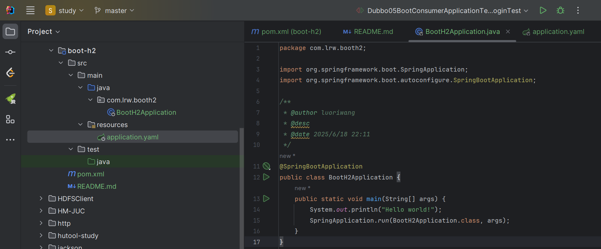
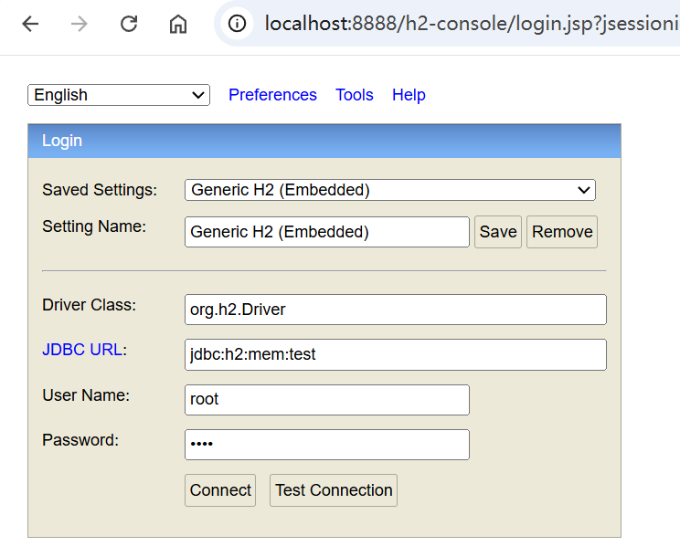
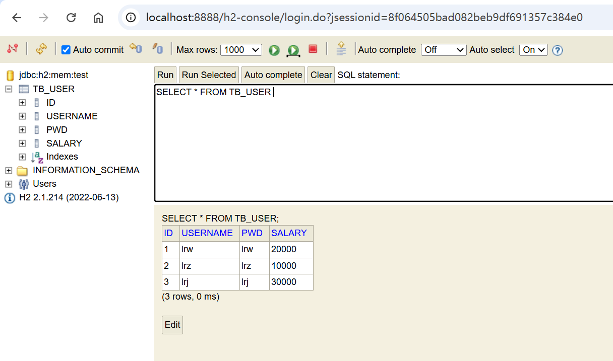
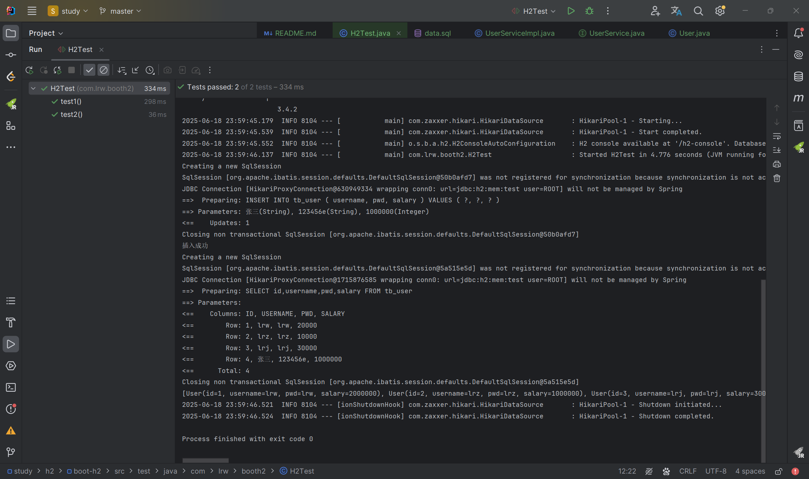

# SpringBoot整合H2数据库

## 1、H2数据库概述

H2是一个Java语言编写的嵌入式数据库，它不受平台的限制，同时H2提供了一个十分方便的web控制台，用于操作和管理数据库内容。

H2特点：
- 运行很快，开源，支持 JDBC API；
- 支持嵌入模式和服务器模式；
- 基于磁盘或内存中的数据库；
- 基于浏览器控制台应用程序；
- 文件很小，jar文件约 1.5 MB
- 加密数据库；
- ODBC 驱动程序；

## 2、SpringBoot整合H2

### 1、创建一个SpringBoot工程


### 2、导入mp和h2相关依赖
```xml
<!--springmvc-->
<dependency>
    <groupId>org.springframework.boot</groupId>
    <artifactId>spring-boot-starter-web</artifactId>
</dependency>

<!--h2数据库-->
<dependency>
    <groupId>com.h2database</groupId>
    <artifactId>h2</artifactId>
    <!--version:1.4.200-->
    <scope>compile</scope>
</dependency>

<!--mp-->
<dependency>
    <groupId>com.baomidou</groupId>
    <artifactId>mybatis-plus-boot-starter</artifactId>
    <version>3.4.2</version>
</dependency>

<!--mysql驱动-->
<dependency>
    <groupId>mysql</groupId>
    <artifactId>mysql-connector-java</artifactId>
    <version>5.1.47</version>
</dependency>

<!--test-->
<dependency>
    <groupId>org.springframework.boot</groupId>
    <artifactId>spring-boot-starter-test</artifactId>
</dependency>

<!-- lombok -->
<dependency>
    <groupId>org.projectlombok</groupId>
    <artifactId>lombok</artifactId>
</dependency>
```

### 3、向application.yml文件中添加配置

```yaml
server:
  port: 8888 # 端口号

spring:
  datasource:
    # url: jdbc:h2:~/mydb  # 数据库
    url: jdbc:h2:mem:test
    driver-class-name: org.h2.Driver
    username: root  
    password: test
  h2:
    console:
      path: /h2-console  #h2嵌入式数据库控制台，可以通过浏览器访问
      enabled: true

mybatis-plus:
  configuration:
    log-impl: org.apache.ibatis.logging.stdout.StdOutImpl # 开启sql日志
    map-underscore-to-case: true # 开启驼峰映射(mp默认开启)
```
- username和 password 是H2数据库的用户名和密码，自己定义即可。

- /h2-console 是自定义的控制台地址，用户可以打开浏览器，进入这个地址管理数据库，使用上面配置的username和password登录。

### 4、编写业务代码

实体类：
```java
package com.lrw.booth2.entity;

import com.baomidou.mybatisplus.annotation.IdType;
import com.baomidou.mybatisplus.annotation.TableId;
import com.baomidou.mybatisplus.annotation.TableName;
import lombok.Data;

@Data
@TableName(value = "tb_user")
public class User {
    @TableId(type = IdType.AUTO)
    private Integer id;
    private String username;
    private String pwd;
    private Integer salary;//以分为单位,避免浮点运算精度丢失问题

    // 封装数据
    public void setSalary(Integer salary) {
        this.salary = salary * 100;
    }
}

```

mapper接口：
```java
package com.lrw.booth2.mapper;

import com.baomidou.mybatisplus.core.mapper.BaseMapper;
import com.lrw.booth2.entity.User;
import org.apache.ibatis.annotations.Mapper;

@Mapper
public interface UserMapper extends BaseMapper<User> {
}

```

service接口：
```java
package com.lrw.booth2.service;

import com.baomidou.mybatisplus.extension.service.IService;
import com.lrw.booth2.entity.User;

public interface UserService extends IService<User> {
}

```

service接口实现类：
```java
package com.lrw.booth2.service.impl;

import com.baomidou.mybatisplus.extension.service.impl.ServiceImpl;
import com.lrw.booth2.entity.User;
import com.lrw.booth2.mapper.UserMapper;
import com.lrw.booth2.service.UserService;
import org.springframework.stereotype.Service;

@Service
public class UserServiceImpl extends ServiceImpl<UserMapper, User> implements UserService {
}

```

### 5、在resources目录下，创建一个schema.sql文件和data.sql文件

```h2
DROP TABLE IF EXISTS tb_user;

CREATE TABLE tb_user(
    id INT PRIMARY KEY  AUTO_INCREMENT COMMENT 'id',
    username VARCHAR(30) NOT NULL UNIQUE COMMENT '用户名',
    pwd VARCHAR(10) NOT NULL COMMENT '密码',
    salary INT DEFAULT 0 COMMENT '薪资'
);

```
```h2
insert into tb_user (username, pwd, salary) values ('lrw', 'lrw', 20000);
insert into tb_user (username, pwd, salary) values ('lrz', 'lrz', 10000);
insert into tb_user (username, pwd, salary) values ('lrj', 'lrj', 30000);
```

Spring Boot针对JDBC DataSource可以使用DML脚本自动创建库表，并使用DDL脚本初始化其数据。默认情况下，从classpath*：schema.sql加载模式脚本，从classpath*：data.sql加载数据脚本。即resources目录下的schema.sql、data.sql

### 6、启动项目，然后浏览器访问：http://localhost:8888/h2-console

输入之前在application.yml中h2的相关配置；如用户名、密码、数据库名



### 7、创建一个测试类，然后使用MP操作H2数据库

```java
package com.lrw.booth2;

import com.lrw.booth2.entity.User;
import com.lrw.booth2.service.UserService;
import org.junit.jupiter.api.Test;
import org.springframework.beans.factory.annotation.Autowired;
import org.springframework.boot.test.context.SpringBootTest;

import javax.annotation.Resource;
import java.util.List;

@SpringBootTest
public class H2Test {

    @Resource
    private UserService userService;

    @Test
    public void test1() {
        User user = new User();
        user.setUsername("张三");
        user.setPwd("123456e");
        user.setSalary(10000); //10k
        boolean flag = userService.save(user);
        System.out.println(flag ? "插入成功" : "插入失败");
    }

    @Test
    public void test2() {
        List<User> list = userService.list();
        System.out.println(list);
    }
}

```
运行结果：

