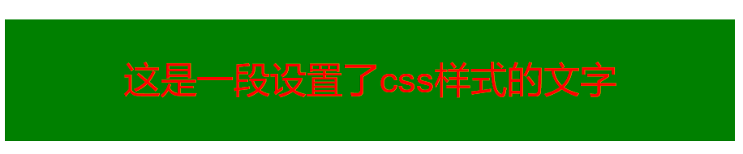
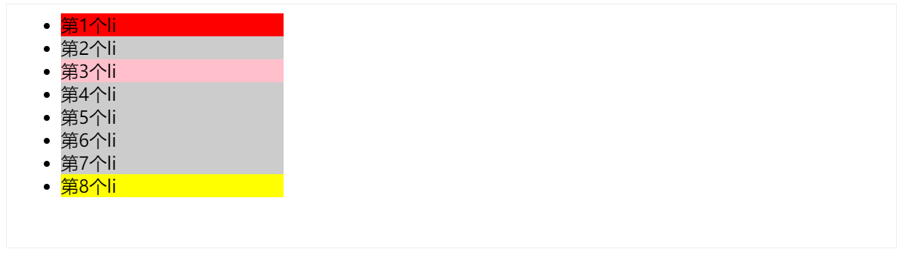
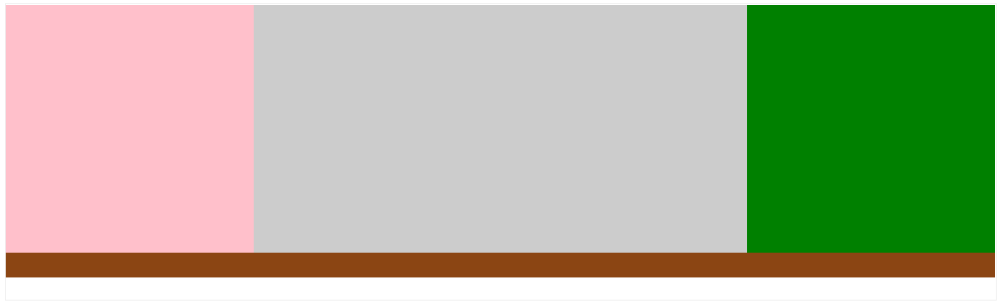
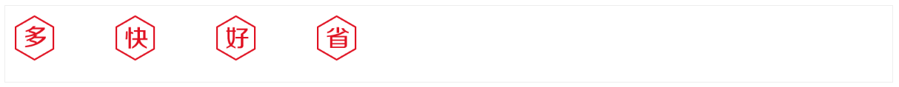

# 一、HTML 基本认知

## 1、常见 5 大浏览器

- IE
- 火狐 FireFox
- 谷歌 Chrome
- Safari
- 欧朋 Opera

## 2、渲染引擎

| 浏览器       | 内核    |
| ------------ | ------- |
| IE           | Trident |
| FireFox      | Gecko   |
| Safari       | Webkit  |
| Chrome/Opera | Blink   |

## 3、Web 标准

保证不同浏览器打开页面显示效果一样

| 构成 | 语言       | 说明     |
| ---- | ---------- | -------- |
| 结构 | HTML       | 页面元素 |
| 表现 | CSS        | 页面样式 |
| 行为 | JavaScript | 页面交互 |

## 4、HTML

Hyper Text Markup Language 超文本标记语言

## 5、hello world

需要设置显示`文件扩展名`

文件扩展名：`.html`

index.html

```html
<strong>hello world</strong>
```

## 6、HTML 骨架

```html
<html>
  <head>
    <title></title>
  </head>

  <body></body>
</html>
```

- html 最外层标签
- head 头部
- title 标题
- body 主体

## 7、开发工具

- Visual Studio Code （首选）
- WebStorm
- Sublime Text
- DreamWeaver
- HBuilder

## 8、VS Code 使用

快速生成 html 网页结构：

- `! + Tab` 多了一行代码`<!DOCTYPE html>`
- `doc + Tab`

快捷键

- 浏览器打开：`Alt + B` / `option⌥ + B`
- ÏLive Server 打开：`[command⌘ + L, command⌘ + O]`

## 9、注释

```html
<!-- 注释内容 -->
```

- 浏览器中不显示注释内容
- 添加和取消注释快捷键：`command + /`

## 10、标签结构

- 双标签 `<开始标签>内容</结束标签>`, 例如：`<strong>内容</strong>`
- 单标签 `<标签 />`, 例如：`<br>`

## 11、标签关系

- 父子关系（嵌套关系）

```html
<html>
  <head></head>
</html>
```

- 兄弟关系（并列关系）

```html
<head></head>
<body></body>
```


# 二、HTML 标签元素

## 1、标题标签 Heading

```
h1~h6
<h1>一级标题</h1>
<h2>二级标题</h2>
<h3>三级标题</h3>
<h4>四级标题</h4>
<h5>五级标题</h5>
<h6>六级标题</h6>
```


同时选中下一个相同字符：`command + D`

特点：

- 独占一行
- 文字加粗
- 文字变大，h1->h6 文字逐渐变小

## 2、段落标签 Paragraph

```html
<p>内容</p>
```


特点：

- 段落之间存在间隙
- 独占一行

## 3、排版标签

（1）换行符 Line Break

```html
第一行文本<br />第二行文本
```


特点

- 单标签
- 让文字强制换行

（1）水平分割线 Horizontal Rule

```html
<hr />
```


## 4、文本格式化标签

推荐使用后者

- b/strong 加粗
- u/ins 下划线
- i/em 倾斜
- s/del 删除线

```html
<b>加粗</b>
<strong>加粗</strong>

<u>下划线</u>
<ins>下划线</ins>

<i>倾斜</i>
<em>倾斜</em>

<s>删除线</s>
<del>删除线</del>
```

## 5、媒体标签

（1）图片标签 Image

```html

```

标签属性：属性名=属性值

## 6、资源路径

（1）当前路径

```html


<!-- 推荐使用./ -->

```

（2）下级路径

```html

```

（3）上级路径

```html

```

## 7、音频标签

```html
<audio
  src="音频地址"
  controls 显示播放控件
  autoplay 自动播放（部分浏览器不支持）
  loop 循环播放
</audio>
```

支持的格式 mp3 wav

## 8、视频标签

```html
<video src="视频地址"
  controls 显示播放控件
  autoplay 自动播放（谷歌浏览器需要配合muted静音播放）
  muted 静音播放
  loop 循环播放
</video>
```

支持的格式 mp4

## 9、链接标签 Anchor

```html
<a href="目标地址">文字内容</a>

<!-- eg: -->
<a href="https://www.baidu.com/">百度</a>
```


属性：

- target: _self 当前窗口打开（默认） / _blank 新窗口打开

Tips: chrome 地址栏双击可以看到完整地址

网站的默认首页 index.html

## 10、列表

- 无序列表
- 有序列表
- 自定义列表

（1）无序列表 Unordered List

列表项 List Item

```html
<ul>
  <li>苹果</li>
  <li>香蕉</li>
  <li>桃子</li>
</ul>
```


（2）有序列表 Ordered List

```html
<ol>
  <li>苹果</li>
  <li>香蕉</li>
  <li>桃子</li>
</ol>
```


（3）自定义列表 Description List

```html
<dl>
  <dt>水果</dt>
  <dd>苹果</dd>
  <dd>香蕉</dd>
  <dd>桃子</dd>
</dl>
```


标签含义

- dt Description Term
- dd Description Details

## 11、表格

（1）基本元素

标签含义

- tr Table Row
- th Table Header
- td Table Data

table 属性：

- border 边框宽度
- width 表格宽度
- height 表格高度

```html
<table border="1">
    <caption>
        表格大标题
    </caption>
    
    <tr>
        <th>姓名</th>
        <th>年龄</th>
    </tr>
    <tr>
        <td>Tom</td>
        <td>23</td>
    </tr>
    <tr>
        <td>Jack</td>
        <td>24</td>
    </tr>
</table>
```


（2）表格结构，可以省略

- thead 表格头部
- tbody 表格主体
- tfoot 表格底部

```html
<table border="1">
    <caption>
        表格大标题
    </caption>

    <thead>
        <tr>
            <th>姓名</th>
            <th>年龄</th>
        </tr>
    </thead>

    <tbody>
        <tr>
            <td>Tom</td>
            <td>23</td>
        </tr>
        <tr>
            <td>Jack</td>
            <td>24</td>
        </tr>
    </tbody>
    
    <tfoot>
        <tr>
            <td>求和</td>
            <td>57</td>
        </tr>
    </tfoot>
</table>
```


（3）合并单元格

- 跨行合并（垂直）rowspan
- 跨列合并（水平）colspan

左上原则

- 上下合并，保留最上
- 左右合并，保留最左

> Tips: 不能跨结构合并

```html
<table border="1">
    <caption>
        表格大标题
    </caption>

    <thead>
        <tr>
            <th>姓名</th>
            <th>年龄</th>
        </tr>
    </thead>
    
    <tbody>
        <tr>
            <td>Tom</td>
            <td rowspan="2">23</td>
        </tr>
        <tr>
            <td>Jack</td>
        </tr>
    </tbody>

    <tfoot>
        <tr>
            <td colspan="2">求和: 57</td>
        </tr>
    </tfoot>
</table>
```


## 12、表单

输入框 input

| type 属性 | 输入框类型 |
| --------- | ---------- |
| text      | 文本框     |
| password  | 密码框     |
| radio     | 单选框     |
| checkbox  | 多选框     |
| file      | 文件选择   |
| submit    | 提交按钮   |
| reset     | 重置按钮   |
| button    | 普通按钮   |

（1）text 文本框

placeholder 占位符

```html
<input type="text" placeholder="文本框占位符" />
```


（2）password 密码框

placeholder 占位符

```html
<input type="password" placeholder="密码框占位符" />
```


（3）radio 单选框

name 属性分组，一个分组只能有一个值被选中

checked 默认选中

```html
<input type="radio" name="sex" value="1" />男
<input type="radio" name="sex" value="2" checked />女
```


（4）checkbox 多选框

checked 默认选中

```html
<input type="checkbox" name="city" value="beijing" />北京
<input type="checkbox" name="city" value="shanghai" checked />上海
```


（5）file 文件选择

multiple 多选(按住 ctrl 多选)

```html
<input type="file" /> <input type="file" multiple />
```

 

（6）按钮

- submit 提交按钮
- reset 重置按钮
- button 普通按钮

需要配合 form 表单域使用

属性 value 修改按钮显示的值

```html
<input type="submit" />
<input type="reset" />
<input type="button" value="普通按钮" />
```

 

## button 按钮标签

type 取值

- submit 提交按钮
- reset 重置按钮
- button 普通按钮(默认)

```html
<button type="submit">提交按钮</button>
<button type="reset">重置按钮</button>
<button type="button">普通按钮</button>
<button>普通按钮</button>
```


## select 下拉菜单

```html
<select>
  <option>北京</option>
  <option>上海</option>
  <option selected>广州</option>
  <select></select>
</select>
```


option 选项

默认选中第一项，可以指定默认选中 selected

## textarea 多行文本域

属性

- cols 宽度 列数
- rows 高度 行数

```html
<textarea></textarea>
```


## label 标签

点击文字也可选中选项

两种使用方式等效

```html
<input type="radio" name="sex" id="man" />
<label for="man">男</label>

<label><input type="radio" name="sex" />女</label>
```


## 无语义标签

- div 块级标签，独占一行
- span 行内标签

## 语义化标签

手机端常用

- header 网页头部
- nav 网页导航
- footer 网页底部
- aside 网页侧边栏
- section 网页区块
- article 网页文章

以上标签和 div 等效，多了语义化

## 字符实体

在网页中显示特殊字符

- 空格 ` `
- 版权符 `©`

```html
<!-- 单词之间有5个空格，最后只显示一个空格 -->
hello world

<!-- 实现单词之间有5个空格 -->
hello&nbsp;&nbsp;&nbsp;&nbsp;&nbsp;world

<!-- 版权符号 -->
&copy;
```

## 综合案例

```html
<!DOCTYPE html>
<html lang="en">

<head>
    <meta charset="UTF-8">
    <meta http-equiv="X-UA-Compatible"
          content="IE=edge">
    <meta name="viewport"
          content="width=device-width, initial-scale=1.0">
    <title>Form Demo</title>
</head>

<body>
    <h2>个人信息</h2>
    <form action="">
        <p>姓名:
            <input type="text"
                   placeholder="姓名">
        </p>
        <p>性别:
            <label><input type="radio"
                       name="sex"
                       checked>男</label>
            <label><input type="radio"
                       name="sex">女</label>
        </p>
        <p>爱好:
            <label><input type="checkbox"
                       checked>足球</label>
            <label><input type="checkbox">篮球</label>
            <label><input type="checkbox">羽毛球</label>
        </p>

        <p>现居：<select>
                <option value="">北京</option>
                <option value="">上海</option>
                <option value="">广州</option>
                <option value="">深圳</option>
            </select>
        </p>

        <p>个人简介：
            <br />
            <textarea cols="60"
                      rows="10"></textarea>
        </p>

        <input type="submit"
               value="提交">
        <button type="reset">重置</button>
    </form>
</body>

</html>
```


# 三、CSS 层叠样式表

## 语法规则

```
选择器 {
    属性名: 属性值
}
```

## 书写位置

```html
<head>
    <title></title>

    <style>
        /* 这里写css */
    </style>
<head>
```

## CSS 引入方式

| 引入方式 | 书写位置                   | 作用范围 | 使用场景     |
| -------- | -------------------------- | -------- | ------------ |
| 内嵌式   | style 标签                 | 当前页面 | 小案例       |
| 外链式   | link 标签引入单独 css 文件 | 多个页面 | 项目中       |
| 行内式   | 标签 style 属性中          | 当前标签 | 配合 js 使用 |

（1）内嵌式

- CSS 写在 style 标签中
- style 标签可以写在页面任意位置，一般放在 head 标签中

```html
<!DOCTYPE html>
<html lang="en">

<head>
    <meta charset="UTF-8">
    <meta http-equiv="X-UA-Compatible"
          content="IE=edge">
    <meta name="viewport"
          content="width=device-width, initial-scale=1.0">
    <title>Document</title>

    <style>
        p {
            /* 这里是注释，快捷键ctrl + /  */
            /* 文字颜色设置为红色 */
            color: red;

            /* 字体大小设置为30像素 */
            font-size: 30px;

            /* 背景颜色 */
            background-color: green;

            /* 设置宽度和高度 */
            width: 600px;
            height: 100px;
            line-height: 100px;
            text-align: center;
        }
    </style>

</head>

<body>
    <p>这是一段设置了css样式的文字</p>
</body>

</html>
```



（2）外链式

- CSS 写在单独的`.css`文件中
- 通过 link 标签引入到网页中

```css
/* css-2.css */

p {
  color: red;
}
```

```html
<!DOCTYPE html>
<html lang="en">

<head>
    <link rel="stylesheet" href="./css-2.css">
</head>

<body>
    <p>这是一段设置了css样式的文字</p>
</body>

</html>
```


（3）行内式

- CSS 写在标签 style 属性中

```html
<div style="color: green; background-color: #f1f1f1;">
  这是一段设置了css样式的文字
</div>
```


## 基础选择器

- 标签选择器
- 类选择器
- id 选择器
- 通配符选择器

（1）标签选择器

```
标签名 {
    属性名：属性值;
}
<style>
    p {
        color: red;
    }
</style>


<p>你好，世界</p>
```


（2）类选择器

```
.类名{
    属性名：属性值;
}
```

- 合法的类名：数字、字母、下划线、中划线
- 一个元素可以有多个类名，空格隔开

```html
<style>
    .red {
        color: red;
    }

    .size {
        font-size: 60px;
    }
</style>

<div class="red">你好，世界</div>
<div class="red size">你好，世界</div>
```


（3）id 选择器

```
#元素id{
    属性名：属性值;
}
```

- 页面中唯一，不能重复
- 一个标签只能有一个 id
- id 选择器一般与 js 配合使用

```html
<style>
    #name {
        color: green;
    }
</style>

<div id="name">你好，世界</div>
```


（4）通配符选择器

```
*{
   属性名：属性值;
}
```

- 选中页面所有标签
- 一般用于统一设置页面样式

```css
/* 清除内外边距 */
* {
  margin: 0;
  padding: 0;
  box-sizing: border-box;
}
```

# 四、CSS 字体和文本样式

## 字体大小

```css
/* 浏览器默认字体大小 16px */
font-size: 16px;
<div style="font-size: 16px;">Hello World!</div>
<div style="font-size: 26px;">Hello World!</div>
```


## 字体粗细

```css
font-weight: 400;
```

| 属性值 | 数值 | 效果 |
| ------ | ---- | ---- |
| normal | 400  | 正常 |
| bold   | 700  | 加粗 |

```html
<div style="font-weight: normal">Hello World!</div>
<div style="font-weight: bold">Hello World!</div>
```


## 字体样式

```css
font-style: normal;
```

| 属性值 | 效果 |
| ------ | ---- |
| normal | 正常 |
| italic | 倾斜 |

```html
<div style="font-style: normal;">Hello World!</div>
<div style="font-style: italic;">Hello World!</div>
```


## 字体系列

```css
/* 优先使用：微软雅黑 > 黑体 */
/* 如果客户端都没有这些字体就选择一种无衬线字体 */
font-family: 微软雅黑, 黑体, sans-serif;
```

| 操作系统 | 默认字体    |
| -------- | ----------- |
| windows  | 微软雅黑    |
| Mac      | PingFang SC |

常见字体系列

| 常见字体系列             | 特点                               | 场景         | 该系列常见字体        |
| ------------------------ | ---------------------------------- | ------------ | --------------------- |
| 无衬线字体（sans-serif） | 文字笔画粗细均匀，并且首尾无装饰   | 网页         | 黑体、Arial           |
| 衬线字体（serif）        | 文字笔画粗细不均匀，并且首尾有装饰 | 报刊书籍     | 宋体、Times New Roman |
| 等宽字体（monospace）    | 每个字母或文字的宽度相等           | 程序代码编写 | Consolas、 fira Code  |

```html
<div style="font-family: 微软雅黑, 黑体, sans-serif;">Hello World!</div>
<div style="font-family: 宋体, Times New Roman, serif;">Hello World!</div>
<div style="font-family: Consolas, fira Code, monospace;">Hello World!</div>
```


## 文本缩进

```css
/* 首行缩进2个字符 */
text-indent: 2em;
```

取值

- 数字 + px
- 数字 + em(推荐：1em=当前标签的 font-size 大小)

```html
<p>Hello World!</p>
<p style="text-indent: 2em;">Hello World!</p>
```


## 文本水平对齐方式

```css
text-align: center;
```

| 属性值 | 效果           |
| ------ | -------------- |
| left   | 左对齐（默认） |
| center | 居中对齐       |
| right  | 右对齐         |

可居中的标签

- 文本
- span a
- input img

内容居中需要给`父元素`设置居中属性

```html
<p>Hello World!</p>
<p style="text-align: center;">Hello World!</p>
```


## 文本修饰

```css
/* 常用于清除a标签默认下划线 */
text-decoration: none;
```

| 属性值       | 效果   |
| ------------ | ------ |
| underline    | 下划线 |
| line-through | 删除线 |
| overline     | 上划线 |
| none         | 无     |

```html
<p style="text-decoration: none;">Hello World!</p>
<p style="text-decoration: underline;">Hello World!</p>
<p style="text-decoration: line-through;">Hello World!</p>
<p style="text-decoration: overline;">Hello World!</p>
```


## 行高

```css
line-height: 1.5;
```

取值

- 数字 + px
- 倍数（当前标签 font-size 的倍数）

文本高度

- 上间距
- 文本高度
- 下间距

应用：

- 单行文本垂直居中：line-height=元素父元素高度
- 取消上下间距：line-height=1

```html
<p style="line-height: 1">Hello World!</p>
<p style="line-height: 1.5;">Hello World!</p>
<p style="line-height: 3;">Hello World!</p>
```


## font 属性简写

层叠性：后面的样式覆盖前面的样式

复合属性

```css
font: [font-style font-weight] font-size/line-height font-family;
```

在线配置 font 简写形式

https://developer.mozilla.org/en-US/docs/Web/CSS/font#live_sample

```html
<div style="font: italic normal 700 24px/3 sans-serif;">Hello World!</div>
```


# 五、CSS 选择器

## 颜色取值

- 文字颜色 color
- 背景颜色 background-color

| 颜色表示方式   | 表示含义                      | 属性值             |
| -------------- | ----------------------------- | ------------------ |
| 关键词         | 预定义的颜色名                | red、green、blue   |
| rbg 表示法     | 红绿蓝三原色，取值 0-255      | rgb(0,0,0)         |
| rgba 表示法    | 红绿蓝三原色+透明度，取值 0-1 | rgba(0, 0, 0, 0.5) |
| 十六进制表示法 | #开头                         | #000000 简写 #000  |

```html
<p style="color: green;">Hello World!</p>
<p style="color: rgb(0, 255, 0);">Hello World!</p>
<p style="color: rgba(0, 255, 0, 0.5);">Hello World!</p>
<p style="color: #00FF00;">Hello World!</p>
<p style="color: #0F0;">Hello World!</p>
```


## 水平居中

```css
margin: 0 auto;
```

div、p、h 需要设置元素的宽度，否则会自动撑满父元素

```html
<div style="margin: 0 auto; width:200px; border: 1px solid #cccccc; text-align: center;">
  Hello World!
</div>
```


## 选择器

1、复合选择器

（1）后代选择器

```css
父选择器 后代选择器: {
}
```

示例：

```html
<style>
    div span {
        color: green;
    }
</style>

<div>
    <span>Hello World!</span>
    <p>
        <span>Hello World!</span>
    </p>
</div>
```


（2）子代选择器

```
父选择器 > 子代选择器: { }
```

示例：

```html
<style>
    div>span {
        color: green;
    }
</style>

<div>
    <span>Hello World!</span>
    <p>
        <span>Hello World!</span>
    </p>
</div>
```


2、并集选择器

```css
选择器1, 选择器2: {
}
```

示例：

```html
<style>
    p,
    span {
        color: green;
    }
</style>

<div>
    <span>Hello World!</span>
    <p>Hello World!</p>
</div>
```


3、交集选择器

```
选择器1选择器2: { }
```

示例：

```html
<style>
    span.title {
        color: green;
    }
</style>

<div>
    <p class="title">Hello World!</p>
    <span class="title">Hello World!</span>
</div>
```


4、hover 伪类选择器

鼠标悬停状态

```css
选择器:hover {
}
```

示例：

```html
<style>
    p:hover {
        color: green;
    }
</style>

<div>
    <p>Hello World!</p>
    <span>Hello World!</span>
</div>
```


5、Emmet 语法

- 简写语法，快速生成代码
- VS Code 等代码编辑器自带

| 语法       | 示例        | 效果                                      |
| ---------- | ----------- | ----------------------------------------- |
| 标签名     | div         | `<div></div>`                             |
| 类选择器   | .red        | `<div class="red"></div>`                 |
| id 选择器  | #one        | `<div id="one"></div>`                    |
| 交集选择器 | p.red#one   | `<p class="red" id="one"></p>`            |
| 子代选择器 | ul>li       | `<ul><li></li></ul>`                      |
| 内部文本   | ul>li{内容} | `<ul><li>Hello</li></ul>`                 |
| 创建多个   | ul>li*3     | `<ul><li></li><li></li><li></li></ul>`    |
| 创建自增   | ul>li{$}*3  | `<ul><li>1</li><li>2</li><li>3</li></ul>` |
| 同级       | div+p       | `<div></div><p></p>`                      |

css 提示

| 单词首字母 | 效果                          |
| ---------- | ----------------------------- |
| fw         | font-weight                   |
| w          | width                         |
| h          | height                        |
| bgc        | backgroud-color               |
| lh         | line-height                   |
| w300+h200  | `width: 300px;height: 200px;` |

# 六、CSS 背景相关属性

## 背景颜色

```css
/* 默认背景色是透明；背景色在背景图之下*/
background-color: transparent;
```

## 背景图片

```css
background-image: url(图片路径);
```

示例：

```html
<style>
    .box {
        width: 100%;
        /* 元素必须给一个尺寸才能显示背景图 */
        height: 500px;
        background-image: url(https://cn.bing.com/th?id=OHR.FanjingStairs_ZH-CN0360402048_UHD.jpg&rf=LaDigue_UHD.jpg&w=300&h=300&c=8&rs=1&o=3&r=0);
    }
</style>

<div class="box"></div>
```


## 背景平铺

background-repeat

| 取值      | 效果                           |
| --------- | ------------------------------ |
| repeat    | （默认值）水平和垂直方向都平铺 |
| no-repeat | 不平铺                         |
| repeat-x  | 水平方向平铺（x 轴）           |
| repeat-y  | 垂直方向平铺（y 轴）           |

示例：

```html
<style>
    .box {
        width: 100%;
        /* 元素必须给一个尺寸才能显示背景图 */
        height: 500px;
        background-image: url(https://cn.bing.com/th?id=OHR.FanjingStairs_ZH-CN0360402048_UHD.jpg&rf=LaDigue_UHD.jpg&w=300&h=300&c=8&rs=1&o=3&r=0);
        background-repeat: no-repeat;
    }
</style>

<div class="box"></div>
```


## 背景位置

```css
background-position: 水平方向位置 垂直方向位置;
```

属性值

方位名词（最多只能表示 9 个位置）

- 水平方向：left center right
- 垂直方向：top center bottom

数字+px（坐标）

- 坐标轴 原点(0,0) 盒子的左上角
- x 轴 水平方向
- y 轴 垂直方向
- 图片左上角与坐标原点重合

示例：

```html
<style>
    .box {
        width: 100%;
        /* 元素必须给一个尺寸才能显示背景图 */
        height: 500px;
        background-image: url(https://cn.bing.com/th?id=OHR.FanjingStairs_ZH-CN0360402048_UHD.jpg&rf=LaDigue_UHD.jpg&w=300&h=300&c=8&rs=1&o=3&r=0);
        background-repeat: no-repeat;
        background-position: center;
    }
</style>

<div class="box"></div>
```


## 背景属性连写

```css
/* 不分先后顺序 */
background: color image repeat position;
```

示例：

```html
<style>
    .box {
        width: 100%;
        /* 元素必须给一个尺寸才能显示背景图 */
        height: 500px;
        /*
        两种写法等价
        background-color: #fff;
        background-image: url(https://cn.bing.com/th?id=OHR.FanjingStairs_ZH-CN0360402048_UHD.jpg&rf=LaDigue_UHD.jpg&w=300&h=300&c=8&rs=1&o=3&r=0);
        background-repeat: no-repeat;
        background-position: center;
        */
        background: #fff url(https://cn.bing.com/th?id=OHR.FanjingStairs_ZH-CN0360402048_UHD.jpg&rf=LaDigue_UHD.jpg&w=300&h=300&c=8&rs=1&o=3&r=0) no-repeat center;
    }
</style>

<div class="box"></div>
```


## img 标签和背景图片区别

img

- 不设置高宽会默认显示
- 重要突出的图使用 img

background-image

- 需要设置元素尺寸
- 装饰性图片使用背景图

# 七、CSS 盒模型

## 元素显示模式

- 块级
- 行内
- 行内块

## 块级元素

- 独占一行
- 宽度默认为父元素 100%；高度默认由元素撑开
- 可以设置宽度和高度

代表标签

```
div p h ul li dl dt dd form
header nav footer
```

## 行内元素

- 一行显示多个
- 宽度和高度默认由内容撑开
- 不可以设置宽度和高度

代表标签

```
a span b u i s strong ins em del
```

## 行内块元素

- 一行显示多个
- 可以设置宽度和高度

代表标签

```
input textarea button select
```

## 元素显示模式转换

```css
display: block;
```

| 属性值       | 效果       |
| ------------ | ---------- |
| block        | 块级元素   |
| inline-block | 行内块元素 |
| inline       | 行内元素   |

## HTML 嵌套规范注意点

- 块级元素一般作为大容器;
- 可以嵌套文本、块级元素、行内元素、行内块元素

> p 标签中不要嵌套 div p h 等块级元素

- a 标签内部可以嵌套任意内容

> a 标签不能嵌套 a 标签

## 盒子模型

（1）盒子

标签可以看做是一个盒子

（2）盒子模型：

- 外边距区域 margin
- 边框区域 border
- 内边距区域 padding
- 内容区域 content

（3）盒子内容的宽高

- width
- height

```css
.box {
  width: 100px;
  height: 100px;
}
```

## 边框 border

```css
/* 粗细 线条样式 颜色（不分先后顺序）*/
/* 默认4个方向都有*/
border: 10px solid red;

/* 单个方向 */
border-top: 10px solid red;
border-bottom: 10px solid red;
border-left: 10px solid red;
border-right: 10px solid red;

/* 单个属性 */
border-width: 边框粗细
border-style: 边框样式
border-color: 边框颜色
```

线条可选样式

- solid 实线
- dashed 虚线
- dotted 点线

布局顺序：从外到内，从上到下

## 内边距 padding

```css
/* 可取 4 个值、3 个值、2 个值、1 个值 */
padding: 上 右 下 左;
padding: 上 左右 下;
padding: 上下 左右;
padding: 上下左右;

/* 单个方向 */
padding-top: 10px;
padding-bottom: 10px;
padding-left: 10px;
padding-right: 10px;
```

规律：顺时针，值不够看对边

## 导航实例

```html
<style>
    .box {
        border-top: 3px solid #ff8500;
        border-bottom: #edeef0;
    }

    .box a {
        /* 先写盒子大小 */
        display: inline-block;
        width: 80px;
        height: 40px;

        /* 推荐先写上背景，便于查看盒子大小 */
        /* background-color: #edeef0; */

        /* 再写文字样式 */
        line-height: 40px;
        text-align: center;
        color: #4c4c4c;
        font-size: 12px;
        text-decoration: none;
    }

    /* 鼠标悬停效果 */
    .box a:hover {
        background-color: #edeef0;
        color: #ff8044;
    }
</style>

<div class="box">
    <a href="#">首页</a>
    <a href="#">文章</a>
    <a href="#">分类</a>
    <a href="#">标签</a>
</div>
```


## 盒子尺寸计算

```
box-sizing: content-box 默认
盒子最终宽度 = width(content) + padding + border

box-sizing: border-box
盒子最终宽度 = width = padding + border + content
```

## 外边距 margin

设置值的方式和 padding 类似

```css
/* 可取 4 个值、3 个值、2 个值、1 个值 */
margin: 上 右 下 左;
margin: 上 左右 下;
margin: 上下 左右;
margin: 上下左右;

/* 单个方向 */
margin-top: 10px;
margin-bottom: 10px;
margin-left: 10px;
margin-right: 10px;
```

使用 margin 让元素居中

```css
.box {
  width: 100px;
  height: 100px;
  background-color: #ccc;
  margin: 0 auto;
}
```

## 清除浏览器默认样式

京东

```css
* {
  margin: 0;
  padding: 0;
}
```

淘宝

```css
blockquote,
body,
button,
dd,
dl,
dt,
fieldset,
form,
h1,
h2,
h3,
h4,
h5,
h6,
hr,
input,
legend,
li,
ol,
p,
pre,
td,
textarea,
th,
ul {
  margin: 0;
  padding: 0;
}
```

常用的清除样式

```css
* {
  margin: 0;
  padding: 0;
  box-sizing: border-box;
}
```

去掉列表前的符号

```css
ul {
  list-style: none;
}
```

## 外边距折叠现象

- 合并现象
- 塌陷现象

（1）合并现象

- 场景：垂直布局的块级元素，上下的 margin 会合并
- 结果：最终两者距离为 margin 的最大值
- 解决方法：只给其中一个盒子设置 margin

```html
<style>
    .box-1 {
        width: 100px;
        height: 100px;
        background-color: #698e6a;
        margin-bottom: 50px;
    }

    .box-2 {
        margin-top: 100px;
        width: 100px;
        height: 100px;
        background-color: #7f9faf;
    }
</style>

<div class="box-1"></div>
<div class="box-2"></div>
```


（2）塌陷现象

- 场景：相互嵌套的块级元素，子元素的 margin-top 会作用在父元素上
- 结果：导致父元素一起往下移动
- 解决方法：

1. 给父元素设置 border-top 或者 padding-top(分隔父子元素的 margin-top)
2. 给父元素设置 overflow:hidden;
3. 转换为行内块元素
4. 设置浮动

```html
<style>
    .box-father {
        width: 200px;
        height: 200px;
        background-color: #b2b6b6;
    }

    .box-child {
        width: 100px;
        height: 100px;
        background-color: #7f9faf;
        margin-top: 100px;
    }

    .resolve {
        overflow: hidden;
        margin-top: 20px;
    }
</style>

<div class="box-wrap">
    <!-- 元素的margin-top 作用在了父元素上 -->
    <div class="box-father">
        <div class="box-child"></div>
    </div>

    <!-- [完美解决方案]给父元素设置 overflow:hidden; -->
    <div class="box-father resolve">
        <div class="box-child"></div>
    </div>

</div>
```


## 行内标签的 margin/pading

垂直方向不生效，使用行高 line-height 实现

```html
<style>
    .box {
        border: 1px solid #eee;
    }

    .box span {
        margin: 20px;
        padding: 20px;
    }
</style>

<div class="box">
    <span>乾坤空落落，岁月去堂堂。</span>
</div>
```


# 八、CSS 特性

- 继承性
- 层叠性
- 优先级

## 继承性 inherited

（1）子元素有默认继承父元素样式的特点

可继承的常见属性（文字属性都可以继承）

```html
color font-style font-weight font-size font-family text-align text-indent
line-height
```

通过调试工具判断样式是否可继承

（2）继承失效的特殊情况

如果元素有浏览器默认样式，就不继承父元素属性

- a 标签的 color 会继承时效
- h 系列标签的 font-size 会继承失效

示例 ：

```html
<style>
    div {
        color: green;
        font-size: 16px;
    }
</style>

<div>
    <h1>将进酒</h1>
    <a href="#">李白 〔唐代〕</a>
    <p>君不见黄河之水天上来，奔流到海不复回。</p>
</div>
```


## 层叠性

同一个标签设置`不同`的样式

- 样式`层叠叠加`，共同作用在标签上

同一个标签设置`相同`的样式

- 样式会`层叠覆盖`，最终写在最后的样式生效

当样式冲突时，只有当选择器优先级相同时，才能通过层叠性判断结果

> 技巧: 编辑器多行输入

示例 ：

```html
<style>
    .color--red {
        color: red;
    }

    /* 绿色的定义位置在红色之后 */
    .color--green {
        color: green;
    }

    .font-size--20 {
        font-size: 20px;
    }
</style>

<div class="color--green color--red font-size--20">
    君不见黄河之水天上来，奔流到海不复回。
</div>
```


## 优先级

不同选择器具有不同的优先级，

优先级高的选择器样式会覆盖优先级低的选择器

（1）优先级公式（由低到高）

- 继承
- 通配符选择器
- 标签选择器
- 类选择器
- id 选择器
- 行内样式
- !important（慎重使用）

总结：选择范围越小，优先级越高

（2）复合选择器权重叠加

计算公式，每级之间不进位

```
（0, 0, 0, 0）

(行内, ID, 类, 标签)
```

- 第一级 行内样式个数
- 第二级 id 选择器个数
- 第三级 类选择器个数
- 第四级 标签选择器个数

需要注意：

- !important 权重最高
- 继承权重最低

> chrome 调试: 元素右键 -> 检查元素

工具：PxCook https://www.fancynode.com.cn/pxcook

示例 1：

```html
<style>
    /* (行内，id, 类，标签) */
    /* (0, 2, 0, 0) */
    #father #son {
        color: blue;
    }

    /* (0, 1, 1, 1) */
    #father p.c2 {
        color: black;
    }

    /* (0, 0, 2, 2) */
    div.c1 p.c2 {
        color: red;
    }

    /* 继承 */
    #father {
        color: green !important;
    }

    /* 继承 */
    div#father.c1 {
        color: yellow;
    }
</style>

<div id="father"
     class="c1">
    <p id="son"
       class="c2">白日依山尽，黄河入海流。</p>
</div>
```


示例 2：

```html
<style>
    /* (行内，id, 类，标签) */
    /* (0, 0, 0, 2) */
    div div {
        color: skyblue;
    }

    /* (0, 0, 0, 1) */
    div {
        color: red;
    }
</style>

<div>
    <div>
        <div>白日依山尽，黄河入海流。</div>
    </div>
</div>
```


示例 3：

```html
<style>
    /* (行内，id, 类，标签) */
    /* (0, 0, 0, 7) */
    div div div div div div div {
        color: red;
    }

    /* (0, 0, 1, 0) */
    .one {
        color: green;
    }
</style>

<div>
    <div>
        <div>
            <div>
                <div>
                    <div>
                        <div class="one">白日依山尽，黄河入海流。</div>
                    </div>
                </div>
            </div>
        </div>
    </div>
</div>
```


示例 4：

```html
<style>
    /* (行内，id, 类，标签) */
    /* (0, 0, 2, 1) */
    .c1 .c2 div {
        color: red;
    }

    /* (0, 1, 0, 1) */
    div #box3 {
        color: green;
    }

    /* (0, 1, 0, 1) */
    #box1 div {
        color: blue;
    }
</style>


<div id="box1"
     class="c1">
    <div id="box2"
         class="c2">
        <div id="box3"
             class="c3">白日依山尽，黄河入海流。</div>
    </div>
</div>
```


示例 5：

```html
<style>
    /* (行内，id, 类，标签) */
    /* 都是继承，最近的父级生效 */
    /* 继承 */
    div p {
        color: red;
    }


    /* 继承 */
    .father {
        color: green;
    }
</style>


<div class="father">
    <p class="son">
        <span>白日依山尽，黄河入海流。</span>
    </p>
</div>
```


# 九、浮动

## 结构伪类选择器

- 作用：根据元素在 HTML 中的结构关系查找元素
- 优势：减少对 HTML 中类的依赖，有利于保持代码整洁
- 场景：常用于查找某父级选择器中的子元素

| 选择器              | 说明                          |
| ------------------- | ----------------------------- |
| E:first-child       | 父元素中的第一个子元素 E      |
| E:last-child        | 父元素中的最后一个子元素 E    |
| E:nth-child(n)      | 父元素中的第 n 个子元素 E     |
| E:nth-last-child(n) | 父元素中的倒数第 n 个子元素 E |

n 可以写公式

n 可取值：0 1 2 3 4...

| 功能              | 公式          |
| ----------------- | ------------- |
| 偶数              | 2n even       |
| 奇数              | 2n+1 2n-1 odd |
| 找到前 5 个       | -n+5          |
| 找到从第 5 个往后 | n+5           |

示例：

```html
<style>
    ul li {
        background-color: #ccc;
        width: 200px;
    }

    ul li:first-child {
        background-color: red;
    }

    ul li:last-child {
        background-color: yellow;
    }

    ul li:nth-child(3) {
        background-color: pink;
    }
</style>

<!-- ul>li{第$个li}*8 -->
<ul>
    <li>第1个li</li>
    <li>第2个li</li>
    <li>第3个li</li>
    <li>第4个li</li>
    <li>第5个li</li>
    <li>第6个li</li>
    <li>第7个li</li>
    <li>第8个li</li>
</ul>
```



## 伪元素

- 元素：HTML 标签
- 伪元素：CSS 模拟出标签效果，装饰性内容

| 伪元素   | 作用                             |
| -------- | -------------------------------- |
| ::before | 在父元素内容的最前添加一个伪元素 |
| ::after  | 在父元素内容的最后添加一个伪元素 |

注意点：

- 必须设置 content 属性才能生效
- 伪元素默认是行内元素

```css
.box::before {
  content: ''; // 必须加属性
}
```

## 标准流

标准流：又称为文档流，浏览器排列元素的规则

常见标准流的排版规则

- 块级元素：从上往下，垂直布局，独占一行
- 行内元素或行内块元素：从左往右，水平布局，空间不够自动折行

## 浮动

- 早期：图文环绕
- 现在：网页布局

```css
float: left/right;
```

行内元素或行内块元素换行书写会产生一个空格

浮动的特点

- 浮动的标签默认顶对齐，可使用 margin-top 修改距离顶部距离
- 浮动元素会脱离标准流（脱标），在标准流中不占用位置
- 浮动元素比标准流高半个级别，可以覆盖标准流中的元素
- 浮动找浮动，下一个浮动元素会在上一个浮动元素后面，左右浮动
- 浮动标签具备行内块特点：

1. 一行显示多个
2. 可设置宽高

- 浮动之后盒子水平居中不生效 margin: 0 auto;

示例：

```html
<style>
    /* 初始化样式 */
    * {
        margin: 0;
        padding: 0;
    }

    /* 清除list圆点样式 */
    ul li {
        list-style: none;
    }

    /* 外层容器 */
    .box {
        width: 1200px;
        height: 620px;
        background-color: #ccc;
        margin: 0 auto;
    }

    /* 左边 */
    .left {
        float: left;
        width: 400px;
        height: 620px;
        background-color: pink;
    }

    /* 右边 */
    .right {
        float: right;
        /* background-color: green; */
        height: 620px;
        width: 780px;
    }

    ul li {
        float: left;
        height: 300px;
        width: 180px;
        background-color: skyblue;
        margin-bottom: 20px;
        margin-left: 20px;
    }

    /* 第1个子元素和第5个子元素 */
    ul li:nth-child(4n + 1) {
        margin-left: 0;
    }
</style>

<div class="box">
    <div class="left"></div>
    <div class="right">
        <ul>
            <li></li>
            <li></li>
            <li></li>
            <li></li>
            <li></li>
            <li></li>
            <li></li>
            <li></li>
        </ul>
    </div>
</div>
```


CSS 书写顺序

- 浮动 / display
- 盒子模型 margin border padding 宽度高度背景色
- 文字样式

常用 css

- 内减模式：box-sizing: border-box;
- 版心居中： margin: 0 auto;

## 清除浮动

清除浮动带来的影响

影响：如果子元素浮动了，此时子元素不能撑开标准流的块级父元素

```html
<style>
    /* 初始化样式 */
    * {
        margin: 0;
        padding: 0;
    }

    /* 外层容器 */
    .box {
        background-color: #ccc;
        /* margin: 0 auto; */
    }

    /* 左边 */
    .left {
        float: left;
        width: 200px;
        height: 200px;
        background-color: pink;
    }

    /* 右边 */
    .right {
        float: right;
        background-color: green;
        width: 200px;
        height: 200px;
    }

    .footer {
        height: 20px;
        background-color: saddlebrown;
    }
</style>

<div class="box">
    <div class="left"></div>
    <div class="right"></div>
</div>

<!-- 期望footer元素紧跟box下面排列 -->
<div class="footer"></div>
```


清除浮动的方法

1. 直接设置父元素高度
2. 额外标签

- 在父元素内容的最后添加一个块级元素
- 给添加的块级元素设置 clear:both;

```css
.clearfix {
  clear: both;
}
```

1. 单伪元素清除法

用伪元素替代了额外标签

优点：直接给标签加类即可清除浮动

（1）基本写法

```css
.clearfix::after {
  content: '';
  display: block;
  clear: both;
}
```

（2）补充写法

```css
.clearfix::after {
  content: '';
  display: block;
  clear: both;

  /* 兼容低版本IE */
  height: 0;
  visibility: hidden;
}
```

1. 双伪元素清除法

```css
/* 解决外边距塌陷问题 */
.clearfix::before,
.clearfix::after {
  content: '';
  display: table;
}

.clearfix::after {
  clear: both;
}
```

1. 给父元素设置 overflow:hidden

```css
overflow: hidden;
<style>
    /* 初始化样式 */
    * {
        margin: 0;
        padding: 0;
    }

    /* 外层容器 */
    .box {
        background-color: #ccc;
        /* margin: 0 auto; */
    }

    /* 左边 */
    .left {
        float: left;
        width: 200px;
        height: 200px;
        background-color: pink;
    }

    /* 右边 */
    .right {
        float: right;
        background-color: green;
        width: 200px;
        height: 200px;
    }

    .footer {
        height: 20px;
        background-color: saddlebrown;
    }

    .clearfix::before,
    .clearfix::after {
        content: '';
        display: table;
    }

    .clearfix::after {
        clear: both;
    }
</style>

<!-- 清除浮动 -->
<div class="box clearfix">
    <div class="left"></div>
    <div class="right"></div>
</div>

<!-- 期望footer元素紧跟box下面排列 -->
<div class="footer"></div>
```



# 10、CSS 实战

网站项目目录

```
index.html
css
js
img
```

清除浏览器默认样式

```css
/* reset.css */

* {
  margin: 0;
  padding: 0;
  /* 内减模式 */
  box-sizing: border-box;
}

li {
  list-style: none;
}

a {
  text-decoration: none;
}

/* 清除浮动 */
.clearfix::before,
.clearfix::after {
  content: '';
  display: table;
}

.clearfix::after {
  clear: both;
}

body {
  background-color: #f3f5f7;
}

/* 版心居中 */
.wrapper {
  width: 1200px;
  margin: 0 auto;
}
```

控制 input placeholder 样式

```css
input::placeholder {
}
```

调节图片上下对齐

```css
img {
  vertical-align: middel;
}
```

通栏盒子

```css
/* 占据屏幕整个宽度 */
.box {
  width: 100%;
}
```

# 11、CSS 定位

## 网页常见布局方式

1. 标准流

- 块级元素独占一行 -> 垂直布局
- 行内元素/行内块元素一行显示多个 -> 水平布局

1. 浮动

- 原本垂直布局的块级元素变成水平布局

1. 定位

- 可以让元素自由的摆放在网页的任意位置
- 一般用于盒子之间的层叠情况
- 让盒子固定在页面某一位置

## 使用定位

1. 设置定位方式

属性名: position

| 定位方式 | 属性值   |
| -------- | -------- |
| 静态定位 | static   |
| 相对定位 | relative |
| 绝对定位 | absolute |
| 固定定位 | fixed    |

1. 设置偏移值

- 偏移值可以设置水平和垂直方向
- 选取原则：就近原则

1. 偏移方向

- 水平距离左边 left
- 水平距离右边 right
- 垂直距离上边 top
- 垂直距离下边 buttom

## 相对定位

- 占有原来的位置
- 相对于自己之前的位置
- 不改变显示模式

```css
position: relative
left: 100px;
top: 100px;
```

> Tips: 如果 4 个定位都有，以 top 和 left 为准

## 绝对定位

- 相对于非静态定位的父元素定位
- 不占有原来的位置
- 改变显示模式
- 默认以浏览器 body 定位

```css
position: absolue
left: 100px;
top: 100px;
```

- 子绝父相：父级相对定位，子级绝对定位
- 绝对定位查找父级的方法：逐级向上，最终是浏览器窗口

## 固定定位

```css
positions: fixed;
```

特点：

- 脱标-不占位置
- 相对于浏览器定位
- 具备行内块特点

## 元素层级关系

1. 不同布局方式元素的层级关系：

```css
标准流 < 浮动 < 定位
```

1. 同层级，后写的会覆盖在先写的元素
2. 设置元素层级

```css
/* 默认值0；数值越大，显示越靠前 */
z-index: 数值;
```

## 案例：子盒子在父盒子中水平居中

方式一：margin

```html
<style>
    .box-wrap {
        position: relative;

        width: 500px;
        height: 500px;

        background-color: skyblue;
    }

    .box {
        position: absolute;
        left: 50%;
        top: 50%;
        /* 手动计算盒子的一半 */
        margin-left: -150px;
        margin-top: -150px;

        width: 300px;
        height: 300px;

        background-color: pink;
    }
</style>

<div class="box-wrap">
    <div class="box"></div>
</div>
```


方式二：transform

```html
<style>
    .box-wrap {
        position: relative;

        width: 500px;
        height: 500px;

        background-color: skyblue;
    }

    .box {
        position: absolute;
        left: 50%;
        top: 50%;

        /* 移动自身一半 */
        transform: translate(-50%, -50%);
        width: 300px;
        height: 300px;

        background-color: pink;
    }
</style>

<div class="box-wrap">
    <div class="box"></div>
</div>
```


# 12、CSS 装饰

## 1. 垂直对齐 vertical-align

基线(baseline)：浏览器文字类型元素排版中存在用于对齐的基线

| 属性值   | 效果           |
| -------- | -------------- |
| baseline | 默认，基线对齐 |
| top      | 顶部对齐       |
| middle   | 中部对齐       |
| bottom   | 底部对齐       |

```css
vertical-align: middle;
```

示例:

```html
<style>
    .text {
        border-bottom: 1px solid #ccc;
    }

    .text-baseline {
        vertical-align: baseline;
    }

    .text-top {
        vertical-align: top;
    }

    .text-middle {
        vertical-align: middle;
    }

    .text-bottom {
        vertical-align: bottom;
    }
</style>
<div>
    <span class="text text-baseline">绝知此事要躬行</span>
    <span class="text text-top">绝知此事要躬行</span>
    <span class="text text-middle">绝知此事要躬行</span>
    <span class="text text-bottom">绝知此事要躬行</span>
</div>
```


> 浏览器把行内和行内块当做文字处理，文字默认基线对齐

示例一：输入框垂直居中对齐

```html
<style>
    input {
        height: 50px;
    }

    input[type="button"] {
        height: 30px;
    }

    .middle input {
        vertical-align: middle;
    }
</style>

<div>

    <input type="text" />
    <input type="button"
           value="搜索" />
</div>
```


示例二：图片垂直居中对齐

```html
<style>
    .box {
        border: 1px solid #ccc;
        width: 500px;
    }

    img {
        height: 200px;
        width: 200px;
    }

    .middle-box {
        margin-top: 20px;
    }

    .middle-box img {
        vertical-align: middle;
    }
</style>

<div>
    <div class="box">
        <input type="button"
               value="搜索" /></div>

    <div class="box middle-box">
        <input type="button"
               value="搜索" /></div>
</div>
```


示例三：图片水平垂直居中

```html
<style>
    .box {
        width: 400px;
        height: 400px;
        background-color: skyblue;
        /* 水平居中 */
        text-align: center;
    }

    .box::after {
        height: 100%;
        content: '';
        display: inline-block;
        vertical-align: middle;
    }

    img {
        height: 200px;
        width: 200px;
        /* 垂直居中 */

        /*方式一*/
        vertical-align: middle;
        /*方式二*/
        /* display: block; */
    }
</style>

<div class="box">
    
</div>
```


## 2. 光标类型 cursor

| 属性值  | 效果                 |
| ------- | -------------------- |
| default | 默认，箭头           |
| pointer | 小手，提示可点击     |
| text    | 工字型，提示可选择   |
| move    | 十字光标，提示可移动 |

示例：

```html
<style>
    .cursor--pointer {
        cursor: pointer;
    }

    .cursor--text {
        cursor: text;
    }

    .cursor--move {
        cursor: move;
    }
</style>

<div class="box">
    <div>默认，箭头</div>
    <div class="cursor--pointer">小手，提示可点击</div>
    <div class="cursor--text">工字型，提示可选择</div>
    <div class="cursor--move">十字光标，提示可移动</div>
</div>
```


## 3. 边框圆角 border-radius

```css
/* 单值 4个角一样*/
border-radius: 数字px/百分比;

/* 多值 左上角开始，顺时针赋值，没有赋值看对角*/
border-radius: 左上 右上 右下 左下;
```

（1）正圆

- 盒子必须是正方形
- 设置边框圆角为盒子宽高的一半

示例：

```html
<style>
    .box {
        width: 200px;
        height: 200px;
        border-radius: 50%;
        background-color: skyblue;
    }
</style>

<div class="box"></div>

```


```css
/* 最大值 50% */
border-radius: 50%;
```

（2）胶囊按钮

- 盒子设置为长方形
- 设置边框圆角为高度的一半

```css
border-radius: height/2;
```

示例：

```html
<style>
    .box {
        width: 100px;
        height: 50px;
        border-radius: 25px;
        background-color: skyblue;
    }
</style>

<div class="box"></div>
```


## 4. 溢出部分效果 overflow

溢出部分：盒子内容部分超出盒子范围的区域

| 属性值  | 效果                               |
| ------- | ---------------------------------- |
| visible | 默认，溢出部分可见                 |
| hidden  | 溢出部分隐藏                       |
| scroll  | 无论是否溢出都显示滚动条           |
| auto    | 根据是否溢出，自动显示或隐藏滚动条 |

示例：

```html
<style>
    .box {
        width: 100px;
        height: 100px;
        background-color: skyblue;

        overflow: hidden;
    }
</style>

<div class="box">
    江夏赠韦南陵冰

    李白〔唐代〕

    胡骄马惊沙尘起，胡雏饮马天津水。
    君为张掖近酒泉，我窜三色九千里。(三色 一作：三巴)
    天地再新法令宽，夜郎迁客带霜寒。
    西忆故人不可见，东风吹梦到长安。
    宁期此地忽相遇，惊喜茫如堕烟雾。
    玉箫金管喧四筵，苦心不得申长句。
    昨日绣衣倾绿尊，病如桃李竟何言。
    昔骑天子大宛马，今乘款段诸侯门。
    赖遇南平豁方寸，复兼夫子持清论。
    有似山开万里云，四望青天解人闷。
    人闷还心闷，苦辛长苦辛。
    愁来饮酒二千石，寒灰重暖生阳春。
    山公醉后能骑马，别是风流贤主人。
    头陀云月多僧气，山水何曾称人意。
    不然鸣笳按鼓戏沧流，呼取江南女儿歌棹讴。
    我且为君槌碎黄鹤楼，君亦为吾倒却鹦鹉洲。
    赤壁争雄如梦里，且须歌舞宽离忧。
</div>
```


## 5. 元素本身隐藏

```css
/* 占位隐藏 */
visibility: hidden;

/* 不占位隐藏（常用） */
display: none;
<style>
    .box-1 {
        width: 100px;
        height: 100px;
        visibility: hidden;
    }

    .box-2 {
        width: 100px;
        height: 100px;
        display: none;
    }
</style>

<div class="box-1"></div>
<div class="box-2"></div>

```


示例：默认隐藏 鼠标悬停显示

```html
<style>
    .box {
        width: 100px;
        height: 100px;
        background-color: skyblue;
        position: relative;
    }

    .box:hover .box-qrcode {
        display: block;
    }

    .box-qrcode {
        position: absolute;
        top: 100px;
        width: 100px;
        height: 100px;
        background-color: pink;
        display: none;
    }
</style>

<div class="box">
    <div class="box-qrcode"></div>
</div>
```

## 6. 元素整体透明 opacity
属性值：

- 0-1 之间的数字；
- 0 完全透明，1 完全不透明

示例：

```html
<style>
    .box {
        width: 100px;
        height: 100px;
        background-color: skyblue;
        opacity: .5;
    }
</style>

<div class="box"></div>
```


## 7.半透明

```css
background-color: rgba(0, 0, 0, 0.5);
```

示例：

```html
<style>
    .box {
        /* width: 100px; */
        height: 100px;
        background-color: rgba(0, 0, 0, 0.4);
    }
</style>

<div class="box"></div>
```


## 精灵图（雪碧图, sprite）
将多张小图合并成一张大图

- 优点：减少服务器发送次数，减轻服务器压力，提高页面加载速度
- 缺点：修改起来比较麻烦

精灵图使用步骤

1. 设置盒子尺寸和小图尺寸相同
2. 将精灵图设置为盒子的背景图片
3. 修改背景图位置

```html
<style>
    .box {
        background-image: url('./img/jd-sprite.png');
        background-repeat: no-repeat;
        background-size: 113px 86.5px;
        width: 36px;
        height: 42px;
        display: inline-block;
        margin-right: 50px;
    }

    .box-1 {
        background-position: 0 0;
    }

    .box-2 {
        background-position: -38.5px 0;
    }

    .box-3 {
        background-position: -77px 0;
    }

    .box-4 {
        background-position: 0 -44.5px;
    }
</style>

<div class="box box-1"></div>
<div class="box box-2"></div>
<div class="box box-3"></div>
<div class="box box-4"></div>
```



## 背景图片大小 background-size

```css
background-size: 宽度 高度;
```

| 取值    | 场景                                                         |
| ------- | ------------------------------------------------------------ |
| 数字+px | 简单方便                                                     |
| 百分比  | 相对于当前盒子自身的宽高百分比                               |
| contain | 包含，背景图等比缩放，直到不会超出盒子的最大，可能有留白     |
| cover   | 覆盖，背景图等比缩放，直到刚好填满整个盒子没有空白，图片可能显示不全 |

background 连写

```css
background： color image repeat position/size;
```

## 盒子阴影 box-shadow

| 参数     | 作用                       |
| -------- | -------------------------- |
| h-shadow | 必须，水平偏移量，允许负值 |
| v-shadow | 必须，垂直偏移量，允许负值 |
| blur     | 可选，模糊度               |
| spread   | 可选，阴影扩大             |
| color    | 可选，阴影颜色             |
| inset    | 可选，将阴影改为内部阴影   |

```html
<style>
    .box {
        width: 100px;
        height: 100px;
        box-shadow: 0 10px 50px 8px #ccc;
    }
</style>

<div class="box"></div>
```


## 过渡 transition

- 让元素样式慢慢变化
- 常配合 hover 使用

```css
transition 属性 时长, 属性 时长;
```

| 参数     | 取值                         |
| -------- | ---------------------------- |
| 过渡属性 | 所有属性 all；具体属性 width |
| 过渡时长 | 数字 + s(秒)                 |

注意：

- 过渡需要默认状态和 hover 样式不同，才能有过渡效果
- transition 属性给需要过渡的元素本身加
- transition 属性设置在不同状态中，效果不同
  - 给默认状态设置，鼠标移入移出都有过渡效果
  - 给 hover 状态设置，鼠标移入有过渡效果，移出没有过渡效果

```html
<style>
    .box {
        width: 100px;
        height: 100px;
        background-color: skyblue;
        transition: all 2s;
    }

    .box:hover {
        width: 200px;
        background-color: pink;
    }
</style>

<div class="box"></div>
```


# 13、CSS 实战 2

## 网站骨架结构标签

```html
<!-- 文档类型声明，HTML5 -->
<!DOCTYPE html>

<!-- 网页语言，中文zh-CN -->
<html lang="en">
  <!-- 网页字符编码 -->
  <meta charset="UTF-8" />

  <meta http-equiv="X-UA-Compatible" content="IE=edge,chrome=1" />

  <!-- 移动端使用 -->
  <meta
    name="viewport"
    content="width=device-width, user-scalable=no, initial-scale=1.0, maximum-scale=1.0, minimum-scale=1.0"
  />
</html>
```

## SEO

Search Engine Optimization 搜索引擎优化

提升网站排名方法：

1. 竞价排名
2. 将网页制作成 html 后缀
3. 标签语义化，适合的地方使用合适的标签

## SEO 三大标签

1. title 标题
2. description 描述
3. keywords 关键词，英文逗号分隔

```html
<title>Coding Tree</title>

<meta name="description" content="Description" />

<meta name="keywords" content="keywords1,keywords2" />
```

## icon 图标

favicon.ico 文件放根路径

```html
<link rel="shortcut icon" href="favicon.ico" type="image/x-icon" />
```

## 项目结构搭建

文件和目录准备

```
favicon.ico

index.html  首页

css/

  base.css   基本公共的样式 清除浏览器默认样式

  common.css 重复使用样式 网页头，网页尾

  index.css  页面单独的样式

images/       固定使用的图片素材

uploads/      非固定使用的图片素材

```

base.css

```css
/* base.css 清除默认样式*/

/*清除常见标签的margin和padding*/
body,
h1,
h2,
h3,
h4,
h5,
h6,
p,
ul,
ol,
li,
dl,
dt,
dd,
input {
  margin: 0;
  padding: 0;
}

/*内减模式*/
* {
  box-sizing: border-box;
}

/*设置网页统一的字体大小，行高，字体系列 */
body {
  font: 16px/1.5 Arial, 'Microsoft Yahei', sans-serif;
  color: #333;
}

/*去除列表默认样式*/
ul,
ol {
  list-style: none;
}

/*去除默认倾斜*/
i,
em {
  font-style: normal;
}

/*去除a标签下划线，并设置默认文字颜色*/
a {
  text-decoration: none;
  color: #333;
}

/*设置img垂直对齐方式为居中对齐，去除默认下间隙*/
img {
  vertical-align: middle;
}

/* 去除input默认样式 */
input {
  border: none;
  outline: none;
  color: #333;
}

/*左浮动*/
.fl {
  float: left;
}
/*右浮动*/
.fr {
  float: right;
}

/*双伪元素清除浮动*/
.clearfix::before,
.clearfix::after {
  content: '';
  display: table;
}

.clearfix::after {
  clear: both;
}
```

common.css

```css
/* 版心居中 */
.wrapper {
  width: 1240px;
  margin: 0 auto;
}

/* 让文字看不见 */
font-size: 0;
```

绝对定位，盒子具备行内块特点

对齐方式：

1. vertical-align
2. 行高
3. 定位

常用类名

```css
prev
next
current/active
```

