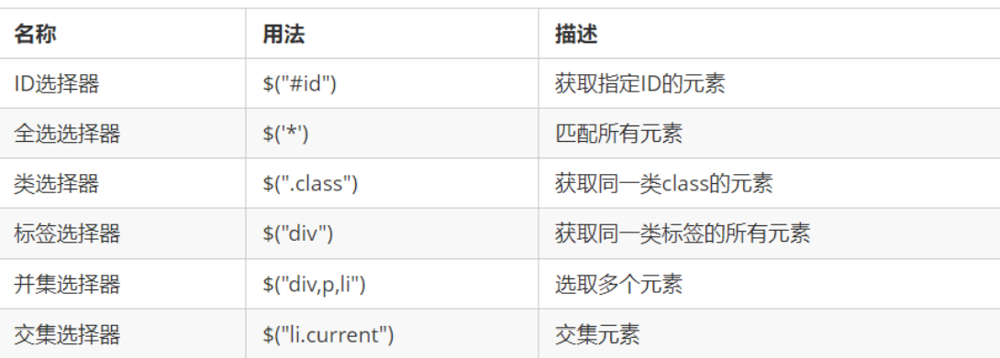
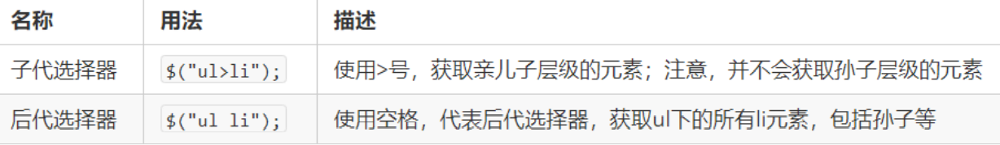
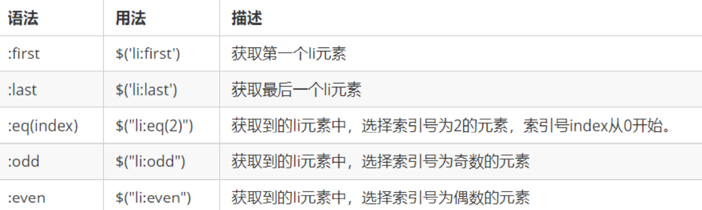
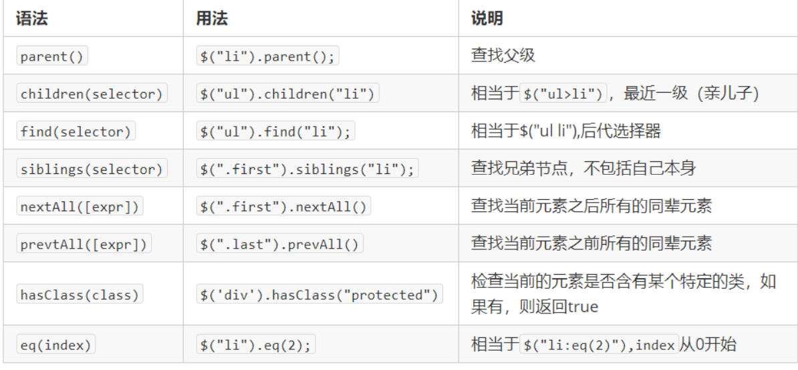
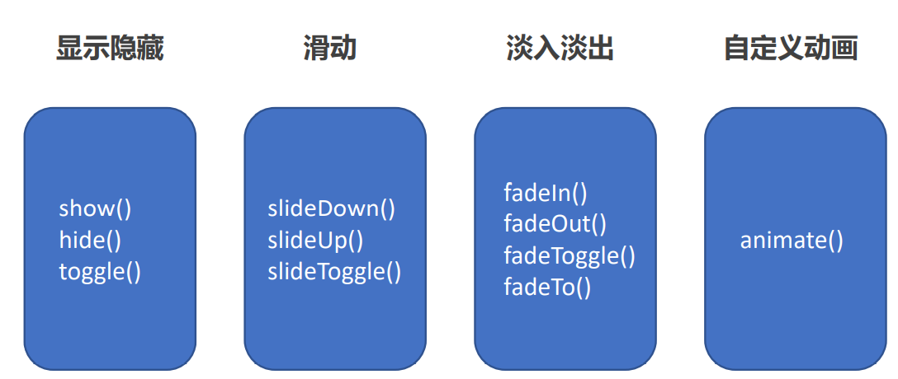
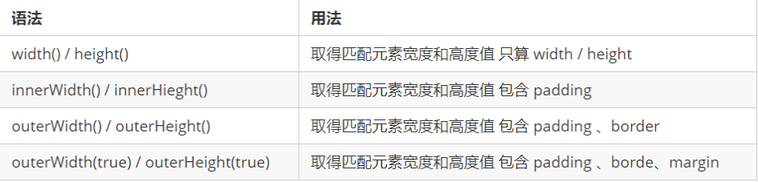

# Day 1 - jQuery 入门

## 01 - 学习目标（target）

- 能够说出什么是 jQuery 
- 能够说出 jQuery 的优点
- 能够简单使用 jQuery
- 能够说出 DOM 对象和 jQuery 对象的区别

## 02 - jQuery 概述 

### JavaScript 库

**JavaScript库：**即 library，是一个**封装**好的特定**的集合**（方法和函数）。从封装一大堆函数的角度理解库，就 是在这个库中，封装了很多预先定义好的函数在里面，比如动画 animate、hide、show，比如获取元素等。

**常见的 JavaScript 库**

- jQuery
- Prototype
- YUI
- Dojo
- Ext JS
- 移动端的zepto

这些库都是对原生 JavaScript 的封装，内部都是用 JavaScript 实现的，我们主要学习的是 jQuery。

### jQuery 的概念

jQuery 是一个快速、简洁的 JavaScript 库，其设计的宗旨是“write Less，Do More”，即倡导写更少的代码， 做更多的事情。 

j 就是 JavaScript； Query 查询； 意思就是查询 js，把 js 中的DOM操作做了封装，我们可以快速的查询使用里 面的功能。

jQuery 封装了 JavaScript 常用的功能代码，优化了 DOM 操作、事件处理、动画设计和 Ajax 交互。

学习 jQuery 本质： 就是学习调用这些函数（方法）。


 优点：

-  轻量级。核心文件才几十kb，不会影响页面加载速度
-  跨浏览器兼容。基本兼容了现在主流的浏览器
-  链式编程、隐式迭代
-  对事件、样式、动画支持，大大简化了DOM操作
-  支持插件扩展开发。有着丰富的第三方的插件，例如： 树形菜单、日期控件、轮播图等
-  免费、开源

## 03 - jQuery 的基本使用

### jQuery 的下载

官网地址： https://jquery.com/

 版本：

-  1x ：兼容 IE 678 等低版本浏览器， 官网不再更新
-  2x ：不兼容 IE 678 等低版本浏览器， 官网不再更新
-  3x ：不兼容 IE 678 等低版本浏览器， 是官方主要更新维护的版本

各个版本的下载：https://code.jquery.com/ 

### jQuery 的使用步骤

1. 引入 jQuery 文件

2. 使用即可

### jQuery 的入口函数

第一种 

```javascript
$(function () { 
     ... // 此处是页面 DOM 加载完成的入口
}) ;
```


第二种 

```javascript
$(document).ready(function(){
   ... // 此处是页面DOM加载完成的入口
});
```

1. 等着 DOM 结构渲染完毕即可执行内部代码，不必等到所有外部资源加载完成，jQuery 帮我们完成了封装。

2. 相当于原生 js 中的 DOMContentLoaded。

3. 不同于原生 js 中的 load 事件是等页面文档、外部的 js 文件、css文件、图片加载完毕才执行内部代码。

4. 更推荐使用第一种方式。

### jQuery 的顶级对象 $ 

1. $ 是 jQuery 的别称，在代码中可以使用 jQuery 代替 $，但一般为了方便，通常都直接使用 $。

2. $ 是 jQuery 的顶级对象， 相当于原生 JavaScript 中的 window。把元素利用 $ 包装成 jQuery 对象，就可以调用 jQuery 的方法。

### jQuery 对象和 DOM 对象 

1. 用原生 JS 获取来的对象就是 DOM 对象 

2. jQuery 方法获取的元素就是 jQuery 对象。

3. jQuery 对象本质是： 利用 $ 对 DOM 对象包装后产生的对象（伪数组形式存储）。

注意：

只有 jQuery 对象才能使用 jQuery 方法，DOM 对象则使用原生的 JavaScirpt 方法。

```html
<!DOCTYPE html>
<html lang="en">
 
<head>
    <meta charset="UTF-8">
    <meta name="viewport" content="width=device-width, initial-scale=1.0">
    <meta http-equiv="X-UA-Compatible" content="ie=edge">
    <title>Document</title>
    <script src="jquery.min.js"></script>
    <style>
        div {
            width: 100px;
            height: 100px;
            background-color: pink;
        }
    </style>
</head>
 
<body>
    <div></div>
    <span></span>
    <script>
        // 1. DOM 对象：  用原生js获取过来的对象就是DOM对象
        var myDiv = document.querySelector('div'); // myDiv 是DOM对象
        var mySpan = document.querySelector('span'); // mySpan 是DOM对象
        console.dir(myDiv);
        // 2. jQuery对象： 用jquery方式获取过来的对象是jQuery对象。 本质：通过$把DOM元素进行了包装
        $('div'); // $('div')是一个jQuery 对象
        $('span'); // $('span')是一个jQuery 对象
        console.dir($('div'));
        // 3. jQuery 对象只能使用 jQuery 方法，DOM 对象则使用原生的 JavaScirpt 属性和方法
        // myDiv.style.display = 'none';
        // myDiv.hide(); myDiv是一个dom对象不能使用 jquery里面的hide方法
        // $('div').style.display = 'none'; 这个$('div')是一个jQuery对象不能使用原生js 的属性和方法
    </script>
</body>
 
</html>
```

**jQuery 对象和 DOM 对象的相互转换**

因为原生 js 比 jQuery 更大，原生的一些属性和方法 jQuery 没有给我们封装。要想使用这些属性和方法需要把 jQuery 对象转换为 DOM 对象才能使用。

1. DOM 对象转换为 jQuery 对象 ：$(DOM对象)

```javascript
$('div')
```

2. jQuery 对象转换为 DOM 对象 （两种方式）

第一种：

```javascript
$('div') [index] // index 是索引号
```

第二种：

```javascript
$('div') .get(index) // index 是索引号
```


# Day 2 - jQuery 常用API

## 01 - 学习目标（target）

-  能够写出常用的 jQuery 选择器
-  能够操作 jQuery 样式
-  能够写出常用的 jQuery 动画
-  能够操作 jQuery 属性
-  能够操作 jQuery 元素
-  能够操作 jQuery 元素尺寸、位置

## 02 - jQuery 选择器 

### jQuery 基础选择器 

原生 JS 获取元素方式很多，很杂，而且兼容性情况不一致，因此 jQuery 给我们做了封装，使获取元素统一标准。 

```javascript
$(“选择器”) // 里面选择器直接写 CSS 选择器即可，但是要加引号
```



### jQuery 层级选择



**知识铺垫**

jQuery 设置样式

```javascript
$('div').css('属性', '值')
```

### 隐式迭代（重要）

遍历内部 DOM 元素（伪数组形式存储）的过程就叫做**隐式迭代**。

简单理解：给匹配到的所有元素进行循环遍历，执行相应的方法，而不用我们再进行循环，简化我们的操作， 方便我们调用。 

隐式迭代就是把匹配的所有元素内部进行遍历循环，给每一个元素添加 css 的方法。

### jQuery 筛选选择器




 实例：

```html
<!DOCTYPE html>
<html lang="en">
 
<head>
    <meta charset="UTF-8">
    <meta name="viewport" content="width=device-width, initial-scale=1.0">
    <meta http-equiv="X-UA-Compatible" content="ie=edge">
    <title>Document</title>
    <script src="jquery.min.js"></script>
</head>
 
<body>
    <ul>
        <li>多个里面筛选几个</li>
        <li>多个里面筛选几个</li>
        <li>多个里面筛选几个</li>
        <li>多个里面筛选几个</li>
        <li>多个里面筛选几个</li>
        <li>多个里面筛选几个</li>
    </ul>
    <ol>
        <li>多个里面筛选几个</li>
        <li>多个里面筛选几个</li>
        <li>多个里面筛选几个</li>
        <li>多个里面筛选几个</li>
        <li>多个里面筛选几个</li>
        <li>多个里面筛选几个</li>
    </ol>
    <script>
        $(function() {
            $("ul li:first").css("color", "red");
            $("ul li:eq(2)").css("color", "blue");
            $("ol li:odd").css("color", "skyblue");
            $("ol li:even").css("color", "pink");
        })
    </script>
</body>
 
</html>
```

### jQuery 筛选方法（重点）



 **重点记住： parent() 、children()、 find()、 siblings() 、eq()**

 实例：

```html
<!DOCTYPE html>
<html lang="en">
 
<head>
    <meta charset="UTF-8">
    <meta name="viewport" content="width=device-width, initial-scale=1.0">
    <meta http-equiv="X-UA-Compatible" content="ie=edge">
    <title>Document</title>
    <script src="jquery.min.js"></script>
</head>
 
<body>
    <div class="yeye">
        <div class="father">
            <div class="son">儿子</div>
        </div>
    </div>
 
    <div class="nav">
        <p>我是屁</p>
        <div>
            <p>我是p</p>
        </div>
    </div>
    <script>
        // 注意一下都是方法 带括号
        $(function () {
            // 1. 父  parent()  返回的是 最近一级的父级元素 亲爸爸
            console.log($(".son").parent());
            // 2. 子
            // (1) 亲儿子 children()  类似子代选择器  ul > li
            // $(".nav").children("p").css("color", "red");
            // (2) 可以选里面所有的孩子 包括儿子和孙子  find() 类似于后代选择器
            $(".nav").find("p").css("color", "red");
            // 3. 兄
        });
    </script>
</body>
 
</html>
```

```html
<!DOCTYPE html>
<html lang="en">
 
<head>
    <meta charset="UTF-8">
    <meta name="viewport" content="width=device-width, initial-scale=1.0">
    <meta http-equiv="X-UA-Compatible" content="ie=edge">
    <title>Document</title>
    <script src="jquery.min.js"></script>
</head>
 
<body>
    <ol>
        <li>我是ol 的li</li>
        <li>我是ol 的li</li>
        <li class="item">我是ol 的li</li>
        <li>我是ol 的li</li>
        <li>我是ol 的li</li>
        <li>我是ol 的li</li>
    </ol>
    <ul>
        <li>我是ol 的li</li>
        <li>我是ol 的li</li>
        <li>我是ol 的li</li>
        <li>我是ol 的li</li>
        <li>我是ol 的li</li>
        <li>我是ol 的li</li>
    </ul>
    <div class="current">俺有current</div>
    <div>俺木有current</div>
    <script>
        // 注意一下都是方法 带括号
        $(function() {
            // 1. 兄弟元素siblings 除了自身元素之外的所有亲兄弟
            $("ol .item").siblings("li").css("color", "red");
            // 2. 第n个元素
            var index = 2;
            // (1) 我们可以利用选择器的方式选择
            // $("ul li:eq(2)").css("color", "blue");
            // $("ul li:eq("+index+")").css("color", "blue");
            // (2) 我们可以利用选择方法的方式选择 更推荐这种写法
            // $("ul li").eq(2).css("color", "blue");
            // $("ul li").eq(index).css("color", "blue");
            // 3. 判断是否有某个类名
            console.log($("div:first").hasClass("current"));
            console.log($("div:last").hasClass("current"));
 
 
        });
    </script>
</body>
 
</html>
```


### jQuery 里面的排他思想

想要多选一的效果，排他思想：当前元素设置样式，其余的兄弟元素清除样式。

```html
<!DOCTYPE html>
<html lang="en">
 
<head>
    <meta charset="UTF-8">
    <meta name="viewport" content="width=device-width, initial-scale=1.0">
    <meta http-equiv="X-UA-Compatible" content="ie=edge">
    <title>Document</title>
    <script src="jquery.min.js"></script>
</head>
 
<body>
    <button>快速</button>
    <button>快速</button>
    <button>快速</button>
    <button>快速</button>
    <button>快速</button>
    <button>快速</button>
    <button>快速</button>
    <script>
        $(function() {
            // 1. 隐式迭代 给所有的按钮都绑定了点击事件
            $("button").click(function() {
                // 2. 当前的元素变化背景颜色
                $(this).css("background", "pink");
                // 3. 其余的兄弟去掉背景颜色 隐式迭代
                $(this).siblings("button").css("background", "");
            });
        })
    </script>
</body>
 
</html>
```


### 链式编程

链式编程是为了节省代码量，看起来更优雅。

```javascript
$(this).css('color', 'red').sibling().css('color', '');
```

 使用链式编程一定注意是哪个对象执行样式。

```html
<!DOCTYPE html>
<html lang="en">
 
<head>
    <meta charset="UTF-8">
    <meta name="viewport" content="width=device-width, initial-scale=1.0">
    <meta http-equiv="X-UA-Compatible" content="ie=edge">
    <title>Document</title>
    <script src="jquery.min.js"></script>
</head>
 
<body>
    woshi body 的文字
    <button>快速</button>
    <button>快速</button>
    <button>快速</button>
    <button>快速</button>
    <button>快速</button>
    <button>快速</button>
    <button>快速</button>
    <script>
        $(function() {
            // 1. 隐式迭代 给所有的按钮都绑定了点击事件
            $("button").click(function() {
                // 2. 让当前元素颜色变为红色
                // $(this).css("color", "red");
                // 3. 让其余的姐妹元素不变色 
                // $(this).siblings().css("color", "");
                // 链式编程
                // $(this).css("color", "red").siblings().css("color", "");
                // 我的颜色为红色, 我的兄弟的颜色为空
                // $(this).siblings().css('color', 'red');
                // 我的兄弟变为红色  ,我本身不变颜色
                $(this).siblings().parent().css('color', 'blue');
                // 最后是给我的兄弟的爸爸 body 变化颜色 
 
            });
        })
    </script>
</body>
 
</html>
```

## 03 - jQuery 样式操作

### 操作 css 方法 

jQuery 可以使用 css 方法来修改简单元素样式； 也可以操作类，修改多个样式。

1. 参数只写属性名，则是返回属性值

```javascript
$(this).css(''color'');
```

 2. 参数是属性名，属性值，逗号分隔，是设置一组样式，属性必须加引号，值如果是数字可以不用跟单位和引号

```javascript
$(this).css(''color'', ''red'');
```

3. 参数可以是对象形式，方便设置多组样式。属性名和属性值用冒号隔开， 属性可以不用加引号

```javascript
$(this).css({ "color":"white","font-size":"20px"});
```

 实例：

```html
<!DOCTYPE html>
<html lang="en">
 
<head>
    <meta charset="UTF-8">
    <meta name="viewport" content="width=device-width, initial-scale=1.0">
    <meta http-equiv="X-UA-Compatible" content="ie=edge">
    <title>Document</title>
    <script src="jquery.min.js"></script>
    <style>
        div {
            width: 200px;
            height: 200px;
            background-color: pink;
        }
    </style>
</head>
 
<body>
    <div></div>
    <script>
        // 操作样式之css方法
        $(function() {
            console.log($("div").css("width"));
            // $("div").css("width", "300px");
            // $("div").css("width", 300);
            // $("div").css(height, "300px"); 属性名一定要加引号
            $("div").css({
                width: 400,
                height: 400,
                backgroundColor: "red"
                    // 如果是复合属性则必须采取驼峰命名法，如果值不是数字，则需要加引号
            })
        })
    </script>
</body>
 
</html>
```

### 设置类样式方法 

作用等同于以前的 classList，可以操作类样式， 注意操作类里面的参数不要加点。

1. 添加类

```javascript
$('div').addClass('current');
```

 2. 移除类

```javascript
$('div').removeClass('current');
```

3. 切换类

```javascript
$('div').toggleClass('current');
```

### 类操作与 className 区别

原生 JS 中 className 会覆盖元素原先里面的类名。

jQuery 里面类操作只是对指定类进行操作，不影响原先的类名。

```html
<!DOCTYPE html>
<html lang="en">
 
<head>
    <meta charset="UTF-8">
    <meta name="viewport" content="width=device-width, initial-scale=1.0">
    <meta http-equiv="X-UA-Compatible" content="ie=edge">
    <title>Document</title>
    <style>
        .one {
            width: 200px;
            height: 200px;
            background-color: pink;
            transition: all .3s;
        }
        
        .two {
            transform: rotate(720deg);
        }
    </style>
    <script src="jquery.min.js"></script>
</head>
 
<body>
    <div class="one two"></div>
    <script>
        // var one = document.querySelector(".one");
        // one.className = "two";
        // $(".one").addClass("two");  这个addClass相当于追加类名 不影响以前的类名
        $(".one").removeClass("two");
    </script>
</body>
 
</html>
```


## 04 - jQuery 效果

jQuery 给我们封装了很多动画效果，最为常见的如下：



### 显示隐藏切换效果

1. **显示语法规范** 

```javascript
show([speed,[easing],[fn]])
```

显示参数
（1）参数都可以省略， 无动画直接显示。

（2）speed：三种预定速度之一的字符串( “slow”，“normal"， or “fast” )或表示动画时长的毫秒数值(如：1000)。 

（3）easing：(Optional) 用来指定切换效果，默认是 “swing”，可用参数 “linear” 。

（4）fn：回调函数，在动画完成时执行的函数，每个元素执行一次。

2. **隐藏语法规范**

```javascript
hide([speed,[easing],[fn]])
```

隐藏参数
（1）参数都可以省略， 无动画直接显示。

（2）speed：三种预定速度之一的字符串( “slow”，“normal”， or “fast” )或表示动画时长的毫秒数值(如：1000)。 

（3）easing：(Optional) 用来指定切换效果，默认是 “swing”，可用参数 “linear” 。

（4）fn：回调函数，在动画完成时执行的函数，每个元素执行一次。

3. **切换语法规范**

```javascript
toggle([speed,[easing],[fn]])
```

切换参数
（1）参数都可以省略， 无动画直接显示。

（2）speed：三种预定速度之一的字符串( “slow”，“normal”， or “fast” )或表示动画时长的毫秒数值(如：1000)。 

（3）easing：(Optional) 用来指定切换效果，默认是 “swing” ，可用参数 “linear” 。

（4）fn：回调函数，在动画完成时执行的函数，每个元素执行一次。

> 建议：平时一般不带参数，直接显示隐藏即可。

实例：

```html
<!DOCTYPE html>
<html lang="en">
 
<head>
    <meta charset="UTF-8">
    <meta name="viewport" content="width=device-width, initial-scale=1.0">
    <meta http-equiv="X-UA-Compatible" content="ie=edge">
    <title>Document</title>
    <style>
        div {
            width: 150px;
            height: 300px;
            background-color: pink;
        }
    </style>
    <script src="jquery.min.js"></script>
</head>
 
<body>
    <button>显示</button>
    <button>隐藏</button>
    <button>切换</button>
    <div></div>
    <script>
        $(function() {
            $("button").eq(0).click(function() {
                $("div").show(1000, function() {
                    alert(1);
                });
            })
            $("button").eq(1).click(function() {
                $("div").hide(1000, function() {
                    alert(1);
                });
            })
            $("button").eq(2).click(function() {
                    $("div").toggle(1000);
                })
                // 一般情况下，我们都不加参数直接显示隐藏就可以了
        });
    </script>
</body>
 
</html>
```


### 滑动效果

1. **下滑效果语法规范** 

```javascript
slideDown([speed,[easing],[fn]])
```

 下滑效果参数
 （1）参数都可以省略。

（2）speed:三种预定速度之一的字符串( “slow”， “normal”， or “fast” )或表示动画时长的毫秒数值(如：1000)。

（3）easing：(Optional) 用来指定切换效果，默认是 “swing”，可用参数 “linear” 。

（4）fn：回调函数，在动画完成时执行的函数，每个元素执行一次。

2. **上滑效果语法规范**

```javascript
slideUp([speed,[easing],[fn]])
```

 上滑效果参数
（1）参数都可以省略。

（2）speed：三种预定速度之一的字符串( “slow”，“normal”， or “fast” )或表示动画时长的毫秒数值(如：1000)。 

（3）easing：(Optional) 用来指定切换效果，默认是 “swing” ，可用参数 “linear” 。

（4）fn：回调函数，在动画完成时执行的函数，每个元素执行一次。

3. **滑动切换效果语法规范**

```javascript
slideToggle([speed,[easing],[fn]])
```

滑动切换效果参数
（1）参数都可以省略。

（2）speed：三种预定速度之一的字符串( “slow”，“normal”， or “fast” )或表示动画时长的毫秒数值(如：1000)。 

（3）easing：(Optional) 用来指定切换效果，默认是 “swing” ，可用参数 “linear” 。

（4）fn：回调函数，在动画完成时执行的函数，每个元素执行一次。

实例：

```html
<!DOCTYPE html>
<html lang="en">
 
<head>
    <meta charset="UTF-8">
    <meta name="viewport" content="width=device-width, initial-scale=1.0">
    <meta http-equiv="X-UA-Compatible" content="ie=edge">
    <title>Document</title>
    <style>
        div {
            width: 150px;
            height: 300px;
            background-color: pink;
            display: none;
        }
    </style>
    <script src="jquery.min.js"></script>
</head>
 
<body>
    <button>下拉滑动</button>
    <button>上拉滑动</button>
    <button>切换滑动</button>
    <div></div>
    <script>
        $(function() {
            $("button").eq(0).click(function() {
                // 下滑动 slideDown()
                $("div").slideDown();
            })
            $("button").eq(1).click(function() {
                // 上滑动 slideUp()
                $("div").slideUp(500);
 
 
            })
            $("button").eq(2).click(function() {
                // 滑动切换 slideToggle()
 
                $("div").slideToggle(500);
 
            });
 
        });
    </script>
</body>
 
</html>
```


### 事件切换 

```javascript
hover([over,]out)
```

 over：鼠标移到元素上要触发的函数（相当于 mouseenter ）
out：鼠标移出元素要触发的函数（相当于 mouseleave ）
如果只写一个函数，则鼠标经过和离开都会触发它
简洁版滑动下拉菜单

```html
<!DOCTYPE html>
<html lang="en">
 
<head>
    <meta charset="UTF-8">
    <meta name="viewport" content="width=device-width, initial-scale=1.0">
    <meta http-equiv="X-UA-Compatible" content="ie=edge">
    <title>Document</title>
    <style>
        * {
            margin: 0;
            padding: 0;
        }
        
        li {
            list-style-type: none;
        }
        
        a {
            text-decoration: none;
            font-size: 14px;
        }
        
        .nav {
            margin: 100px;
        }
        
        .nav>li {
            position: relative;
            float: left;
            width: 80px;
            height: 41px;
            text-align: center;
        }
        
        .nav li a {
            display: block;
            width: 100%;
            height: 100%;
            line-height: 41px;
            color: #333;
        }
        
        .nav>li>a:hover {
            background-color: #eee;
        }
        
        .nav ul {
            display: none;
            position: absolute;
            top: 41px;
            left: 0;
            width: 100%;
            border-left: 1px solid #FECC5B;
            border-right: 1px solid #FECC5B;
        }
        
        .nav ul li {
            border-bottom: 1px solid #FECC5B;
        }
        
        .nav ul li a:hover {
            background-color: #FFF5DA;
        }
    </style>
    <script src="jquery.min.js"></script>
</head>
 
<body>
    <ul class="nav">
        <li>
            <a href="#">微博</a>
            <ul>
                <li>
                    <a href="">私信</a>
                </li>
                <li>
                    <a href="">评论</a>
                </li>
                <li>
                    <a href="">@我</a>
                </li>
            </ul>
        </li>
        <li>
            <a href="#">微博</a>
            <ul>
                <li>
                    <a href="">私信</a>
                </li>
                <li>
                    <a href="">评论</a>
                </li>
                <li>
                    <a href="">@我</a>
                </li>
            </ul>
        </li>
        <li>
            <a href="#">微博</a>
            <ul>
                <li>
                    <a href="">私信</a>
                </li>
                <li>
                    <a href="">评论</a>
                </li>
                <li>
                    <a href="">@我</a>
                </li>
            </ul>
        </li>
        <li>
            <a href="#">微博</a>
            <ul>
                <li>
                    <a href="">私信</a>
                </li>
                <li>
                    <a href="">评论</a>
                </li>
                <li>
                    <a href="">@我</a>
                </li>
            </ul>
        </li>
    </ul>
    <script>
        $(function() {
            // 鼠标经过
            // $(".nav>li").mouseover(function() {
            //     // $(this) jQuery 当前元素  this不要加引号
            //     // show() 显示元素  hide() 隐藏元素
            //     $(this).children("ul").slideDown(200);
            // });
            // // 鼠标离开
            // $(".nav>li").mouseout(function() {
            //     $(this).children("ul").slideUp(200);
            // });
            // 1. 事件切换 hover 就是鼠标经过和离开的复合写法
            // $(".nav>li").hover(function() {
            //     $(this).children("ul").slideDown(200);
            // }, function() {
            //     $(this).children("ul").slideUp(200);
            // });
            // 2. 事件切换 hover  如果只写一个函数，那么鼠标经过和鼠标离开都会触发这个函数
            $(".nav>li").hover(function() {
                $(this).children("ul").slideToggle();
            });
        })
    </script>
</body>
 
</html>
```


### 动画队列及其停止排队方法

1. **动画或效果队列** 

动画或者效果一旦触发就会执行，如果多次触发，就造成多个动画或者效果排队执行。

2. **停止排队** 

```html
stop()
```

stop() 方法用于停止动画或效果。
注意： stop() 写到动画或者效果的前面， 相当于停止结束上一次的动画。

```html
<!DOCTYPE html>
<html lang="en">
 
<head>
    <meta charset="UTF-8">
    <meta name="viewport" content="width=device-width, initial-scale=1.0">
    <meta http-equiv="X-UA-Compatible" content="ie=edge">
    <title>Document</title>
    <style>
        * {
            margin: 0;
            padding: 0;
        }
        
        li {
            list-style-type: none;
        }
        
        a {
            text-decoration: none;
            font-size: 14px;
        }
        
        .nav {
            margin: 100px;
        }
        
        .nav>li {
            position: relative;
            float: left;
            width: 80px;
            height: 41px;
            text-align: center;
        }
        
        .nav li a {
            display: block;
            width: 100%;
            height: 100%;
            line-height: 41px;
            color: #333;
        }
        
        .nav>li>a:hover {
            background-color: #eee;
        }
        
        .nav ul {
            display: none;
            position: absolute;
            top: 41px;
            left: 0;
            width: 100%;
            border-left: 1px solid #FECC5B;
            border-right: 1px solid #FECC5B;
        }
        
        .nav ul li {
            border-bottom: 1px solid #FECC5B;
        }
        
        .nav ul li a:hover {
            background-color: #FFF5DA;
        }
    </style>
    <script src="jquery.min.js"></script>
</head>
 
<body>
    <ul class="nav">
        <li>
            <a href="#">微博</a>
            <ul>
                <li>
                    <a href="">私信</a>
                </li>
                <li>
                    <a href="">评论</a>
                </li>
                <li>
                    <a href="">@我</a>
                </li>
            </ul>
        </li>
        <li>
            <a href="#">微博</a>
            <ul>
                <li>
                    <a href="">私信</a>
                </li>
                <li>
                    <a href="">评论</a>
                </li>
                <li>
                    <a href="">@我</a>
                </li>
            </ul>
        </li>
        <li>
            <a href="#">微博</a>
            <ul>
                <li>
                    <a href="">私信</a>
                </li>
                <li>
                    <a href="">评论</a>
                </li>
                <li>
                    <a href="">@我</a>
                </li>
            </ul>
        </li>
        <li>
            <a href="#">微博</a>
            <ul>
                <li>
                    <a href="">私信</a>
                </li>
                <li>
                    <a href="">评论</a>
                </li>
                <li>
                    <a href="">@我</a>
                </li>
            </ul>
        </li>
    </ul>
    <script>
        $(function() {
            // 鼠标经过
            // $(".nav>li").mouseover(function() {
            //     // $(this) jQuery 当前元素  this不要加引号
            //     // show() 显示元素  hide() 隐藏元素
            //     $(this).children("ul").slideDown(200);
            // });
            // // 鼠标离开
            // $(".nav>li").mouseout(function() {
            //     $(this).children("ul").slideUp(200);
            // });
            // 1. 事件切换 hover 就是鼠标经过和离开的复合写法
            // $(".nav>li").hover(function() {
            //     $(this).children("ul").slideDown(200);
            // }, function() {
            //     $(this).children("ul").slideUp(200);
            // });
            // 2. 事件切换 hover  如果只写一个函数，那么鼠标经过和鼠标离开都会触发这个函数
            $(".nav>li").hover(function() {
                // stop 方法必须写到动画的前面
                $(this).children("ul").stop().slideToggle();
            });
        })
    </script>
</body>
 
</html>
```


### 淡入淡出效果

1. **淡入效果语法规范** 

```javascript
fadeIn([speed,[easing],[fn]])
```

 淡入效果参数
（1）参数都可以省略。

（2）speed：三种预定速度之一的字符串( “slow”，“normal”，or “fast” )或表示动画时长的毫秒数值(如：1000)。 

（3）easing：(Optional) 用来指定切换效果，默认是 “swing” ，可用参数 “linear” 。

（4）fn：回调函数，在动画完成时执行的函数，每个元素执行一次。

2. **淡出效果语法规范**

```javascript
fadeOut([speed,[easing],[fn]])
```

 淡出效果参数
（1）参数都可以省略。

（2）speed：三种预定速度之一的字符串( “slow”，“normal”， or “fast” )或表示动画时长的毫秒数值(如：1000)。

（3）easing：(Optional) 用来指定切换效果，默认是 “swing” ，可用参数 “linear” 。

（4）fn：回调函数，在动画完成时执行的函数，每个元素执行一次。

3. **淡入淡出切换效果语法规范**

```javascript
fadeToggle([speed,[easing],[fn]])
```

 淡入淡出切换效果参数
（1）参数都可以省略。

（2）speed：三种预定速度之一的字符串( “slow”，“normal”, or “fast” )或表示动画时长的毫秒数值(如：1000)。 

（3）easing：(Optional) 用来指定切换效果，默认是 “swing” ，可用参数 “linear” 。

（4）fn：回调函数，在动画完成时执行的函数，每个元素执行一次。

4. 渐进方式调整到指定的不透明度

```javascript
fadeTo([[speed],opacity,[easing],[fn]])
```

 效果参数
（1）opacity 透明度必须写，取值 0~1 之间。

（2）speed：三种预定速度之一的字符串( “slow”，“normal”，or  “fast” )或表示动画时长的毫秒数值(如：1000)。必须写 

（3）easing：(Optional) 用来指定切换效果，默认是 “swing” ，可用参数 “linear” 。

（4）fn：回调函数，在动画完成时执行的函数，每个元素执行一次。

```html
<!DOCTYPE html>
<html lang="en">
 
<head>
    <meta charset="UTF-8">
    <meta name="viewport" content="width=device-width, initial-scale=1.0">
    <meta http-equiv="X-UA-Compatible" content="ie=edge">
    <title>Document</title>
    <style>
        div {
            width: 150px;
            height: 300px;
            background-color: pink;
            display: none;
        }
    </style>
    <script src="jquery.min.js"></script>
</head>
 
<body>
    <button>淡入效果</button>
    <button>淡出效果</button>
    <button>淡入淡出切换</button>
    <button>修改透明度</button>
    <div></div>
    <script>
        $(function() {
            $("button").eq(0).click(function() {
                // 淡入 fadeIn()
                $("div").fadeIn(1000);
            })
            $("button").eq(1).click(function() {
                // 淡出 fadeOut()
                $("div").fadeOut(1000);
 
            })
            $("button").eq(2).click(function() {
                // 淡入淡出切换 fadeToggle()
                $("div").fadeToggle(1000);
 
            });
            $("button").eq(3).click(function() {
                //  修改透明度 fadeTo() 这个速度和透明度要必须写
                $("div").fadeTo(1000, 0.5);
 
            });
 
 
        });
    </script>
</body>
 
</html>
```


### 自定义动画 animate

1. **语法** 

animate(params,[speed],[easing],[fn])
2. **参数**

（1）params: 想要更改的样式属性，以对象形式传递，必须写。 属性名可以不用带引号， 如果是复合属性则需要采取驼峰命名法 borderLeft。其余参数都可以省略。

（2）speed：三种预定速度之一的字符串( “slow”，“normal”，or “fast” )或表示动画时长的毫秒数值(如：1000)。

（3）easing：(Optional) 用来指定切换效果，默认是 “swing” ，可用参数 “linear” 。

（4）fn：回调函数，在动画完成时执行的函数，每个元素执行一次。

```html
<!DOCTYPE html>
<html lang="en">
 
<head>
    <meta charset="UTF-8">
    <meta name="viewport" content="width=device-width, initial-scale=1.0">
    <meta http-equiv="X-UA-Compatible" content="ie=edge">
    <title>Document</title>
    <script src="jquery.min.js"></script>
    <style>
        div {
            position: absolute;
            width: 200px;
            height: 200px;
            background-color: pink;
        }
    </style>
</head>
 
<body>
    <button>动起来</button>
    <div></div>
    <script>
        $(function() {
            $("button").click(function() {
                $("div").animate({
                    left: 500,
                    top: 300,
                    opacity: .4,
                    width: 500
                }, 500);
            })
        })
    </script>
</body>
 
</html>
```


## 05 - jQuery 属性操作

### 设置或获取元素固有属性值 prop() 

所谓元素固有属性就是元素本身自带的属性，比如 <a> 元素里面的 href ，比如 <input> 元素里面的 type。

1. **获取属性语法**

```javascript
prop(''属性'')
```

 2. **设置属性语法**

```javascript
prop(''属性'', ''属性值'')
```

### 设置或获取元素自定义属性值 attr()

 用户自己给元素添加的属性，我们称为自定义属性。 比如给 div 添加 index =“1”。

1. **获取属性语法**

```javascript
attr(''属性'') // 类似原生 getAttribute()
```

2. **设置属性语法**

```javascript
attr(''属性'', ''属性值'') // 类似原生 setAttribute()
```

该方法也可以获取 H5 自定义属性

### 数据缓存 data() 

data() 方法可以在指定的元素上存取数据，并不会修改 DOM 元素结构。一旦页面刷新，之前存放的数据都将被移除。 

1. **附加数据语法**

```javascript
data(''name'',''value'') // 向被选元素附加数据
```

 2. **获取数据语法**

```javascript
date(''name'') // 向被选元素获取数据
```

 同时，还可以读取 HTML5 自定义属性 data-index ，得到的是数字型

```html
<!DOCTYPE html>
<html lang="en">
 
<head>
    <meta charset="UTF-8">
    <meta name="viewport" content="width=device-width, initial-scale=1.0">
    <meta http-equiv="X-UA-Compatible" content="ie=edge">
    <title>Document</title>
    <script src="jquery.min.js"></script>
</head>
 
<body>
    <a href="http://www.itcast.cn" title="都挺好">都挺好</a>
    <input type="checkbox" name="" id="" checked>
    <div index="1" data-index="2">我是div</div>
    <span>123</span>
    <script>
        $(function() {
            //1. element.prop("属性名") 获取元素固有的属性值
            console.log($("a").prop("href"));
            $("a").prop("title", "我们都挺好");
            $("input").change(function() {
                console.log($(this).prop("checked"));
 
            });
            // console.log($("div").prop("index"));
            // 2. 元素的自定义属性 我们通过 attr()
            console.log($("div").attr("index"));
            $("div").attr("index", 4);
            console.log($("div").attr("data-index"));
            // 3. 数据缓存 data() 这个里面的数据是存放在元素的内存里面
            $("span").data("uname", "andy");
            console.log($("span").data("uname"));
            // 这个方法获取data-index h5自定义属性 第一个 不用写data-  而且返回的是数字型
            console.log($("div").data("index"));
        })
    </script>
</body>
 
</html>
```


## 06 - jQuery 内容文本值

主要针对元素的**内容**还有**表单的值**操作。 

### 普通元素内容 html()（ 相当于原生 inner HTML ) 

```javascript
html() // 获取元素的内容

html('内容') // 设置元素的内容
```

### 普通元素文本内容 text() （相当与原生 innerText )

```javascript
text() // 获取元素的文本内容

text(''文本内容'') // 设置元素的文本内容
```

### 表单的值 val()（相当于原生value)

```javascript
val() // 获取表单的值


val(''内容'') // 设置表单的值
```

 实例：

```html
<!DOCTYPE html>
<html lang="en">
 
<head>
    <meta charset="UTF-8">
    <meta name="viewport" content="width=device-width, initial-scale=1.0">
    <meta http-equiv="X-UA-Compatible" content="ie=edge">
    <title>Document</title>
    <script src="jquery.min.js"></script>
</head>
 
<body>
    <div>
        <span>我是内容</span>
    </div>
    <input type="text" value="请输入内容">
    <script>
        // 1. 获取设置元素内容 html()
        console.log($("div").html());
        // $("div").html("123");
        // 2. 获取设置元素文本内容 text()
        console.log($("div").text());
        $("div").text("123");
 
        // 3. 获取设置表单值 val()
        console.log($("input").val());
        $("input").val("123");
    </script>
</body>
 
</html>
```

返回指定祖先元素的方法：

```javascript
parents('选择器') 可以返回指定祖先元素
```

```html
<!DOCTYPE html>
<html lang="en">
 
<head>
    <meta charset="UTF-8">
    <meta name="viewport" content="width=device-width, initial-scale=1.0">
    <meta http-equiv="X-UA-Compatible" content="ie=edge">
    <title>Document</title>
    <script src="jquery.min.js"></script>
</head>
 
<body>
    <div class="one">
        <div class="two">
            <div class="three">
                <div class="four">我不容易</div>
            </div>
        </div>
    </div>
    <script>
        console.log($(".four").parent().parent().parent());
        console.log($(".four").parents());
        console.log($(".four").parents(".one"));
    </script>
</body>
 
</html>
```

## 07 - jQuery 元素操作

主要是遍历、创建、添加、删除元素操作。

### 遍历元素 

jQuery 隐式迭代是对同一类元素做了同样的操作。 如果想要给同一类元素做不同操作，就需要用到遍历。 

语法1：

```javascript
$("div").each(function (index, domEle) { xxx; })
```

-  each() 方法遍历匹配的每一个元素。主要用DOM处理。 each 每一个；
- 里面的回调函数有2个参数： index 是每个元素的索引号；demEle 是每个 DOM 元素对象，不是 jquery 对象；
- 所以要想使用 jquery 方法，需要给这个 DOM 元素转换为 jquery 对象 $(domEle)

语法2： 

```javascript
$.each(object，function (index, element) { xxx; })
```

-  $.each(object，function (index, element) { xxx; }）
- 里面的函数有2个参数： index 是每个元素的索引号；element 遍历内容

实例： 

```html
<!DOCTYPE html>
<html lang="en">
 
<head>
    <meta charset="UTF-8">
    <meta name="viewport" content="width=device-width, initial-scale=1.0">
    <meta http-equiv="X-UA-Compatible" content="ie=edge">
    <title>Document</title>
    <style>
 
    </style>
    <script src="jquery.min.js"></script>
</head>
 
<body>
    <div>1</div>
    <div>2</div>
    <div>3</div>
    <script>
        $(function() {
            // $("div").css("color", "red");
            // 如果针对于同一类元素做不同操作，需要用到遍历元素（类似for，但是比for强大）
            var sum = 0;
            // 1. each() 方法遍历元素 
            var arr = ["red", "green", "blue"];
            $("div").each(function(i, domEle) {
                // 回调函数第一个参数一定是索引号  可以自己指定索引号号名称
                // console.log(index);
                // console.log(i);
                // 回调函数第二个参数一定是 dom元素对象 也是自己命名
                // console.log(domEle);
                // domEle.css("color"); dom对象没有css方法
                $(domEle).css("color", arr[i]);
                sum += parseInt($(domEle).text());
            })
            console.log(sum);
            // 2. $.each() 方法遍历元素 主要用于遍历数据，处理数据
            // $.each($("div"), function(i, ele) {
            //     console.log(i);
            //     console.log(ele);
 
            // });
            // $.each(arr, function(i, ele) {
            //     console.log(i);
            //     console.log(ele);
 
 
            // })
            $.each({
                name: "andy",
                age: 18
            }, function(i, ele) {
                console.log(i); // 输出的是 name age 属性名
                console.log(ele); // 输出的是 andy  18 属性值
 
 
            })
        })
    </script>
</body>
 
</html>
```


### 创建元素

语法： 

```javascript
$('<li></li>'); 
```

 动态的创建了一个 <li>

### 添加元素

1.  内部添加 

```javascript
element.append(''内容'')
```

把内容放入匹配元素内部最后面，类似原生 appendChild。

```javascript
element.prepend(''内容'') 
```

把内容放入匹配元素内部最前面。

2. 外部添加

```javascript
element.after(''内容'') // 把内容放入目标元素后面


element.before(''内容'') // 把内容放入目标元素前面
```

① 内部添加元素，生成之后，它们是父子关系。

② 外部添加元素，生成之后，他们是兄弟关系。

### 删除元素 

```javascript
element.remove() // 删除匹配的元素（本身）


element.empty() // 删除匹配的元素集合中所有的子节点


element.html('''') // 清空匹配的元素内容
```

① remove 删除元素本身。

② empt() 和 html('' '') 作用等价，都可以删除元素里面的内容，只不过 html 还可以设置内容。

实例：

```html
<!DOCTYPE html>
<html lang="en">
 
<head>
    <meta charset="UTF-8">
    <meta name="viewport" content="width=device-width, initial-scale=1.0">
    <meta http-equiv="X-UA-Compatible" content="ie=edge">
    <title>Document</title>
    <script src="jquery.min.js"></script>
</head>
 
<body>
    <ul>
        <li>原先的li</li>
    </ul>
    <div class="test">我是原先的div</div>
    <script>
        $(function() {
            // 1. 创建元素
            var li = $("<li>我是后来创建的li</li>");
            // 2. 添加元素
 
            // (1) 内部添加
            // $("ul").append(li);  内部添加并且放到内容的最后面 
            $("ul").prepend(li); // 内部添加并且放到内容的最前面
 
            // (2) 外部添加
            var div = $("<div>我是后妈生的</div>");
            // $(".test").after(div);
            $(".test").before(div);
            // 3. 删除元素
            // $("ul").remove(); 可以删除匹配的元素 自杀
            // $("ul").empty(); // 可以删除匹配的元素里面的子节点 孩子
            $("ul").html(""); // 可以删除匹配的元素里面的子节点 孩子
 
        })
    </script>
</body>
 
</html>
```


## 08 - jQuery 尺寸、位置操作

### jQuery 尺寸 



- 以上参数为空，则是获取相应值，返回的是数字型。
- 如果参数为数字，则是修改相应值。
- 参数可以不必写单位。 

```html
<!DOCTYPE html>
<html lang="en">
 
<head>
    <meta charset="UTF-8">
    <meta name="viewport" content="width=device-width, initial-scale=1.0">
    <meta http-equiv="X-UA-Compatible" content="ie=edge">
    <title>Document</title>
    <style>
        div {
            width: 200px;
            height: 200px;
            background-color: pink;
            padding: 10px;
            border: 15px solid red;
            margin: 20px;
        }
    </style>
    <script src="jquery.min.js"></script>
</head>
 
<body>
    <div></div>
    <script>
        $(function() {
            // 1. width() / height() 获取设置元素 width和height大小 
            console.log($("div").width());
            // $("div").width(300);
 
            // 2. innerWidth() / innerHeight()  获取设置元素 width和height + padding 大小 
            console.log($("div").innerWidth());
 
            // 3. outerWidth()  / outerHeight()  获取设置元素 width和height + padding + border 大小 
            console.log($("div").outerWidth());
 
            // 4. outerWidth(true) / outerHeight(true) 获取设置 width和height + padding + border + margin
            console.log($("div").outerWidth(true));
 
 
        })
    </script>
</body>
 
</html>
```


### jQuery 位置

位置主要有三个：offset()、position()、scrollTop() / scrollLeft() 

1. **offset() 设置或获取元素偏移** 

① offset() 方法设置或返回被选元素相对于文档的偏移坐标，跟父级没有关系。

② 该方法有2个属性 left、top 。offset().top 用于获取距离文档顶部的距离，offset().left 用于获取距离文档左侧的距离。

③ 可以设置元素的偏移：offset({ top: 10, left: 30 }); 

2. **position() 获取元素偏移** 

① position() 方法用于返回被选元素相对于带有定位的父级偏移坐标，如果父级都没有定位，则以文档为准。

② 该方法有2个属性 left、top。position().top 用于获取距离定位父级顶部的距离，position().left 用于获取距离定位父级左侧的距离。

③ 该方法只能获取。 

```html
<!DOCTYPE html>
<html lang="en">
 
<head>
    <meta charset="UTF-8">
    <meta name="viewport" content="width=device-width, initial-scale=1.0">
    <meta http-equiv="X-UA-Compatible" content="ie=edge">
    <title>Document</title>
    <style>
        * {
            margin: 0;
            padding: 0;
        }
        
        .father {
            width: 400px;
            height: 400px;
            background-color: pink;
            margin: 100px;
            overflow: hidden;
            position: relative;
        }
        
        .son {
            width: 150px;
            height: 150px;
            background-color: purple;
            position: absolute;
            left: 10px;
            top: 10px;
        }
    </style>
    <script src="jquery.min.js"></script>
</head>
 
<body>
    <div class="father">
        <div class="son"></div>
    </div>
    <script>
        $(function() {
            // 1. 获取设置距离文档的位置（偏移） offset
            console.log($(".son").offset());
            console.log($(".son").offset().top);
            // $(".son").offset({
            //     top: 200,
            //     left: 200
            // });
            // 2. 获取距离带有定位父级位置（偏移） position   如果没有带有定位的父级，则以文档为准
            // 这个方法只能获取不能设置偏移
            console.log($(".son").position());
            // $(".son").position({
            //     top: 200,
            //     left: 200
            // });
        })
    </script>
</body>
 
</html>
```


3. **scrollTop()/scrollLeft() 设置或获取元素被卷去的头部和左侧**

① scrollTop() 方法设置或返回被选元素被卷去的头部。

② 不跟参数是获取，参数为不带单位的数字则是设置被卷去的头部。 

jQuery 被卷去的头部：

```html
<!DOCTYPE html>
<html lang="en">
 
<head>
    <meta charset="UTF-8">
    <meta name="viewport" content="width=device-width, initial-scale=1.0">
    <meta http-equiv="X-UA-Compatible" content="ie=edge">
    <title>Document</title>
    <style>
        body {
            height: 2000px;
        }
        
        .back {
            position: fixed;
            width: 50px;
            height: 50px;
            background-color: pink;
            right: 30px;
            bottom: 100px;
            display: none;
        }
        
        .container {
            width: 900px;
            height: 500px;
            background-color: skyblue;
            margin: 400px auto;
        }
    </style>
    <script src="jquery.min.js"></script>
</head>
 
<body>
    <div class="back">返回顶部</div>
    <div class="container">
    </div>
    <script>
        $(function() {
            $(document).scrollTop(100);
            // 被卷去的头部 scrollTop()  / 被卷去的左侧 scrollLeft()
            // 页面滚动事件
            var boxTop = $(".container").offset().top;
            $(window).scroll(function() {
                // console.log(11);
                console.log($(document).scrollTop());
                if ($(document).scrollTop() >= boxTop) {
                    $(".back").fadeIn();
                } else {
                    $(".back").fadeOut();
                }
            });
            // 返回顶部
            $(".back").click(function() {
                // $(document).scrollTop(0);
                $("body, html").stop().animate({
                    scrollTop: 0
                });
                // $(document).stop().animate({
                //     scrollTop: 0
                // }); 不能是文档而是 html和body元素做动画
            })
        })
    </script>
</body>
 
</html>
```


# Day 3 - jQuery 事件

## 01 - 学习目标（target）

◆ 能够说出 4 种常见的注册事件

◆ 能够说出 on 绑定事件的优势

◆ 能够说出 jQuery 事件委派的优点以及方式

◆ 能够说出绑定事件与解绑事件

## 02 - jQuery 事件注册 

### 单个事件注册 

语法： 

```javascript
element.事件(function(){})


$('div').click(function(){事件处理程序})
```

其他事件和原生基本一致。 比如 mouseover、mouseout、blur、focus、change、keydown、keyup、resize、scroll 等。

## 03 - jQuery 事件处理

### 事件处理 on() 绑定事件 

on() 方法在匹配元素上绑定一个或多个事件的事件处理函数

语法： 

```javascript
element.on(events,[selector],fn)
```

- events：一个或多个用空格分隔的事件类型，如 "click" 或 "keydown" 。
- selector：元素的子元素选择器 。
- fn：回调函数 即绑定在元素身上的侦听函数。

**on() 方法优势1：** 

可以绑定多个事件，多个处理事件处理程序。 

```javascript
$('div').on({
  mouseover: function(){}, 
  mouseout: function(){},
  click: function(){}
});
```

如果事件处理程序相同，那么可以采取这种形式：

```javascript
$('div').on('mouseover mouseout', function() {
    $(this).toggleClass('current');
});
```

**on() 方法优势2：**

可以事件委派操作 。事件委派的定义就是，把原来加给子元素身上的事件绑定在父元素身上，就是把事件委派给父元素。 

```javascript
$('ul').on('click', 'li', function() {
        alert('hello world!');
});
```

在此之前有 bind()，live()， delegate() 等方法来处理事件绑定或者事件委派，最新版本的请用 on  替代他们。

**on() 方法优势3：**

动态创建的元素，click() 没有办法绑定事件，on() 可以给动态生成的元素绑定事件 

```javascript
$('div').on('click','p',function(){
    alert("俺可以给动态生成的元素绑定事件")
});

$('div').append($('<p>我是动态创建的p</p>'));
```


事件处理 on 实例

```html
<!DOCTYPE html>
<html lang="en">
 
<head>
    <meta charset="UTF-8">
    <meta name="viewport" content="width=device-width, initial-scale=1.0">
    <meta http-equiv="X-UA-Compatible" content="ie=edge">
    <title>Document</title>
    <style>
        div {
            width: 100px;
            height: 100px;
            background-color: pink;
        }
        
        .current {
            background-color: purple;
        }
    </style>
    <script src="jquery.min.js"></script>
</head>
 
<body>
    <div></div>
    <ul>
        <li>我们都是好孩子</li>
        <li>我们都是好孩子</li>
        <li>我们都是好孩子</li>
        <li>我们都是好孩子</li>
        <li>我们都是好孩子</li>
    </ul>
    <ol>
 
    </ol>
    <script>
        $(function() {
            // 1. 单个事件注册
            // $("div").click(function() {
            //     $(this).css("background", "purple");
            // });
            // $("div").mouseenter(function() {
            //     $(this).css("background", "skyblue");
            // });
 
            // 2. 事件处理on
            // (1) on可以绑定1个或者多个事件处理程序
            // $("div").on({
            //     mouseenter: function() {
            //         $(this).css("background", "skyblue");
            //     },
            //     click: function() {
            //         $(this).css("background", "purple");
            //     },
            //     mouseleave: function() {
            //         $(this).css("background", "blue");
            //     }
            // });
            $("div").on("mouseenter mouseleave", function() {
                $(this).toggleClass("current");
            });
            // (2) on可以实现事件委托（委派）
            // $("ul li").click();
            $("ul").on("click", "li", function() {
                alert(11);
            });
            // click 是绑定在ul 身上的，但是 触发的对象是 ul 里面的小li
            // (3) on可以给未来动态创建的元素绑定事件
            // $("ol li").click(function() {
            //     alert(11);
            // })
            $("ol").on("click", "li", function() {
                alert(11);
            })
            var li = $("<li>我是后来创建的</li>");
            $("ol").append(li);
        })
    </script>
</body>
 
</html>
```


### 案例：微博发布效果

```html
<!DOCTYPE html>
<html>
 
<head lang="en">
    <meta charset="UTF-8">
    <title></title>
    <style>
        * {
            margin: 0;
            padding: 0
        }
        
        ul {
            list-style: none
        }
        
        .box {
            width: 600px;
            margin: 100px auto;
            border: 1px solid #000;
            padding: 20px;
        }
        
        textarea {
            width: 450px;
            height: 160px;
            outline: none;
            resize: none;
        }
        
        ul {
            width: 450px;
            padding-left: 80px;
        }
        
        ul li {
            line-height: 25px;
            border-bottom: 1px dashed #cccccc;
            display: none;
        }
        
        input {
            float: right;
        }
        
        ul li a {
            float: right;
        }
    </style>
    <script src="jquery.min.js"></script>
    <script>
        $(function() {
            // 1.点击发布按钮， 动态创建一个小li，放入文本框的内容和删除按钮， 并且添加到ul 中
            $(".btn").on("click", function() {
                var li = $("<li></li>");
                li.html($(".txt").val() + "<a href='javascript:;'> 删除</a>");
                $("ul").prepend(li);
                li.slideDown();
                $(".txt").val("");
            })
 
            // 2.点击的删除按钮，可以删除当前的微博留言li
            // $("ul a").click(function() {  // 此时的click不能给动态创建的a添加事件
            //     alert(11);
            // })
            // on可以给动态创建的元素绑定事件
            $("ul").on("click", "a", function() {
                $(this).parent().slideUp(function() {
                    $(this).remove();
                });
            })
 
        })
    </script>
</head>
 
<body>
    <div class="box" id="weibo">
        <span>微博发布</span>
        <textarea name="" class="txt" cols="30" rows="10"></textarea>
        <button class="btn">发布</button>
        <ul>
        </ul>
    </div>
</body>
 
</html>
```


### 事件处理 off() 解绑事件

off() 方法可以移除通过 on() 方法添加的事件处理程序。

```javascript
$("p").off() // 解绑p元素所有事件处理程序


$("p").off( "click") // 解绑p元素上面的点击事件 后面的 foo 是侦听函数名


$("ul").off("click", "li"); // 解绑事件委托
```

 如果有的事件只想触发一次， 可以使用 one() 来绑定事件。

实例：

```html
<!DOCTYPE html>
<html lang="en">
 
<head>
    <meta charset="UTF-8">
    <meta name="viewport" content="width=device-width, initial-scale=1.0">
    <meta http-equiv="X-UA-Compatible" content="ie=edge">
    <title>Document</title>
    <style>
        div {
            width: 100px;
            height: 100px;
            background-color: pink;
        }
    </style>
    <script src="jquery.min.js"></script>
    <script>
        $(function() {
            $("div").on({
                click: function() {
                    console.log("我点击了");
                },
                mouseover: function() {
                    console.log('我鼠标经过了');
                }
            });
            $("ul").on("click", "li", function() {
                alert(11);
            });
            // 1. 事件解绑 off 
            // $("div").off();  // 这个是解除了div身上的所有事件
            $("div").off("click"); // 这个是解除了div身上的点击事件
            $("ul").off("click", "li");
            // 2. one() 但是它只能触发事件一次
            $("p").one("click", function() {
                alert(11);
            })
        })
    </script>
</head>
 
<body>
    <div></div>
    <ul>
        <li>我们都是好孩子</li>
        <li>我们都是好孩子</li>
        <li>我们都是好孩子</li>
    </ul>
    <p>我是屁</p>
</body>
 
</html>
```


### 自动触发事件 trigger()

有些事件希望自动触发, 比如轮播图自动播放功能跟点击右侧按钮一致。可以利用定时器自动触发右侧按钮点击事件，不必鼠标 点击触发。 

```javascript
element.click() // 第一种简写形式


element.trigger("type") // 第二种自动触发模式


$("p").on("click", function () {
       alert("hi~");
});
$("p").trigger("click"); // 此时自动触发点击事件，不需要鼠标点击

element.triggerHandler(type) // 第三种自动触发模式
```

triggerHandler 模式不会触发元素的默认行为，这是和前面两种的区别。

实例：

```javascript
element.click() // 第一种简写形式


element.trigger("type") // 第二种自动触发模式


$("p").on("click", function () {
       alert("hi~");
});
$("p").trigger("click"); // 此时自动触发点击事件，不需要鼠标点击

element.triggerHandler(type) // 第三种自动触发模式
```


## 04 - jQuery 事件对象

事件被触发，就会有事件对象的产生。

```javascript
element.on(events,[selector],function(event) {})
```

阻止默认行为：event.preventDefault() 或者 return false

阻止冒泡： event.stopPropagation()

实例：

```html
<!DOCTYPE html>
<html lang="en">
 
<head>
    <meta charset="UTF-8">
    <meta name="viewport" content="width=device-width, initial-scale=1.0">
    <meta http-equiv="X-UA-Compatible" content="ie=edge">
    <title>Document</title>
    <style>
        div {
            width: 100px;
            height: 100px;
            background-color: pink;
        }
    </style>
    <script src="jquery.min.js"></script>
    <script>
        $(function() {
            $(document).on("click", function() {
                console.log("点击了document");
 
            })
            $("div").on("click", function(event) {
                // console.log(event);
                console.log("点击了div");
                event.stopPropagation();
            })
        })
    </script>
</head>
 
<body>
    <div></div>
</body>
 
</html>
```


# Day 4 jQuery 其他方法

## 01 - 学习目标（target） 

◆ 能够说出 jQuery 对象的拷贝方法

◆ 能够说出 jQuery 多库共存的2种方法

◆ 能够使用 jQuery 插件

## 02 - jQuery 拷贝对象 

如果想要把某个对象拷贝（合并） 给另外一个对象使用，此时可以使用 $.extend() 方法 

语法：

```javascript
$.extend([deep], target, object1, [objectN])
```

- deep：如果设为 true 为深拷贝，默认为false 浅拷贝
- target：要拷贝的目标对象
- object1：待拷贝到第 1 个对象的对象。
- objectN：待拷贝到第 N 个对象的对象。
- 浅拷贝是把被拷贝的对象复杂数据类型中的地址拷贝给目标对象，修改目标对象会影响被拷贝对象。
- 深拷贝，前面加true， 完全克隆(拷贝的对象，而不是地址)，修改目标对象不会影响被拷贝对象。 

实例：

```html
<!DOCTYPE html>
<html lang="en">
 
<head>
    <meta charset="UTF-8">
    <meta name="viewport" content="width=device-width, initial-scale=1.0">
    <meta http-equiv="X-UA-Compatible" content="ie=edge">
    <title>Document</title>
    <script src="jquery.min.js"></script>
    <script>
        $(function() {
            // var targetObj = {};
            // var obj = {
            //     id: 1,
            //     name: "andy"
            // };
            // // $.extend(target, obj);
            // $.extend(targetObj, obj);
            // console.log(targetObj);
            // var targetObj = {
            //     id: 0
            // };
            // var obj = {
            //     id: 1,
            //     name: "andy"
            // };
            // // $.extend(target, obj);
            // $.extend(targetObj, obj);
            // console.log(targetObj); // 会覆盖targetObj 里面原来的数据
            var targetObj = {
                id: 0,
                msg: {
                    sex: '男'
                }
            };
            var obj = {
                id: 1,
                name: "andy",
                msg: {
                    age: 18
                }
            };
            // // $.extend(target, obj);
            // $.extend(targetObj, obj);
            // console.log(targetObj); // 会覆盖targetObj 里面原来的数据
            // // 1. 浅拷贝把原来对象里面的复杂数据类型地址拷贝给目标对象
            // targetObj.msg.age = 20;
            // console.log(targetObj);
            // console.log(obj);
            // 2. 深拷贝把里面的数据完全复制一份给目标对象 如果里面有不冲突的属性,会合并到一起 
            $.extend(true, targetObj, obj);
            // console.log(targetObj); // 会覆盖targetObj 里面原来的数据
            targetObj.msg.age = 20;
            console.log(targetObj); // msg :{sex: "男", age: 20}
            console.log(obj);
 
 
 
 
        })
    </script>
</head>
 
<body>
 
</body>
 
</html>
```


## 03 - 多库共存

**问题概述：** 

jQuery 使用 $ 作为标示符，随着 jQuery 的流行,其他 js 库也会用这 $ 作为标识符， 这样一起使用会引起冲突。 

**客观需求：**

需要一个解决方案，让 jQuery 和其他的 js 库不存在冲突，可以同时存在，这就叫做多库共存。

**jQuery 解决方案：**

1. 把里面的 $ 符号 统一改为 jQuery。 比如 jQuery(''div'')

2. jQuery 变量规定新的名称：$.noConflict() var xx = $.noConflict(); 

实例：

```html
<!DOCTYPE html>
<html lang="en">
 
<head>
    <meta charset="UTF-8">
    <meta name="viewport" content="width=device-width, initial-scale=1.0">
    <meta http-equiv="X-UA-Compatible" content="ie=edge">
    <title>Document</title>
    <script src="jquery.min.js"></script>
    <script>
        $(function() {
            function $(ele) {
                return document.querySelector(ele);
            }
            console.log($("div"));
            // 1. 如果$ 符号冲突 我们就使用 jQuery
            jQuery.each();
            // 2. 让jquery 释放对$ 控制权 让用自己决定
            var suibian = jQuery.noConflict();
            console.log(suibian("span"));
            suibian.each();
        })
    </script>
</head>
 
<body>
    <div></div>
    <span></span>
</body>
 
</html>
```


## 04 - jQuery 插件

jQuery 功能比较有限，想要更复杂的特效效果，可以借助于 jQuery 插件完成。

注意：这些插件也是依赖于 jQuery 来完成的，所以必须要先引入 jQuery 文件，因此也称为 jQuery 插件。 

### jQuery 插件常用的网站

1. jQuery 插件库  http://www.jq22.com/ 

2. jQuery 之家  http://www.htmleaf.com/

### jQuery 插件使用步骤 

1. 引入相关文件。（ jQuery 文件 和 插件文件 ）

2. 复制相关html、css、js (调用插件)。 

### jQuery 插件演示 

1. 瀑布流

2. 图片懒加载（图片使用延迟加载在可提高网页下载速度。它也能帮助减轻服务器负载） 当我们页面滑动到可视区域，再显示图片。 我们使用 jQuery 插件库 EasyLazyload。 注意，此时的 js 引入文件和 js 调用必须写到 DOM 元素（图片）最后面

3. 全屏滚动（fullpage.js）

gitHub：https://github.com/alvarotrigo/fullPage.js

中文翻译网站：http://www.dowebok.com/demo/2014/77/ 

### bootstrap JS 插件

bootstrap 框架也是依赖于 jQuery 开发的，因此里面的 js 插件使用 ，也必须引入 jQuery 文件