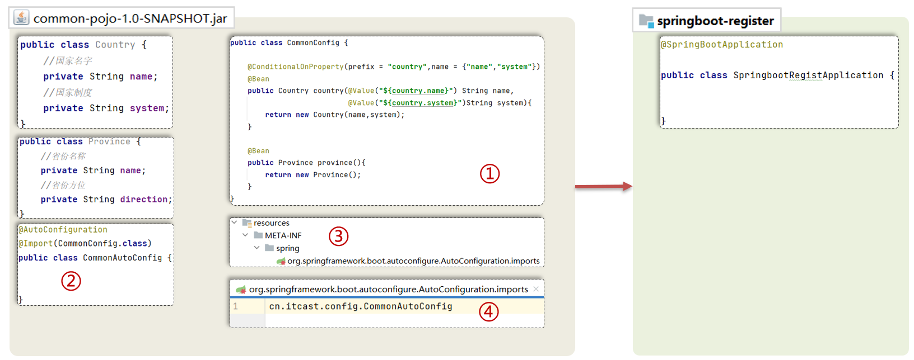
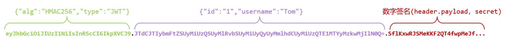
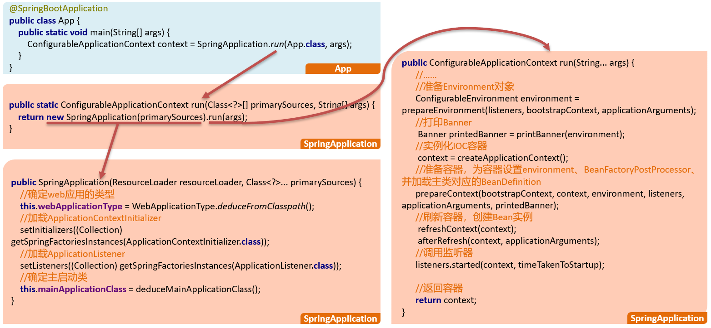
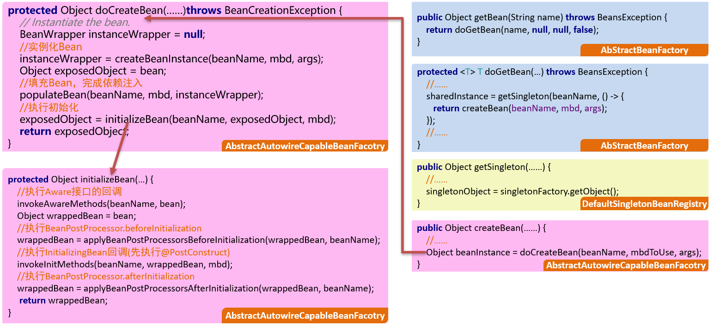

视频地址：https://www.bilibili.com/video/BV14z4y1N7pg

# 基础篇

## 01、SpringBoot概述

Spring Boot是Spring提供的一个子项目，用于快速构建Spring应用程序


### 传统方式构建spring应用

- 导入依赖繁琐
- 项目配置繁琐


### SpringBoot特性

#### 起步依赖

本质上就是一个Maven坐标，整合了完成一个功能需要的所有坐标


#### 自动配置

遵循约定大约配置的原则，在boot程序启动后，一些bean对象会自动注入到ioc容器，不需要手动声明，简化开发


#### 其他特性

- 内嵌的Tomcat、Jetty（无需部署WAR文件）
- 外部化配置
- 不需要XML配置(properties/yml)


## 02、SpringBoot入门

1. 创建Maven工程

2. 导入spring-boot-stater-web起步依赖

   ```xml
   <dependency>
     <groupId>org.springframework.boot</groupId>
     <artifactId>spring-boot-starter-web</artifactId>
   </dependency>
   ```

3. 提供启动类

   ```java
   @SpringBootApplication
   public class SpringbootQuickstartApplication {
   
       public static void main(String[] args) {
           SpringApplication.run(SpringbootQuickstartApplication.class, args);
       }
   
   }
   ```

4. 编写Controller

   ```java
   @RestController
   public class HelloController {
   
       @RequestMapping("/hello")
       public String hello() {
           return "hello springboot3";
       }
   
   }
   ```

## 03、配置文件

### application.properties

官网说明：docs.spring.io/spring-boot/docs/current/reference/html/application-properties.html#appendix.application-properties


### 配置文件格式

- application.properties
- application.yml / application.yaml

### yml配置文件的书写

- 值前边必须有空格，作为分隔符
- 使用空格作为缩进表示层级关系，相同的层级左侧对齐

### 配置获取

@Value("$键名")


@ConfigurationProperties(prefix="前缀")


## 04、整合mybatis

sql脚本

```sql
create database if not exists mybatis;

use mybatis;

create table user(
    id int unsigned primary key auto_increment comment 'ID',
    name varchar(100) comment '姓名',
    age tinyint unsigned comment '年龄',
    gender tinyint unsigned comment '性别, 1:男, 2:女',
    phone varchar(11) comment '手机号'
) comment '用户表';

insert into user(id, name, age, gender, phone) VALUES (null,'白眉鹰王',55,'1','18800000000');
insert into user(id, name, age, gender, phone) VALUES (null,'金毛狮王',45,'1','18800000001');
insert into user(id, name, age, gender, phone) VALUES (null,'青翼蝠王',38,'1','18800000002');
insert into user(id, name, age, gender, phone) VALUES (null,'紫衫龙王',42,'2','18800000003');
insert into user(id, name, age, gender, phone) VALUES (null,'光明左使',37,'1','18800000004');
insert into user(id, name, age, gender, phone) VALUES (null,'光明右使',48,'1','18800000005');

```

pom.xml

```xml
<dependencies>
        <dependency>
            <groupId>org.springframework.boot</groupId>
            <artifactId>spring-boot-starter-web</artifactId>
        </dependency>
        <dependency>
            <groupId>org.mybatis.spring.boot</groupId>
            <artifactId>mybatis-spring-boot-starter</artifactId>
            <version>3.0.3</version>
        </dependency>
        <dependency>
            <groupId>com.mysql</groupId>
            <artifactId>mysql-connector-j</artifactId>
        </dependency>

        <dependency>
            <groupId>org.springframework.boot</groupId>
            <artifactId>spring-boot-starter-test</artifactId>
            <scope>test</scope>
        </dependency>
        <dependency>
            <groupId>org.mybatis.spring.boot</groupId>
            <artifactId>mybatis-spring-boot-starter-test</artifactId>
            <version>3.0.3</version>
            <scope>test</scope>
        </dependency>
    </dependencies>
```

application.yml

```yml
spring:
  datasource:
    driver-class-name: com.mysql.cj.jdbc.Driver
    url: jdbc:mysql://localhost:3307/mybatis?useUnicode=true&characterEncoding=utf-8&useSSL=false&serverTimezone=Asia/Shanghai
    username: root
    password: 123456
```

启动类

```
@SpringBootApplication
public class SpringbootMybatisApplication {

    public static void main(String[] args) {
        SpringApplication.run(SpringbootMybatisApplication.class, args);
    }

}
```

controller、service、mapper、pojo略

## 05、bean管理

### Bean扫描

1、springboot的自动扫描


`@SpringBootApplication`为组合注解，其中的`@ComponentScan`起扫描bean的作用，当未指定扫描路径时，==默认扫描启动类所在的包及其子包==

2、如何扫描启动类所在包以外的bean

通过`@ComponentScan`指定扫描路径（可添加在启动上）

eg：`@ComponentScan(basePackage = "com.lrw")`

### Bean注册

| 注解        | 说明                 | 位置                                            |
| ----------- | -------------------- | ----------------------------------------------- |
| @Component  | 声明bean的基础注解   | 不属于以下三类时，用此注解                      |
| @Controller | @Component的衍生注解 | 标注在控制器类上                                |
| @Service    | @Component的衍生注解 | 标注在业务类上                                  |
| @Repository | @Component的衍生注解 | 标注在数据访问类上（由于与mybatis整合，用的少） |

如果要注册的对象来自第三方（不是自定义的），是无法用@Componet及衍生注解声明bean的

#### @Bean

如果要注册第三方bean，建议在配置类中集中注册

```java
@Configuration
public class CommonConfig {

    @Bean
    public Country country() {
        return new Country("china", "社会主义");
    }

    // bean对象的默认名称为方法名
    // @Bean("hunan") 指定bean对象的名称
    // 如果方法的内部使用需要使用到ioc容器中的对象，那么只需要在方法上声明即可，spring会自动注入
    @Bean("hunan")
    public Province province(Country country) {
        System.out.println("province:" + country);
        return new Province("湖南", "china");
    }

}
```

> 1. @Bean注册的对象默认名字为方法名，通过@Bean("xxx")指定名称
>
> 2. 如果方法的内部使用需要使用到ioc容器中的对象，那么只需要在方法上声明即可，spring会自动注入


#### @Import

`@Import(xxx.class)`导入单个类

`@Import({a.class, b.class})`导入多个类

**导入配置类**

```java
@Import({CommonConfig.class})
```

**导入ImportSelector接口实现类**

```java
@Import({CommonImportSelector.class})
```

```java
public class CommonImportSelector implements ImportSelector {

    // 方式一：全类名直接写在代码中
    // @Override
    // public String[] selectImports(AnnotationMetadata importingClassMetadata) {
    //     return new String[]{"com.lrw.config.CommonConfig"};
    // }

    // 方式二：通过读取配置文件
    @Override
    public String[] selectImports(AnnotationMetadata importingClassMetadata) {
        List<String> imports = new ArrayList<>();
        ClassLoader classLoader = getClass().getClassLoader();
        try (InputStream is = classLoader.getResourceAsStream("common.imports")) {
            InputStreamReader isr = new InputStreamReader(is, StandardCharsets.UTF_8);
            BufferedReader br = new BufferedReader(isr);
            String line = null;
            while ((line = br.readLine()) != null) {
                imports.add(line);
            }
        } catch (Exception e) {
            throw new RuntimeException(e);
        }
        return imports.toArray(new String[0]);
    }

}
```

### Bean注册条件

SpringBoot提供了设置注册生效条件的注解`@Conditional`

| 注解                    | 说明                                     |
| ----------------------- | ---------------------------------------- |
| @ConditionOnProperty    | 配置文件中存在对应的属性，才声明该bean   |
| @ConditionOnMissingBean | 当不存在当前类型的bean时，才声明该bean   |
| @ConditionOnClass       | 当前环境存在指定的这个类时，才声明该bean |

## 06、自动配置原理

### 自动配置-源码分析

程序引入spring-boot-starter-web 起步依赖，启动后，会自动往ioc容器中注入DispatcherServlet


### 自动配置



### SpringBoot自动配置原理

1. 在主启动类上添加了SpringBootApplication注解，这个注解组合了EnableAutoConfiguration注解
2. EnableAutoConfiguration注解又组合了Import注解，导入了AutoConfigurationImportSelector类
3. 实现selectImports方法，这个方法经过层层调用，最终会读取META-INF 目录下的 后缀名 为imorts的文件，当然了，boot2.7以前的版本，读取的是spring.factories文件
4. 读取到全类名了之后，会解析注册条件，也就是@Conditional及其衍生注解，把满足注册条件的Bean对象自动注入到IOC容器中


## 07、自定义starter


# 实战篇


## 01、环境搭建

- 执行资料中的big_event.sql脚本，准备数据库表

  ```sql
  -- 创建数据库
  create database big_event;
  
  -- 使用数据库
  use big_event;
  
  -- 用户表
  create table user (
                        id int unsigned primary key auto_increment comment 'ID',
                        username varchar(20) not null unique comment '用户名',
                        password varchar(32)  comment '密码',
                        nickname varchar(10)  default '' comment '昵称',
                        email varchar(128) default '' comment '邮箱',
                        user_pic varchar(128) default '' comment '头像',
                        create_time datetime not null comment '创建时间',
                        update_time datetime not null comment '修改时间'
  ) comment '用户表';
  
  -- 分类表
  create table category(
                           id int unsigned primary key auto_increment comment 'ID',
                           category_name varchar(32) not null comment '分类名称',
                           category_alias varchar(32) not null comment '分类别名',
                           create_user int unsigned not null comment '创建人ID',
                           create_time datetime not null comment '创建时间',
                           update_time datetime not null comment '修改时间',
                           constraint fk_category_user foreign key (create_user) references user(id) -- 外键约束
  );
  
  -- 文章表
  create table article(
                          id int unsigned primary key auto_increment comment 'ID',
                          title varchar(30) not null comment '文章标题',
                          content varchar(10000) not null comment '文章内容',
                          cover_img varchar(128) not null  comment '文章封面',
                          state varchar(3) default '草稿' comment '文章状态: 只能是[已发布] 或者 [草稿]',
                          category_id int unsigned comment '文章分类ID',
                          create_user int unsigned not null comment '创建人ID',
                          create_time datetime not null comment '创建时间',
                          update_time datetime not null comment '修改时间',
                          constraint fk_article_category foreign key (category_id) references category(id),-- 外键约束
                          constraint fk_article_user foreign key (create_user) references user(id) -- 外键约束
  )
  ```

- 创建springboot工程，引入对应的依赖（web、mybatis、mysql驱动）

  ```xml
  <?xml version="1.0" encoding="UTF-8"?>
  <project xmlns="http://maven.apache.org/POM/4.0.0"
           xmlns:xsi="http://www.w3.org/2001/XMLSchema-instance"
           xsi:schemaLocation="http://maven.apache.org/POM/4.0.0 http://maven.apache.org/xsd/maven-4.0.0.xsd">
      <modelVersion>4.0.0</modelVersion>
  
      <parent>
          <groupId>org.springframework.boot</groupId>
          <artifactId>spring-boot-starter-parent</artifactId>
          <version>3.3.1</version>
          <relativePath/>
      </parent>
  
      <groupId>com.lrw</groupId>
      <artifactId>big-event</artifactId>
      <version>1.0-SNAPSHOT</version>
  
      <properties>
          <maven.compiler.source>17</maven.compiler.source>
          <maven.compiler.target>17</maven.compiler.target>
          <project.build.sourceEncoding>UTF-8</project.build.sourceEncoding>
      </properties>
  
      <dependencies>
          <dependency>
              <groupId>org.springframework.boot</groupId>
              <artifactId>spring-boot-starter-web</artifactId>
          </dependency>
          <dependency>
              <groupId>org.mybatis.spring.boot</groupId>
              <artifactId>mybatis-spring-boot-starter</artifactId>
              <version>3.0.3</version>
          </dependency>
          <dependency>
              <groupId>com.mysql</groupId>
              <artifactId>mysql-connector-j</artifactId>
          </dependency>
          <dependency>
              <groupId>com.github.pagehelper</groupId>
              <artifactId>pagehelper-spring-boot-starter</artifactId>
              <version>1.4.7</version>
          </dependency>
          <dependency>
              <groupId>org.springframework.boot</groupId>
              <artifactId>spring-boot-starter-test</artifactId>
              <scope>test</scope>
          </dependency>
          <dependency>
              <groupId>org.projectlombok</groupId>
              <artifactId>lombok</artifactId>
          </dependency>
      </dependencies>
  
      <build>
          <plugins>
              <plugin>
                  <groupId>org.springframework.boot</groupId>
                  <artifactId>spring-boot-maven-plugin</artifactId>
              </plugin>
          </plugins>
      </build>
  
  </project>
  ```

- 配置文件application.yml中引入mybatis的配置信息

  ```yml
  spring:
    datasource:
      driver-class-name: com.mysql.cj.jdbc.Driver
      url: jdbc:mysql://localhost:3307/big_event?useUnicode=true&characterEncoding=utf-8&useSSL=false&serverTimezone=Asia/Shanghai
      username: root
      password: 123456
  mybatis:
    configuration:
      map-underscore-to-camel-case: true
      log-impl: org.apache.ibatis.logging.stdout.StdOutImpl
    mapper-locations: classpath:mapper/*.xml
  ```

- 创建包结构，并准备实体类

## 02、接口开发

### 开发接口的流程

- 明确需求
- 阅读接口文档
- 思路分析
- 开发
- 测试

### 参数校验

**Spring Validation**：Spring 提供的一个参数校验框架，使用预定义的注解完成参数校验。

引入Spring Validation 起步依赖

```xml
<dependency>
  <groupId>org.springframework.boot</groupId>
  <artifactId>spring-boot-starter-validation</artifactId>
</dependency>
```

#### 表单参数校验

1. 在参数前面添加@Pattern注解

   ```java
   @Pattern(regexp = "^\\S{5,16}$")
   ```

2. 在Controller类上添加@Validated注解

   ```java
   @Validated
   ```

#### 实体参数校验

实体类的成员变量上添加注解

- @NotNull
- @NotEmpty
- @Email

接口方法的实体参数上添加@Validated注解


#### 分组校验

把校验项进行归类分组，在完成不同的功能的时候，校验指定组中的校验项

1. 定义分组
2. 定义校验项时指定归属的分组
3. 校验时指定要校验的分组


```java
@Data
public class Category implements Serializable {
    /**
     * ID
     */
    @NotNull(groups = {Update.class})
    private Integer id;

    /**
     * 分类名称
     */
    @NotBlank
    private String categoryName;

    /**
     * 分类别名
     */
    @NotBlank
    private String categoryAlias;

    /**
     * 创建人ID
     */
    private Integer createUser;

    /**
     * 创建时间
     */
    @JsonFormat(pattern = "yyyy-MM-dd HH:mm:ss", timezone = "GMT+8")
    private Date createTime;

    /**
     * 修改时间
     */
    @JsonFormat(pattern = "yyyy-MM-dd HH:mm:ss", timezone = "GMT+8")
    private Date updateTime;

    private static final long serialVersionUID = 1L;

    public interface Add extends Default {

    }

    public interface Update extends Default {

    }
}
```

```java
@RestController
@RequestMapping("/category")
public class CategoryController {

    @Autowired
    private CategoryService categoryService;

    @PostMapping
    public Result add(@RequestBody @Validated(Category.Add.class) Category category) {
        categoryService.add(category);
        return Result.success();
    }

    @GetMapping
    public Result list() {
        return Result.success(categoryService.list());
    }

    @GetMapping("/detail")
    public Result detail(Integer id) {
        return Result.success(categoryService.detail(id));
    }

    @PutMapping
    public Result edit(@RequestBody @Validated(Category.Update.class) Category category) {
        categoryService.edit(category);
        return Result.success();
    }

    @DeleteMapping
    public Result delete(Integer id) {
        categoryService.delete(id);
        return Result.success();
    }

}
```

> 定义校验项时如果没有指定分组，则属于Default分组，分组可以继承

1. 如何定义分组？

   在实体类内部定义接口

2. 如何对校验项分组？

   通过groups属性指定

3. 校验时如何指定分组？

   给@Validated注解的value属性赋值

4. 校验项默认属于什么组?

   Default

#### 自定义校验

已有的注解不能满足所有的校验需求，特殊的情况需要自定义校验(自定义校验注解)

1. 自定义注解State
2. 自定义校验数据的类StateValidation
3. 实现ConstraintValidator接口
4. 在需要校验的地方使用自定义注解


### 全局异常处理

```java
@RestControllerAdvice
@Slf4j
public class GlobalExceptionHandler {

    @ExceptionHandler(value = {Exception.class})
    public Result exceptionHandler(Exception e) {
        log.error("Exception, errInfo: {}", e.getMessage(), e);
        return Result.error(StringUtils.hasLength(e.getMessage()) ? e.getMessage() : "服务器内部错误");
    }

}
```


### 登录认证

#### jwt

1. 概述

   - Header(头)，记录令牌类型和签名算法等
   - PayLoad(载荷)，携带自定义的信息
   - Signature(签名)，对头部和载荷进行加密计算得来

   

2. 使用

   - 引入java-jwt坐标

     ```xml
     <dependency>
       <groupId>com.auth0</groupId>
       <artifactId>java-jwt</artifactId>
       <version>4.4.0</version>
     </dependency>
     ```

   - 调用API生成或验证令牌

3. 生成

   ```java
   
   String token = JWT.create()
     .withClaim(“user”, 用户数据)
     .withExpiresAt(new Date(System.currentTimeMillis() + 1000*60*60))
     .sign(Algorithm.HMAC256(秘钥));
   ```

4. 验证

   ```java
   
   JWTVerifier jwtVerifier = JWT.require(Algorithm.HMAC256(“itheima”)).build();
   DecodedJWT decodedJWT = jwtVerifier.verify(令牌字符串);//抛异常解析失败
   Map<String, Claim> claims = decodedJWT.getClaims();
   ```

#### 流程


#### 实现

- 使用拦截器统一验证令牌
- 登录和注册接口需要放行

```java
@Component
public class LoginInterceptor implements HandlerInterceptor {

    @Override
    public boolean preHandle(HttpServletRequest request, HttpServletResponse response, Object handler) throws Exception {
        String token = request.getHeader("Authorization");
        try {
            Map<String, Object> claims = JwtUtil.parseToken(token);
            // 放行
            return true;
        } catch (Exception e) {
            e.printStackTrace();
            response.setStatus(HttpServletResponse.SC_UNAUTHORIZED);
            // 不放行
            return false;
        }
    }
}
```

```java
@Configuration
public class WebConfig implements WebMvcConfigurer {

    @Autowired
    private LoginInterceptor loginInterceptor;

    @Override
    public void addInterceptors(InterceptorRegistry registry) {
        registry.addInterceptor(loginInterceptor).excludePathPatterns("/user/login", "/user/register");
    }

}
```


### ThreadLocal线程局部变量

- 用来存取数据: set()/get()
- 使用ThreadLocal存储的数据，线程安全
- 用完记得调用remove方法释放

```java
@Component
public class LoginInterceptor implements HandlerInterceptor {

    @Override
    public boolean preHandle(HttpServletRequest request, HttpServletResponse response, Object handler) throws Exception {
        String token = request.getHeader("Authorization");
        try {
            Map<String, Object> claims = JwtUtil.parseToken(token);
            // 把认证信息存储到ThreadLocal中
            ThreadLocalUtil.set(claims);
            // 放行
            return true;
        } catch (Exception e) {
            e.printStackTrace();
            response.setStatus(HttpServletResponse.SC_UNAUTHORIZED);
            // 不放行
            return false;
        }
    }

    @Override
    public void afterCompletion(HttpServletRequest request, HttpServletResponse response, Object handler, Exception ex) throws Exception {
        // 清除ThreadLocal
        ThreadLocalUtil.remove();
    }
}
```

```java
// 获取当前用户id
Map<String, Object> map = ThreadLocalUtil.get();
Integer userId = (Integer) map.get("id");
```

### PageHelper分页查询

```xml
<dependency>
  <groupId>com.github.pagehelper</groupId>
  <artifactId>pagehelper-spring-boot-starter</artifactId>
  <version>1.4.7</version>
</dependency>
```

```java
@Mapper
public interface ArticleMapper {

    List<Article> list(Article article);
  
}
```

```java
@Override
public PageBean<Article> page(Integer pageNum, Integer pageSize, Integer categoryId, String state) {
    // 1.创建pageBean对象
    PageBean<Article> pageBean = new PageBean<>();
    // 2.开启分页查询 pageHelper
    PageHelper.startPage(pageNum, pageSize);
    // 3.调用mapper
    Integer userId = LoginUserUtil.getLoginUserId();
    Article article = Article.builder().categoryId(categoryId).state(state).createUser(userId).build();
    Page<Article> page = (Page<Article>) articleMapper.list(article);
    // 4.数据处理
    pageBean.setTotal(page.getTotal());
    pageBean.setItems(page.getResult());
    return pageBean;
}
```

### 阿里云OSS

阿里云对象存储OSS（Object Storage Service），是一款海量、安全、低成本、高可靠的云存储服务。使用OSS，您可以通过网络随时存储和调用包括文本、图片、音频和视频等在内的各种文件。


```xml
<!--阿里oss-->
<dependency>
  <groupId>com.aliyun.oss</groupId>
  <artifactId>aliyun-sdk-oss</artifactId>
  <version>3.17.4</version>
</dependency>
<dependency>
  <groupId>javax.xml.bind</groupId>
  <artifactId>jaxb-api</artifactId>
  <version>2.3.1</version>
</dependency>
<dependency>
  <groupId>javax.activation</groupId>
  <artifactId>activation</artifactId>
  <version>1.1.1</version>
</dependency>
<!-- no more than 2.3.3-->
<dependency>
  <groupId>org.glassfish.jaxb</groupId>
  <artifactId>jaxb-runtime</artifactId>
  <version>2.3.3</version>
</dependency>
```

```java
public class AliOssUtil {

    // Endpoint以华东1（杭州）为例，其它Region请按实际情况填写。
    private final static String ENDPOINT = "https://oss-cn-guangzhou.aliyuncs.com";
    private final static String ACCESS_KEY_ID = "LTAI5tGUpLHBqzHDSUUojfV7";
    private final static String ACCESS_KEY_SECRET = "7OV1kTj3uSkwftD30jCDQO8SEjoHhz";
    // 填写Bucket名称，例如examplebucket。
    private final static String BUCKET_NAME = "big-event-lrw";

    public static String upload(String objectName, InputStream in) {

        // 从环境变量中获取访问凭证。运行本代码示例之前，请确保已设置环境变量OSS_ACCESS_KEY_ID和OSS_ACCESS_KEY_SECRET。
        // EnvironmentVariableCredentialsProvider credentialsProvider = CredentialsProviderFactory.newEnvironmentVariableCredentialsProvider();

        // 填写Object完整路径，例如exampledir/exampleobject.txt。Object完整路径中不能包含Bucket名称。
        // String objectName = "exampledir/exampleobject.txt";

        // 创建OSSClient实例。
        OSS ossClient = new OSSClientBuilder().build(ENDPOINT, ACCESS_KEY_ID, ACCESS_KEY_SECRET);
        //公文访问地址
        String url = "";
        try {
            // String content = "Hello OSS";
            // ossClient.putObject(BUCKET_NAME, objectName, new ByteArrayInputStream(content.getBytes()));
            ossClient.putObject(BUCKET_NAME, objectName, in);
            url = "https://" + BUCKET_NAME + "." + ENDPOINT.substring(ENDPOINT.lastIndexOf("/") + 1) + "/" + objectName;
        } catch (OSSException oe) {
            System.out.println("Caught an OSSException, which means your request made it to OSS, "
                    + "but was rejected with an error response for some reason.");
            System.out.println("Error Message:" + oe.getErrorMessage());
            System.out.println("Error Code:" + oe.getErrorCode());
            System.out.println("Request ID:" + oe.getRequestId());
            System.out.println("Host ID:" + oe.getHostId());
        } catch (ClientException ce) {
            System.out.println("Caught an ClientException, which means the client encountered "
                    + "a serious internal problem while trying to communicate with OSS, "
                    + "such as not being able to access the network.");
            System.out.println("Error Message:" + ce.getMessage());
        } finally {
            if (ossClient != null) {
                ossClient.shutdown();
            }
        }
        return url;
    }

}
```

```java
@RestController
public class FileUploadController {

    @PostMapping("/upload")
    public Result upload(MultipartFile file) throws IOException {
        String originalFilename = file.getOriginalFilename();
        String extension = StringUtils.getFilenameExtension(originalFilename);
        String fileName = UUID.randomUUID().toString() + "." + extension;
        // file.transferTo(new File("C:\\Users\\luoriwang\\Desktop\\" + fileName));
        String url = AliOssUtil.upload(fileName, file.getInputStream());
        return Result.success(url);
    }

}
```

### 登录优化-redis

#### springboot集成redis

1. 导入spring-boot-starter-data-redis起步依赖

   ```xml
   <!--redis-->
   <dependency>
     <groupId>org.springframework.boot</groupId>
     <artifactId>spring-boot-starter-data-redis</artifactId>
   </dependency>
   ```

2. 在yml配置文件中, 配置redis连接信息

   ```yml
   spring:
     data:
       redis:
         host: localhost
         port: 6379
   ```

3. 调用API(StringRedisTemplate)完成字符串的存取操作

#### 令牌主动失效机制


- 登录成功后，给浏览器响应令牌的同时，把该令牌存储到redis中

  ```java
  @RequestMapping(value = "/login", method = RequestMethod.POST)
  public Result login(@Pattern(regexp = "^\\S{5,16}$") String username, @Pattern(regexp = "^\\S{5,16}$") String password) {
    // 根据用户名查找用户信息
    User user = userService.findByUsername(username);
    if (user == null) {
      return Result.error("用户名错误");
    }
    // 校验密码
    String md5Password = Md5Util.getMD5String(password);
    if (!Objects.equals(md5Password, user.getPassword())) {
      return Result.error("密码错误");
    }
    // 生成token
    Map<String, Object> claims = new HashMap<>();
    claims.put("id", user.getId());
    claims.put("username", user.getUsername());
    String token = JwtUtil.genToken(claims);
    // 令牌存储到redis中
    stringRedisTemplate.opsForValue().set(token, token, 60 * 60 * 12, TimeUnit.SECONDS);
    return Result.success(token);
  }
  ```

- LoginInterceptor拦截器中，需要验证浏览器携带的令牌，并同时需要获取到redis中存储的与之相同的令牌

  ```java
  @Component
  public class LoginInterceptor implements HandlerInterceptor {
  
      @Autowired
      private StringRedisTemplate stringRedisTemplate;
  
      @Override
      public boolean preHandle(HttpServletRequest request, HttpServletResponse response, Object handler) throws Exception {
          String token = request.getHeader("Authorization");
          try {
              // 从redis中查询token
              String s = stringRedisTemplate.opsForValue().get(token);
              if (s == null) {
                  throw new RuntimeException("无效token");
              }
              Map<String, Object> claims = JwtUtil.parseToken(token);
              // 把认证信息存储到ThreadLocal中
              ThreadLocalUtil.set(claims);
              // 放行
              return true;
          } catch (Exception e) {
              e.printStackTrace();
              response.setStatus(HttpServletResponse.SC_UNAUTHORIZED);
              // 不放行
              return false;
          }
      }
  
      @Override
      public void afterCompletion(HttpServletRequest request, HttpServletResponse response, Object handler, Exception ex) throws Exception {
          // 清除ThreadLocal
          ThreadLocalUtil.remove();
      }
  }
  ```

- 当用户修改密码成功后，删除redis中存储的旧令牌

  ```java
  @RequestMapping(value = "/updatePwd", method = RequestMethod.PATCH)
  public Result updatePwd(@Validated @RequestBody UpdatePwdDto updatePwdDto, @RequestHeader("Authorization") String token) {
    // 原密码是否正确
    Map<String, Object> map = ThreadLocalUtil.get();
    String username = (String) map.get("username");
    User user = userService.findByUsername(username);
    if (!Objects.equals(Md5Util.getMD5String(updatePwdDto.getOldPwd()), user.getPassword())) {
      return Result.error("原密码错误");
    }
    // newPwd和rePwd是否一致
    if (!Objects.equals(updatePwdDto.getNewPwd(), updatePwdDto.getRePwd())) {
      return Result.error("两次密码不一致");
    }
    userService.updatePwd(updatePwdDto.getNewPwd());
    // 修改秘密成功后，删除redis中存储的旧token
    stringRedisTemplate.opsForValue().getOperations().delete(token);
    return Result.success();
  }
  ```

  

## 03、SpringBoot项目部署

```xml
<build>
  <plugins>
    <plugin>
      <groupId>org.springframework.boot</groupId>
      <artifactId>spring-boot-maven-plugin</artifactId>
    </plugin>
  </plugins>
</build>
```

1. 如何生成jar包？
   执行package命令即可
2. 如何运行jar包?
   Java –jar jar包位置
3. Jar包部署对服务器有什么要求？
   必须有jre环境

## 04、属性配置方式

### 项目内部配置文件方式


### 命令行参数方式


### 环境变量方式


### 外部配置文件方式


### 配置优先级


由高到低：命令行参数 ==》环境变量 ==》外部配置文件 ==》项目内部配置文件

## 05、多环境开发-Profiles

### 单文件配置

- ---  分隔不同环境的配置
- spring.config.activate.on-profile 配置所属的环境
- spring.profiles.active 激活环境

```yml
#公共配置
spring:
  profiles:
    active: pro

---
#开发环境
spring:
  config:
    activate:
      on-profile: dev
server:
  port: 8081

---
#测试环境
spring:
  config:
    activate:
      on-profile: test
server:
  port: 8082

---
#生产环境
spring:
  config:
    activate:
      on-profile: pro
server:
  port: 8083
```


### 多文件配置

- 通过多个文件分别配置不同环境的属性
- 文件的名字为 application-环境名称.yml
- 在application.yml中激活环境

application.yml

```yml
spring:
  profiles:
    active: dev
```

application-dev.yml

```yml
server:
  port: 8081
```

application-test.yml

```yml
server:
  port: 8082
```

application-pro.yml

```yml
server:
  port: 8083
```


### 分组配置

- 按照配置的类别，把配置信息配置到不同的配置文件中

  application-分类名.yml

- 在application.yml中定义分组

  spring.profiles.group

- 在application.yml中激活分组

  spring.profiles.active

```yml
spring:
  profiles:
    active: dev
    group:
      "dev": devDB,devRedis,devMVC
      "test": testDB,testRedis,testMVC
      "pro": proDB,proRedis,proMVC
# 这里启动dev组，配置文件扫描顺序是：dev 》 devDB 》 devRedis 》 devMVC      
# 当主环境dev与其他环境有相同属性时，主环境属性失效；其他环境中有相同的属性时，最后加载的环境属性生效
```


# 前端

## html + css + js

Java程序员学前端：https://www.bilibili.com/video/BV1Tt4y1772f

P1~P38

### JavaScript-导入导出

#### 导入整个js文件

export.js

```javascript
//简单的展示信息
function simpleMessage(msg) {
    console.log(msg)
}

//复杂的展示信息
function complexMessage(msg) {
    console.log(new Date() + ": " + msg)
}

```

import.html

```html
<!DOCTYPE html>
<html lang="en">
<head>
    <meta charset="UTF-8">
    <title>Title</title>
</head>
    <div>
        <button id="btn">点我展示信息</button>
        <!--导入export.js文件的全部内容-->
        <script src="export.js"></script>
        <script>
            document.getElementById("btn").onclick = function () {
                complexMessage('bbbb')
            }
        </script>
    </div>
</html>
```

#### 按需导入

方式一：


方式二：


### 默认导出


## Vue

Vue 是一款用于构建用户界面的渐进式的JavaScript框架。 （官方：https://cn.vuejs.org/）

### 01、快速入门

- 准备

  准备html页面,并引入Vue模块（官方提供）

  创建Vue程序的应用实例

  准备元素(div)，被Vue控制

- 构建用户界面

  准备数据

  通过插值表达式渲染页面

```html
<!DOCTYPE html>
<html lang="en">
<head>
    <meta charset="UTF-8">
    <title>Title</title>
</head>
<body>
<div id="app">
    <h1>{{message}}</h1>
</div>

<script type="module">
    import {createApp} from 'https://unpkg.com/vue@3/dist/vue.esm-browser.js'

    createApp({
        data() {
            return {
                message: 'Hello Vue!'
            }
        }
    }).mount('#app')
</script>
</body>
</html>
```

### 02、常用指令

指令：HTML标签上带有 v-前缀的特殊属性，不同的指令具有不同的含义，可以实现不同的功能。

常用指令：

| **指令**              | **作用**                                            |
| --------------------- | --------------------------------------------------- |
| v-for                 | 列表渲染，遍历容器的元素或者对象的属性              |
| v-bind                | 为HTML标签绑定属性值，如设置 href , css样式等       |
| v-if/v-else-if/v-else | 条件性的渲染某元素，判定为true时渲染,否则不渲染     |
| v-show                | 根据条件展示某元素，区别在于切换的是display属性的值 |
| v-model               | 在表单元素上创建双向数据绑定                        |
| v-on                  | 为HTML标签绑定事件                                  |

#### v-for

- 作用：列表渲染，遍历容器的元素或者对象的属性

- 语法： `v-for = "(item,index) in items"`

  参数说明：

  items 为遍历的数组

  item 为遍历出来的元素

  index 为索引/下标，从0开始 ；可以省略，省略index语法： v-for = "item in items"

> 遍历的数组，必须在data中定义； 要想让哪个标签循环展示多次，就在哪个标签上使用 v-for 指令。

```html
<!DOCTYPE html>
<html lang="en">
<head>
    <meta charset="UTF-8">
    <meta name="viewport" content="width=device-width, initial-scale=1.0">
    <title>Document</title>
</head>
<body>

<div id="app">
    <table border="1 solid" colspa="0" cellspacing="0">
        <tr>
            <th>文章标题</th>
            <th>分类</th>
            <th>发表时间</th>
            <th>状态</th>
            <th>操作</th>
        </tr>
        <tr v-for="(article, index) in articleList">
            <td>{{article.title}}</td>
            <td>{{article.category}}</td>
            <td>{{article.time}}</td>
            <td>{{article.state}}</td>
            <td>
                <button>编辑</button>
                <button>删除</button>
            </td>
        </tr>
    </table>
</div>

<script type="module">
    //导入vue模块
    import {createApp} from './vue.js'
    //创建应用实例
    createApp({
        data() {
            return {
                articleList: [
                    {
                        title: "医疗反腐绝非砍医护收入",
                        category: "时事",
                        time: "2023-09-5",
                        state: "已发布"
                    },
                    {
                        title: "中国男篮缘何一败涂地？",
                        category: "篮球",
                        time: "2023-09-5",
                        state: "草稿"
                    },
                    {
                        title: "华山景区已受大风影响阵风达7-8级，未来24小时将持续",
                        category: "旅游",
                        time: "2023-09-5",
                        state: "已发布"
                    }
                ]
            }
        }
    }).mount("#app")//控制页面元素
</script>
</body>
</html>
```

#### v-bind

作用：动态为HTML标签绑定属性值，如设置href，src，style样式等。

语法：v-bind:属性名="属性值"

简化：:属性名="属性值"

```html
<!DOCTYPE html>
<html lang="en">
<head>
    <meta charset="UTF-8">
    <meta name="viewport" content="width=device-width, initial-scale=1.0">
    <title>Document</title>
</head>
<body>
<div id="app">
    <a v-bind:href="url">黑马官网</a>
</div>

<script type="module">
    //引入vue模块
    import {createApp} from './vue.js'
    //创建vue应用实例
    createApp({
        data() {
            return {
                url: 'https://www.itheima.com'
            }
        }
    }).mount("#app")//控制html元素
</script>
</body>
</html>
```

#### v-if & v-show

作用：这两类指令，都是用来控制元素的显示与隐藏的

v-if
语法：v-if="表达式"，表达式值为 true，显示；false，隐藏
其它：可以配合 v-else-if / v-else 进行链式调用条件判断
原理：==基于条件判断，来控制创建或移除元素节点（条件渲染）==
场景：要么显示，要么不显示，不频繁切换的场景

v-show
语法：v-show="表达式"，表达式值为 true，显示；false，隐藏
原理：==基于CSS样式display来控制显示与隐藏==
场景：频繁切换显示隐藏的场景

```html
<!DOCTYPE html>
<html lang="en">

<head>
    <meta charset="UTF-8">
    <meta name="viewport" content="width=device-width, initial-scale=1.0">
    <title>Document</title>
</head>

<body>
    <div id="app">

        手链价格为:
        <span v-if="0 <= this.levle && this.levle <= 1">9.9</span>
        <span v-else-if="2 <= this.levle && this.levle <= 4">19.9</span>
        <span v-else>29.9</span>

        <br />

        手链价格为:
        <span v-show="0 <= this.levle && this.levle <= 1">9.9</span>
        <span v-show="2 <= this.levle && this.levle <= 4">19.9</span>
        <span v-show="5 <= this.levle">29.9</span>

    </div>

    <script type="module">
        //导入vue模块
        import { createApp } from './vue.js'

        //创建vue应用实例
        createApp({
            data() {
                return {
                    levle: 2
                }
            }
        }).mount("#app")//控制html元素
    </script>
</body>

</html>
```

#### v-on

作用：为html标签绑定事件

语法：v-on:事件名="函数名"

简写:  @事件名="函数名"

```html
<!DOCTYPE html>
<html lang="en">

<head>
    <meta charset="UTF-8">
    <meta name="viewport" content="width=device-width, initial-scale=1.0">
    <title>Document</title>
</head>

<body>
    <div id="app">
        <button v-on:click="money()">点我有惊喜</button> &nbsp;
        <button @click="love()">再点更惊喜</button>
    </div>

    <script type="module">
        //导入vue模块
        import { createApp } from './vue.js'

        //创建vue应用实例
        createApp({
            data() {
                return {
                    //定义数据
                }
            },
            methods: {
                money: function () {
                    alert('送你100元')
                },
                love: function () {
                    alert('爱你一万年')
                }
            },
        }).mount("#app");//控制html元素

    </script>
</body>

</html>
```

#### v-model

作用：在表单元素上使用，双向数据绑定。可以方便的 获取 或 设置 表单项数据

语法：v-model="变量名"

> v-model 中绑定的变量，必须在data中定义。

```html
<!DOCTYPE html>
<html lang="en">

<head>
    <meta charset="UTF-8">
    <meta name="viewport" content="width=device-width, initial-scale=1.0">
    <title>Document</title>
</head>

<body>
    <div id="app">

        文章分类: <input type="text" v-model="searchCondition.category" /><span>{{searchCondition.category}}</span>

        发布状态: <input type="text" v-model="searchCondition.state" /><span>{{searchCondition.state}}</span>

        <button>搜索</button>

        <button @click="reset">重置</button></button>

        <br />
        <br />
        <table border="1 solid" colspa="0" cellspacing="0">
            <tr>
                <th>文章标题</th>
                <th>分类</th>
                <th>发表时间</th>
                <th>状态</th>
                <th>操作</th>
            </tr>
            <tr v-for="(article,index) in articleList">
                <td>{{article.title}}</td>
                <td>{{article.category}}</td>
                <td>{{article.time}}</td>
                <td>{{article.state}}</td>
                <td>
                    <button>编辑</button>
                    <button>删除</button>
                </td>
            </tr>
        </table>
    </div>
    <script type="module">
        //导入vue模块
        import { createApp } from './vue.js'
        //创建vue应用实例
        createApp({
            data() {
                return {
                    //搜索条件
                    searchCondition: {
                        category: '',
                        state: ''
                    },
                    //定义数据
                    articleList: [{
                        title: "医疗反腐绝非砍医护收入",
                        category: "时事",
                        time: "2023-09-5",
                        state: "已发布"
                    },
                    {
                        title: "中国男篮缘何一败涂地？",
                        category: "篮球",
                        time: "2023-09-5",
                        state: "草稿"
                    },
                    {
                        title: "华山景区已受大风影响阵风达7-8级，未来24小时将持续",
                        category: "旅游",
                        time: "2023-09-5",
                        state: "已发布"
                    }]
                }
            },
            methods: {
                reset: function () {
                    this.searchCondition.category = '';
                    this.searchCondition.state = '';
                }
            },
        }).mount("#app")//控制html元素
    </script>
</body>

</html>
```

### 03、生命周期

#### Vue生命周期

生命周期：指一个对象从创建到销毁的整个过程。

生命周期的八个阶段：每个阶段会自动执行一个生命周期方法(钩子)，让开发者有机会在特定的阶段执行自己的代码


| **状态**      | **阶段周期** |
| ------------- | ------------ |
| beforeCreate  | 创建前       |
| created       | 创建后       |
| beforeMount   | 载入前       |
| mounted       | 挂载完成     |
| beforeUpdate  | 数据更新前   |
| updated       | 数据更新后   |
| beforeUnmount | 组件销毁前   |
| unmounted     | 组件销毁后   |

Vue生命周期典型的应用场景 ？

在页面加载完毕时，发起异步请求，加载数据，渲染页面。

```html
//生命周期-钩子函数 mounted
mounted() {
	console.log('Vue挂载完毕, 发送请求获取数据 ...’);
}
```

#### Axios

介绍：Axios 对原生的Ajax进行了封装，简化书写，快速开发。

官网：https://www.axios-http.cn/

Axios 发送异步请求

- GET: 

  axios.get(url).then((res)=>{…}).catch((err)=>{…})

- POST: 

  axios.post(url,data).then((res)=>{…}).catch((err)=>{…})


```html
<!DOCTYPE html>
<html lang="en">

<head>
  <meta charset="UTF-8">
  <meta name="viewport" content="width=device-width, initial-scale=1.0">
  <title>Document</title>
</head>

<body>
  <div id="app">

  </div>

  <!-- 导入axios -->
  <script src="https://unpkg.com/axios/dist/axios.min.js"></script>

  <script type="module">
    //导入vue模块
    import { createApp } from './vue.js'

    //创建vue应用实例
    createApp({
      data() {

      },
      mounted() {
        axios.get('http://localhost:8080/article/getAll').then((result) => {
          console.log(result.data);
        }).catch((err) => {
          console.log(err);
        });
      },
    }).mount("#app")//控制html元素
  </script>
</body>

</html>
```

### 04、案例

 使用表格展示所有文章的数据，并完成条件搜索功能

- 钩子函数mounted中，获取所有的文章数据
- 使用v-for指令，把数据渲染到表格上展示
- 使用v-model指令，完成表单数据的双向绑定
- 使用v-on指令，为搜索按钮绑定单击事件


```html
<!DOCTYPE html>
<html lang="en">

<head>
    <meta charset="UTF-8">
    <meta name="viewport" content="width=device-width, initial-scale=1.0">
    <title>Document</title>
</head>

<body>
    <div id="app">

        文章分类: <input type="text" v-model="searchCondition.category">

        发布状态: <input type="text" v-model="searchCondition.state">

        <button @click="search">搜索</button>

        <br />
        <br />
        <table border="1 solid" colspa="0" cellspacing="0">
            <tr>
                <th>文章标题</th>
                <th>分类</th>
                <th>发表时间</th>
                <th>状态</th>
                <th>操作</th>
            </tr>
            <tr v-for="(article, index) in articleList" :key="index">
                <td>{{article.title}}</td>
                <td>{{article.category}}</td>
                <td>{{article.time}}</td>
                <td>{{article.state}}</td>
                <td>
                    <button>编辑</button>
                    <button>删除</button>
                </td>
            </tr>
        </table>
    </div>

    <!-- 导入axios -->
    <script src="https://unpkg.com/axios/dist/axios.min.js"></script>

    <script type="module">
        //导入vue模块
        import { createApp } from './vue.js'

        createApp({
            data() {
                return {
                    searchCondition: {
                        category: '',
                        state: ''
                    },
                    articleList: []
                }
            },
            methods: {
                search: function () {
                    axios.get('http://localhost:8080/article/search?category=' + this.searchCondition.category + '&state=' + this.searchCondition.state).then((result) => {
                        this.articleList = result.data
                    }).catch((err) => {
                        console.log(err);
                    });
                }
            },
            mounted() {
                axios.get('http://localhost:8080/article/getAll').then((result) => {
                    this.articleList = result.data
                }).catch((err) => {
                    console.log(err);
                });
            },
        }).mount("#app")//控制html元素
    </script>

</body>

</html>
```

## Vue工程化

### 环境准备

安装nodejs

### Vue项目创建和启动

#### 创建

创建一个工程化的Vue项目，执行命令：`npm init vue@latest`


> 执行上述指令，将会安装并执行 create-vue，它是 Vue 官方的项目脚手架工具

#### 安装依赖

进入项目目录，执行命令安装当前项目的依赖：`npm install`


> 创建项目以及安装依赖的过程，都是需要联网的。

#### 启动

依赖安装完成后，执行命令启动项目：`npm run dev`


#### 目录结构


### API风格

Vue的组件有两种不同的风格：**组合式API** 和 **选项式API**


#### 组合式API

- setup：是一个标识，告诉Vue需要进行一些处理，让我们可以更简洁的使用组合式API。
- ref()：接收一个内部值，返回一个响应式的ref对象，此对象只有一个指向内部值的属性 value。
- onMounted()：在组合式API中的钩子方法，注册一个回调函数，在组件挂载完成后执行。

#### 选项式API

可以用包含多个选项的对象来描述组件的逻辑，如：data，methods，mounted等。

### 案例

 使用表格展示所有文章的数据, 并完成条件搜索功能


- 钩子函数mounted中，获取所有的文章数据
- 使用v-for指令，把数据渲染到表格上展示
- 使用v-model指令完成表单数据的双向绑定
- 使用v-on指令为搜索按钮绑定单击事件

## Element Plus

- Element：是饿了么团队研发的，基于 Vue 3，面向设计师和开发者的组件库。
- 组件：组成网页的部件，例如 超链接、按钮、图片、表格、表单、分页条等等。
- 官网：https://element-plus.org/zh-CN/#/zh-CN

### 快速入门

1. 准备工作：

   - 创建一个工程化的vue项目

   - 参照官方文档，安装Element Plus组件库（在当前工程的目录下）：`npm install element-plus --save`

   - main.js中引入Element Plus组件库（参照官方文档）

     ```javascript
     import { createApp } from 'vue'
     import App from './App.vue'
     
     //引入ElementPlus
     import ElementPlus from 'element-plus'
     import 'element-plus/dist/index.css'
     
     const app = createApp(App)
     
     app.use(ElementPlus)
     app.mount('#app')
     ```

     

2. 制作组件：
   - 访问Element官方文档，复制组件代码，调整


### 常用组件


```vue
<script lang="ts" setup>
import { reactive } from "vue";

const formInline = reactive({
  user: "",
  region: "",
  date: "",
});

const onSubmit = () => {
  console.log("submit!");
};

const tableData = [
  {
    title: "标题1",
    category: "时事",
    time: "2000-01-01",
    state: "已发布",
  },
  {
    title: "标题1",
    category: "时事",
    time: "2000-01-01",
    state: "已发布",
  },
  {
    title: "标题1",
    category: "时事",
    time: "2000-01-01",
    state: "已发布",
  },
  {
    title: "标题1",
    category: "时事",
    time: "2000-01-01",
    state: "已发布",
  },
];

import { Delete, Edit } from "@element-plus/icons-vue";

import { ref } from "vue";
const currentPage4 = ref(4);
const pageSize4 = ref(5);
const small = ref(false);
const disabled = ref(false);
const background = ref(false);

const handleSizeChange = (val: number) => {
  console.log(`${val} items per page`);
};
const handleCurrentChange = (val: number) => {
  console.log(`current page: ${val}`);
};
</script>

<template>
  <el-card>
    <div class="card-header">
      <span>文章管理</span>
      <el-button type="primary">发布文章</el-button>
    </div>

    <div style="margin-top: 20px"><hr /></div>

    <el-form :inline="true" :model="formInline" class="demo-form-inline">
      <el-form-item label="文章分类">
        <el-select v-model="formInline.region" placeholder="请选择" clearable>
          <el-option label="时事" value="时事" />
          <el-option label="军事" value="军事" />
        </el-select>
      </el-form-item>
      <el-form-item label="发布状态">
        <el-select v-model="formInline.region" placeholder="请选择" clearable>
          <el-option label="已发布" value="已发布" />
          <el-option label="草稿" value="草稿" />
        </el-select>
      </el-form-item>
      <el-form-item>
        <el-button type="primary" @click="onSubmit">搜索</el-button>
        <el-button type="default" @click="onSubmit">重置</el-button>
      </el-form-item>
    </el-form>

    <el-table :data="tableData" style="width: 100%">
      <el-table-column prop="title" label="文章标题" />
      <el-table-column prop="category" label="分类" />
      <el-table-column prop="time" label="发表时间" />
      <el-table-column prop="state" label="状态" />
      <el-table-column label="操作" width="180">
        <el-button type="primary" :icon="Edit" circle />
        <el-button type="danger" :icon="Delete" circle />
      </el-table-column>
    </el-table>

    <el-pagination
      class="el-p"
      v-model:current-page="currentPage4"
      v-model:page-size="pageSize4"
      :page-sizes="[5, 10, 20, 50]"
      :small="small"
      :disabled="disabled"
      :background="background"
      layout="jumper , total, sizes, prev, pager, next"
      :total="20"
      @size-change="handleSizeChange"
      @current-change="handleCurrentChange"
    />
  </el-card>
</template>

<style>
.card-header {
  display: flex;
  justify-content: space-between;
}

.demo-form-inline .el-input {
  --el-input-width: 220px;
}

.demo-form-inline .el-select {
  --el-select-width: 220px;
}

.el-p {
  margin-top: 20px;
  display: flex;
  justify-content: flex-end;
}
</style>

```

## 大事件

### 环境准备

1. 创建Vue工程

   `npm init vue@latest`

2. 安装依赖

   Element-Plus

   `npm install element-plus --save`

   Axios

   `npm install axios`

   Sass

   `npm install sass -D`

3. 目录调整

   - 删除components下面自动生成的内容
   - 新建目录api、utils、views
   - 将资料中的静态资源拷贝到assets目录下
   - 删除App.uve中自动生成的内容

### 开发步骤


1. 搭建页面

2. 数据绑定

   参考接口文档给属性起名

3. 表单校验

   el-form标签上通过rules属性，绑定校验规则
   el-form-item标签上通过prop属性，指定校验项

4. 调用后台接口

### 跨域

由于浏览器的==同源策略==限制，向不同源(**不同协议、不同域名、不同端口**)发送ajax请求会失败

解决跨域：配置代理


- request.js中配置baseURL的值为/api

  ```javascript
  import axios from "axios";
  
  const baseURL = "/api"
  const instance = axios.create({ baseURL })
  
  export default instance;
  ```

- vite.config.js中配置：

  ```javascript
  import { fileURLToPath, URL } from 'node:url'
  
  import { defineConfig } from 'vite'
  import vue from '@vitejs/plugin-vue'
  
  // https://vitejs.dev/config/
  export default defineConfig({
    plugins: [
      vue(),
    ],
    resolve: {
      alias: {
        '@': fileURLToPath(new URL('./src', import.meta.url))
      }
    },
    server: {
      //配置代理
      proxy: {
        '/api': {
          changeOrigin: true, // 是否改变请求域名
          target: 'http://localhost:8080', // 后端服务器地址
          rewrite: (path) => path.replace(/^\/api/, '') //将原有请求路径中的api替换为''
        }
      }
    },
  })
  ```

浏览器发送请求：http://localhost:5173/api/user/register

代理服务器发送请求：http://127.0.0.1:8080/user/register

浏览器发送请求到代理服务器，代理服务器发送请求到后端服务，浏览器和代理服务器同源（http://localhost:5173），代理服务器和后端服务不存在跨域问题（只有浏览器才存在跨域问题）

上线时配置nginx代理，不需要前端代理服务器（前端代理用于前端开始时解决跨域问题）

### Axios响应拦截器

统一处理响应数据，request.js文件中，对axios统一添加响应拦截器

```javascript
import axios from "axios";

const baseURL = "/api"
const instance = axios.create({ baseURL })

// 添加响应拦截器
instance.interceptors.response.use(
  result => {
    //如果业务状态码为0，代表本次操作成功
    if (result.data.code == 0) {
      return result.data;
    }
    //代码走到这里，代表业务状态码不是0，本次操作失败
    alert(result.data.message || '服务异常');
    return Promise.reject(result.data);//异步的状态转化成失败的状态
  },
  err => {
    alert('服务异常');
    return Promise.reject(err);//异步的状态转化成失败的状态
  }
)

export default instance;
```

### 路由

- 路由，决定从起点到终点的路径的进程
- 在前端工程中，路由指的是根据不同的访问路径，展示不同组件的内容
- Vue Router是Vue.js的官方路由


#### Vue Router

- 安装vue-router    npm install vue-router@4
- 在src/router/index.js中创建路由器，并导出
- 在vue应用实例中使用vue-router
- 声明router-view标签，展示组件内容

index.js

```javascript
//导入vue-router
import { createRouter, createWebHistory } from 'vue-router'

//定义路由关系
const routes = [
    { path: '/login', component: () => import('@/views/Login.vue') },
    { path: '/', component: () => import('@/views/Layout.vue') }
]

//创建路由器
const router = createRouter({
    history: createWebHistory(),
    routes: routes
});

export default router
```

main.js

```javascript
import router from '@/router/index.js'

app.use(router)
```

App.vue

```vue
<template>
  <router-view></router-view>
</template>
```


#### 路由器如何切换组件？

```javascript
import { useRouter } from 'vue-router'
const router = useRouter();

router.push('/')
```


#### 子路由

- 复制资料中提供好的五个组件
- 配置子路由
- 声明router-view标签
- 为菜单项 el-menu-item 设置index属性，设置点击后的路由路径

```javascript
//定义路由关系
const routes = [
  { path: '/login', component: () => import('@/views/Login.vue') },
  {
    path: '/',
    component: () => import('@/views/Layout.vue'),
    // 重定向
    redirect: '/article/manage',
    // 子路由
    children: [
      { path: '/article/category', component: () => import('@/views/article/ArticleCategory.vue') },
      { path: '/article/manage', component: () => import('@/views/article/ArticleManage.vue') },
      { path: '/user/info', component: () => import('@/views/user/UserInfo.vue') },
      { path: '/user/avatar', component: () => import('@/views/user/UserAvatar.vue') },
      { path: '/user/resetPassword', component: () => import('@/views/user/UserResetPassword.vue') },
    ]
  }
]
```


### Pinia状态管理库

Pinia是Vue的专属状态管理库，它允许你跨组件或页面共享状态


- 安装pinia    `npm install pinia`
- 在vue应用实例中使用pinia
- 在src/stores/token.js中定义store
- 在组件中使用store

main.js

```javascript
import { createPinia } from 'pinia'
const pinia = createPinia()

app.use(pinia)
```

token.js

```javascript
import { defineStore } from "pinia";
import { ref } from 'vue';

/*
    defineStore参数描述：
        第一个参数：给状态起名，具有唯一性
        第二个参数：函数，可以把定义该状态中拥有的内容

    defineStore返回值描述：
        返回的是一个函数，将来可以调用该函数，得到第二个参数中返回的内容
*/
export const useTokenStore = defineStore('token', () => {
  //1.定义描述token
  const token = ref('');

  //2.定义修改token的方法
  const setToken = (newToken) => {
    token.value = newToken;
  }

  //3.定义移除token的方法
  const removeToken = () => {
    token.value = '';
  }

  return {
    token,
    setToken,
    removeToken
  }
});
```

Login.vue

```vue
//导入token状态
import { useTokenStore } from '@/stores/token.js'

//调用useTokenStore得到状态
const tokenStore = useTokenStore();

//保存token
tokenStore.setToken(result.data);

//tokenStore.token
//tokenStore.setToken()
//tokenStore.removeToken()
```

### Pinia持久化插件-persist

Pinia默认是内存存储，当刷新浏览器的时候会丢失数据。

Persist插件可以将pinia中的数据持久化的存储

- 安装persist    `npm install pinia-persistedstate-plugin`
- 在pinia中使用persist
- 定义状态Store时指定持久化配置参数

main.js

```javascript
import {createPersistedState} from'pinia-persistedstate-plugin’ 
const persist = createPersistedState()
pinia.use(persist)
```


### Axios请求拦截器

统一添加请求头

request.js

```javascript
//导入token状态
import { useTokenStore } from '@/stores/token.js';

const tokenStore = useTokenStore()

// 添加请求拦截器
instance.interceptors.request.use(
  config => {
    //在发送请求之前做什么
    //如果token中有值，在携带
    if (tokenStore.token) {
      config.headers.Authorization = tokenStore.token
    }
    return config
  },
  err => {
    //如果请求错误做什么
    Promise.reject(err)
  })
```

### 未登录统一处理

响应拦截器中判断失败响应状态码为401是，路由到登录页面


# 面试篇

## 前置知识

SpringBoot框架在设计之初,为了有更好的兼容性,在不同的运行阶段,提供了非常多的扩展点, 可以让程序员根据自己的需求, 在整个Spring应用程序运行过程中执行程序员自定义的代码


### ApplicationContextInitializer

IOC容器对象创建完成后执行,可以对上下文环境做一些操作, 例如运行环境属性注册等

1. 自定义类,实现ApplicationContextInitializer接口

   ```java
   public class MyApplicationContextInitializer implements ApplicationContextInitializer {
       // ioc容器创建完成后执行
       @Override
       public void initialize(ConfigurableApplicationContext applicationContext) {
           // 给上下文context对象注入环境属性
           // 1.准备属性
           Map<String, Object> myMap = new HashMap<>();
           myMap.put("applicationName", "big-event");
           // 2.获取一个属性资源管理对象
           ConfigurableEnvironment environment = applicationContext.getEnvironment();
           MutablePropertySources propertySources = environment.getPropertySources();
           // 3.注册
           propertySources.addLast(new MapPropertySource("myMap", myMap));
       }
   }
   ```

2. 在META-INF/spring.factories配置文件中配置自定义的类

   ```
   # 接口全路径名称 = 自定义类全路径
   org.springframework.context.ApplicationContextInitializer=com.lrw.initializer.MyApplicationContextInitializer
   ```

### ApplicationListener

监听容器发布的事件, 允许程序员执行自己的代码,完成事件驱动开发, 它可以监听容器初始化完成、初始化失败等事件. 通常情况下可以使用监听器加载资源,开启定时任务等

1. 自定义类,实现ApplicationListener接口

   ```java
   public class MyListener implements ApplicationListener {
       @Override
       public void onApplicationEvent(ApplicationEvent event) {
           if (event instanceof ApplicationReadyEvent) {
               System.out.println("MyListener...容器初始化成功...");
           }
           if (event instanceof ApplicationFailedEvent) {
               System.out.println("MyListener...容器初始化失败...");
           }
       }
   }
   ```

2. 在META-INF/spring.factories配置文件中配置自定义的类

   ```
   org.springframework.context.ApplicationListener=com.lrw.listener.MyListener
   ```

### BeanFactory

Bean容器的根接口, 提供Bean对象的创建、配置、依赖注入等功能


BeanFactory常见的两个实现?

- ApplicationConfigServletServerApplicationContext
- DefaultListableBeanFactory

### BeanDefinition

用于描述Bean，包括Bean的名称，Bean的属性，Bean的行为，实现的接口，添加的注解等等，Spring中，Bean在创建之前，都需要封装成对应的BeanDefinition，然后根据BeanDefinition进一步创建Bean对象


### BeanFactoryPostProcessor

Bean工厂后置处理器，当BeanFactory准备好了后(Bean初始化之前)，会调用该接口的postProcessBeanFactory方法，经常用于新增BeanDefinition

| **实现类名**                              | **作用**                                  |
| ----------------------------------------- | ----------------------------------------- |
| ConfigurationClassPostProcessor           | 扫描启动类所在包下的注解                  |
| ServltComponentRegisteringPostProcessor   | 扫描@WebServlet、@WebFilter、@WebListener |
| CachingMetadataReaderFactoryPostProcessor | 配置ConfigurationClassPostProcessor       |
| ConfigurationWarningsPostProcessor        | 配置警告提示                              |


### Aware

感知接口，Spring提供的一种机制，通过实现该接口，重写方法，可以感知Spring应用程序执行过程中的一些变化。Spring会判断当前的Bean有没有实现Aware接口，如果实现了，会在特定的时机回调接口对应的方法

| **子接口名**         | **作用**               |
| -------------------- | ---------------------- |
| BeanNameAware        | Bean名称的感知接口     |
| BeanClassLoaderAware | Bean类加载器的感知接口 |
| BeanFactoryAware     | Bean工厂的感知接口     |


### InitializingBean/DisposableBean

- 初始化接口，当Bean被实例化好后，会回调里面的函数，经常用于做一些加载资源的工作
- 销毁接口，当Bean被销毁之前，会回调里面的函数，经常用于做一些释放资源的工作


### BeanPostProcessor

Bean的后置处理器，当Bean对象初始化之前以及初始化之后，会回调该接口对应的方法

- postProcessBeforeInitialization:  Bean对象初始化之前调用
- postProcessAfterInitialization:  Bean对象初始化之后调用


| **实现类名**                         | **作用**                        |
| ------------------------------------ | ------------------------------- |
| AutowiredAnnotationBeanPostProcessor | 用来完成依赖注入                |
| AbstractAutoProxyCreator             | 用来完成代理对象的创建          |
| AbstractAdvisingBeanPostProcessor    | 将Aop中的通知作用于特定的Bean上 |

## 面试题

### SpringBoot启动流程

- new SpringApplication()
  1. 确认web应用的类型
  2. 加载ApplicationContextInitializer
  3. 加载ApplicationListener
  4. 记录主启动类
- run()
  1. 准备环境对象Environment，用于加载系统属性等等
  2. 打印Banner
  3. 实例化容器Context
  4. 准备容器，为容器设置Environment、BeanFactoryPostProcessor，并加载主类对应的BeanDefinition
  5. 刷新容器(创建Bean实例)
  6. 返回容器




总: SpringBoot启动，其本质就是加载各种配置信息，然后初始化IOC容器并返回

分：在其启动的过程中会做这么几个事情

首先，当我们在启动类执行SpringApplication.run这行代码的时候，在它的方法内部其实会做两个事情

 	1. 创建SpringApplication对象；
 	2. 执行run方法。

其次，在创建SpringApplication对象的时候，在它的构造方法内部主要做3个事情。

 	1. 确认web应用类型，一般情况下是Servlet类型，这种类型的应用，将来会自动启动一个tomcat
 	2. 从spring.factories配置文件中，加载默认的ApplicationContextInitializer和ApplicationListener
 	3. 记录当前应用的主启动类，将来做包扫描使用

最后，对象创建好了以后，再调用该对象的run方法，在run方法的内部主要做4个事情

 	1. 准备Environment对象，它里面会封装一些当前应用运行环境的参数，比如环境变量等等
 	2. 实例化容器，这里仅仅是创建ApplicationContext对象
 	3. 容器创建好了以后，会为容器做一些准备工作，比如为容器设置Environment、BeanFactoryPostProcessor后置处理器，并且加载主类对应的Definition
 	4. 刷新容器，就是我们常说的referesh，在这里会真正的创建Bean实例

总：总结一下我刚说的，其实SpringBoot启动的时候核心就两步，创建SpringApplication对象以及run方法的调用，在run方法中会真正的实例化容器，并创建容器中需要的Bean实例，最终返回

### IOC容器初始化流程

- AbstractApplicationContext.refresh（）

  1. 准备BeanFactory（DefaultListableBeanFactory）
     设置ClassLoader
     设置Environment

  2. 扫描要放入容器中的Bean，得到对应的BeaDefinition(只扫描，并不创建)
  3. 注册BeanPostProcessor
  4. 处理国际化
  5. 初始化事件多播器ApplicationEventMulticaster
  6. 启动tomcat
  7. 绑定事件监听器和事件多播器
  8. ==实例化非懒加载的单例Bean==
  9. 扫尾工作，比如清空实例化时占用的缓存等


总: IOC容器的初始化，核心工作是在AbstractApplicationContext.refresh方法中完成的

分：在refresh方法中主要做了这么几件事

1. 准备BeanFactory，在这一块需要给BeanFacory设置很多属性，比如类加载器、Environment等

2. 执行BeanFactory后置处理器，这一阶段会扫描要放入到容器中的Bean信息，得到对应的BeanDefinition（注意，这里只扫描，不创建）
3. 是注册BeanPostProcesor，我们自定义的BeanPostProcessor就是在这一个阶段被加载的, 将来Bean对象实例化好后需要用到
4. 启动tomcat
5. 实例化容器中实例化非懒加载的单例Bean, 这里需要说的是，多例Bean和懒加载的Bean不会在这个阶段实例化，将来用到的时候再创建
6. 当容器初始化完毕后，再做一些扫尾工作，比如清除缓存等		

总：简单总结一下，在IOC容器初始化的的过程中，首先得准备并执行BeanFactory后置处理器，其次得注册Bean后置处理器,并启动tomcat，最后需要借助于BeanFactory完成Bean的实例化

### Bean生命周期

AbstractAutowireCapableBeanFacotry.doCreateBean()

- 创建对象
  - 实例化（构造方法）
  - 依赖注入
- 初始化
  - 执行Aware接口回调
  - 执行BeanPostProcessor. postProcessBeforeInitialization
  - 执行InitializingBean回调（先执行@PostConstruct）
  - 执行BeanPostProcessor. postProcessAfterInitialization
- 使用对象
- 销毁对象
  - 执行DisposableBean回调(先执行@PreDestory)




总: Bean的生命周期总的来说有4个阶段，分别有创建对象，初始化对象，使用对象以及销毁对象，而且这些工作大部分是交给Bean工厂的doCreateBean方法完成的

分：

首先，在创建对象阶段，先调用构造方法实例化对象，对象有了后会填充该对象的内容，其实就是处理依赖注入

其次，对象创建完毕后，需要做一些初始化的操作，在这里涉及到几个扩展点。

 	1. 执行Aware感知接口的回调方法
 	2. 执行Bean后置处理器的postProcessBeforeInitialization方法
 	3. 执行InitializingBean接口的回调，在这一步如果Bean中有标注了@PostConstruct注解的方法，会先执行它
 	4. 执行Bean后置处理器的postProcessAfterInitialization把这些扩展点都执行完，Bean的初始化就完成了

接下来，在使用阶段就是程序员从容器中获取该Bean使用即可

最后，在容器销毁之前，会先销毁对象，此时会执行DisposableBean接口的回调，这一步如果Bean中有标注了@PreDestroy接口的函数，会先执行它	

总：简单总结一下，Bean的生命周期共包含四个阶段，其中初始化对象和销毁对象我们程序员可以通过一些扩展点执行自己的代码

### Bean循环依赖

循环依赖指的是依赖闭环的问题


总: Bean的循环依赖指的是A依赖B，B又依赖A这样的依赖闭环问题，在Spring中，通过三个对象缓存区来解决循环依赖问题，这三个缓存区被定义到了DefaultSingletonBeanRegistry中，分别是singletonObjects用来存储创建完毕的Bean，earlySingletonObjecs用来存储未完成依赖注入的Bean，还有SingletonFactories用来存储创建Bean的ObjectFactory。假如说现在A依赖B，B依赖A，整个Bean的创建过程是这样的

分：

​         首先，调用A的构造方法实例化A，当前的A还没有处理依赖注入，暂且把它称为半成品，此时会把半成品A封装到一个ObjectFactory中，并存储到springFactories缓存区

​         接下来，要处理A的依赖注入了，由于此时还没有B，所以得先实例化一个B，同样的，半成品B也会被封装到ObjectFactory中，并存储到springFactory缓存区

​         紧接着，要处理B的依赖注入了，此时会找到springFactories中A对应的ObjecFactory, 调用它的getObject方法得到刚才实例化的半成品A(如果需要代理对象,则会自动创建代理对象,将来得到的就是代理对象)，把得到的半成品A注入给B，并同时会把半成品A存入到earlySingletonObjects中，将来如果还有其他的类循环依赖了A，就可以直接从earlySingletonObjects中找到它了，那么此时springFactories中创建A的ObjectFactory也可以删除了

​         至此，B的依赖注入处理完了后，B就创建完毕了，就可以把B的对象存入到singletonObjects中了，并同时删除掉springFactories中创建B的ObjectFactory

​          B创建完毕后，就可以继续处理A的依赖注入了，把B注入给A，此时A也创建完毕了，就可以把A的对象存储到singletonObjects中，并同时删除掉earlySingletonObjects中的半成品A

​          截此为止，A和B对象全部创建完毕，并存储到了singletonObjects中，将来通过容器获取对象，都是从singletonObejcts中获取

总：总结起来还是一句话，借助于DefaultSingletonBeanRegistry的三个缓存区可以解决循环依赖问题

### SpringMvc执行流程

Mvc接收到请求开始,到给浏览器做出响应之间的过程


总: 使用了SpringMvc后，所有的请求都需要经过DispatcherServlet前端控制器，该类中提供了一个doDispatch方法，有关请求处理和结果响应的所有流程都在该方法中完成

分：
         首先，借助于HandlerMapping处理器映射器得到处理器执行链，里面封装了HandlerMethod代表目标Controller的方法，同时还通过一个集合记录了要执行的拦截器

​         接下来，会根据HandlerMethod获取对应的HandlerAdapter处理器适配器，里面封装了参数解析器以及结果处理器

​         然后，执行拦截器的preHandle方法

​         接下来是核心，通过HandlerAdapter处理器适配器执行目标Controller的方法，在这个过程中会通过参数解析器和结果处理器分别解析浏览器提交的数据以及处理Controller方法返回的结果

​          然后，执行拦截器的postHandle方法，

​          最后处理响应，在这个过程中如果有异常抛出，会执行异常的逻辑，这里还会执行全局异常处理器的逻辑，并通过视图解析器ViewResolver解析视图，再渲染视图，最后再执行拦截器的afterCompletion
