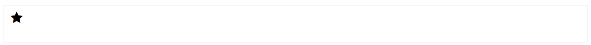
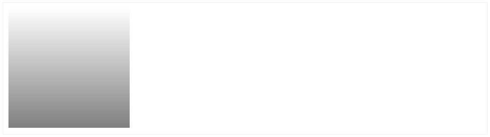
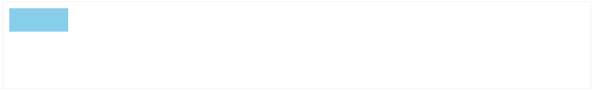
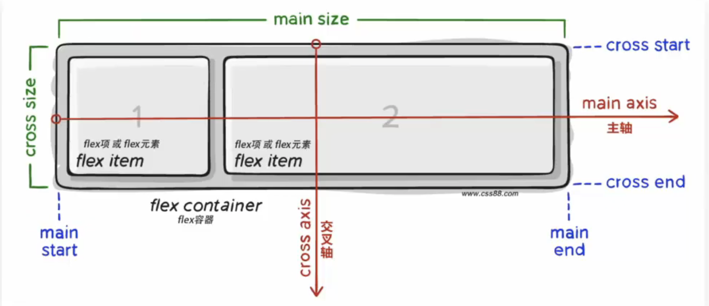

# 一、字体图标

iconfont-阿里巴巴矢量图标库

https://www.iconfont.cn/

iconfont 支持上传 SVG 矢量图

示例：

```html
<link rel="stylesheet" href="iconfont/iconfont.css">

<i class="iconfont icon-star"></i>
```




# 二、平面转换 transform

使用 transform 实现位移、旋转、缩放等效果

平面坐标

```
   -y
-x  0  +x
   +y
```

## 位移 translate

语法

```css
transform: translate(水平移动距离，垂直移动距离);
```

取值

- 正负均可
- 像素单位数值
- 百分比（参照盒子自身大小）

配合过渡使用

```css
transition: all 0.5s;
```

示例：(元素居中效果)

```html
<style>
    .wrap {
        width: 500px;
        height: 200px;
        border: 1px solid #333;
        position: relative;
    }

    .box {
        left: 0;
        top: 0;

        width: 100px;
        height: 100px;
        background-color: skyblue;
        position: absolute;
        /* 过渡 */
        transition: all 0.5s;

    }

    /* 鼠标移入后居中 */
    .wrap:hover .box {
        top: 50%;
        left: 50%;

        /* 替换：margin-left: -1/2x; margin-top: -1/2y */
        transform: translate(-50%, -50%);
    }
</style>

<div class="wrap">
    <div class="box"></div>
</div>
```


技巧

- translate 只给一个值，表示 x 轴方向移动距离
- 单独设置某个方向的移动：translateX(), translateY()

```css
/* 背景图从右显示 */
background-position: right 0;
```

示例：双开门

```html
<style>
    .box {
        width: 600px;
        height: 200px;
        border: 1px solid #333;
        position: relative;
        overflow: hidden;
    }

    .box::before,
    .box::after {
        /* 必须有contetn属性 */
        content: '';
        position: absolute;
        width: 50%;
        height: 100%;
        /* 过渡 */
        transition: all 0.5s;
    }

    .box::before {
        left: 0;
        top: 0;
        background-color: skyblue;
    }

    .box::after {
        right: 0;
        top: 0;
        background-color: yellow;
    }

    /* 鼠标移入 */
    .box:hover::before {
        transform: translateX(-100%);
    }

    .box:hover::after {
        transform: translateX(100%);
    }
</style>

<div class="box"></div>
```

## 旋转 rotate

语法

```css
transform: rotate(角度);
```

角度单位`deg`, 正负数均可

- 正数：顺时针
- 负数：逆时针

示例：

```html
<style>
    .box {
        margin: 0 auto;
        width: 50px;
        height: 50px;
        background-color: skyblue;
        transition: all 0.5s;

    }

    .box:hover {
        /* 顺时针旋转360度 */
        transform: rotate(360deg);
    }
</style>


<div class="box"></div>
```

## 改变转换原点 transform-origin

默认的旋转原点是盒子中心点

语法

```
transform-origin 原点水平位置, 原点垂直位置;
```

取值

- 方位名词 top left right bottom center
- 像素单位数值
- 百分比（参照盒子自身尺寸）

示例：

```html
<style>
    .box {
        margin: 0 auto;
        width: 50px;
        height: 50px;
        background-color: skyblue;
        transition: all 0.5s;

        /* 改变旋转中心点 */
        transform-origin: right bottom;
    }

    .box:hover {
        /* 顺时针旋转360度 */
        transform: rotate(360deg);
    }
</style>


<div class="box"></div>
```

## 多重转换

```css
/* 复合属性 先后顺序不一样，效果也不一样 */
transform: translate() rotate();
```

示例：边走边转

```html
<style>
    .wrap {
        width: 600px;
        height: 200px;
        border: 1px solid #666;
        margin: 0 auto;

    }

    .box {
        height: 200px;
        width: 200px;
        background-color: skyblue;

        border-radius: 50%;
       
        position: relative;
        overflow: hidden;
        transition: all 3s;
    }

    .box::before {
        position: absolute;

        content: '';
        width: 200px;
        height: 100px;
        background-color: yellow;
    }

    .wrap:hover .box {
        /* 旋转会改变坐标轴向 */
        transform: translate(400px) rotate(360deg);
    }
</style>

<div class="wrap">
    <div class="box"></div>
</div>
```

## 缩放 scale

实现元素从中心点缩放效果

语法

```css
transform: scale(x轴缩放倍数, y轴缩放倍数);

/* x、y等比例缩放 */
transform: scale(缩放倍数);
```

| 效果 | 取值   | 示例       |
| ---- | ------ | ---------- |
| 放大 | 数值>1 | scale(1.2) |
| 不变 | 数值=1 | scale(1)   |
| 缩小 | 数值<1 | scale(0.8) |

示例：

```html
<style>
    .box {
        margin: 0 auto;
        height: 250px;
        width: 200px;
        border: 1px solid #666;
        overflow: hidden;
        text-align: center;
    }

    .cover {
        width: 200px;
        height: 150px;
        background-color: skyblue;
        position: relative;
    }

    .cover::after {
        /* 居中布局 */
        position: absolute;
        content: '';
        left: 50%;
        top: 50%;


        background-image: url(../img/play-circle.png);
        background-size: contain;
        width: 40px;
        height: 40px;

        transition: all .5s;

        /* 居中可以使用 margin 也可以使用 translate */
        /* 放大 */
        /* margin-left: -20px;
        margin-top: -20px; 
        transform: scale(5); */
        transform: translate(-50%, -50%) scale(5);
        /* 透明 */
        opacity: 0;
    }

    .box:hover .cover::after {
        /* transform: scale(1); */
        transform: translate(-50%, -50%) scale(1);
        opacity: 1;
    }
</style>

<div class="box">
    <div class="cover"></div>

    <p>欲把西湖比西子</p>
    <p>淡妆浓抹总相宜</p>
</div>
```

## 渐变背景 background-image

示例 1：

```html
<style>
    .box {
        width: 200px;
        height: 200px;
        /* 逗号隔开多个值, 从透明到半透明 渐变 */
        background-image: linear-gradient(transparent, rgba(0, 0, 0, .5));
    }
</style>

<div class="box"></div>
```



示例 2：

```html
<style>
    p {
        margin: 0;
        padding: 0;
    }

    .box {
        display: block;
        width: 200px;
        height: 150px;
        margin: 0 auto;
        position: relative;
        overflow: hidden;
    }

    .box .cover {
        width: 100%;
        height: 100%;
        object-fit: cover;
        transition: all 0.5s;
    }

    .box .title {
        position: absolute;
        width: 100%;
        height: 50px;
        padding: 10px;
        bottom: 0;
        left: 0;
        color: white;
        box-sizing: border-box;
        z-index: 2;
    }


    /* 渐变背景 */
    .box .mask {
        position: absolute;
        opacity: 0;
        transition: all 0.5s;
        width: 100%;
        height: 100%;
        top: 0;
        left: 0;
        background-image: linear-gradient(transparent,
                rgba(0, 0, 0, .6));
    }

    .box:hover .mask {
        opacity: 1;
    }

    .box:hover .cover {
        transform: scale(1.2);
    }
</style>

<a class="box"
   href="#">
    

    <div class="title">
        <p>百日依山尽</p>
    </div>

    <div class="mask"></div>
</a>
```


# 三、空间转换（3D 转换）

空间内位移、旋转、缩放

z 轴的正方向指向用户（屏幕外边方向）

语法

```css
transform: translate3d(x, y, z);

transform: translateX(x);
transform: translateY(y);
transform: translateZ(z);
```

取值：

- 正负均可
- 百分比
- 像素值

## 1、透视

perspective 视线透视效果

透视效果：近大远小，近实远虚

父级添加属性

```css
/* 透视距离(视距): 人眼睛到屏幕的距离 */
perspective: 像素值; /* (800-1200) */
```

示例：

```html
<style>
    .box-wrap {
        perspective: 1000px;
    }

    .box {
        margin: 0 auto;
        width: 200px;
        height: 200px;
        background-color: skyblue;
        transition: all .5s;
    }

    .box:hover {
        transform: translateZ(100px);
    }
</style>

<div class="box-wrap">
    <div class="box"></div>
</div>
```

## 2、空间旋转 rotate

语法

```css
transform: rotateZ(角度);
transform: rotateX(角度);
transform: rotateY(角度);
```

示例：

```html
<style>
    .box-wrap {
        margin: 0 auto;
        display: grid;
        grid-template-columns: repeat(3, 1fr);
        width: 640px;
        overflow: hidden;

        perspective: 1000px;
    }

    .box {
        width: 200px;
        height: 200px;
        /* background-color: skyblue; */
        transition: all .5s;
        background-image: url('https://api.isoyu.com/bing_images.php');
    }

    .box .cover {
        width: 100%;
        height: 100%;
        object-fit: cover;
    }

    .box-rotate-z:hover {
        /* 以z轴为中心点旋转 */
        transform: rotateZ(60deg);
    }

    .box-rotate-x:hover {
        /* 以x轴为中心点旋转 */
        transform: rotateX(60deg);
    }

    .box-rotate-y:hover {
        /* 以y轴为中心点旋转 */
        transform: rotateY(60deg);
    }
</style>

<div class="box-wrap">
    <div class="box box-rotate-z"></div>

    <div class="box box-rotate-x"></div>

    <div class="box box-rotate-y"></div>
</div>
```

## 左手法则: 判断旋转方向

左手握住旋转轴，拇指指向正值方向，手指弯曲方向为旋转正值方向

## rotate3d（了解）

自定义旋转周的位置及旋转角度

```css
rotate3d(x, y, z, 角度);
```

x, y, z 取 0-1 之间的数字

## 呈现立体图形

让子级元素处于 3d 空间中

```css
transform-style: preserve-3d;
```

示例:

```html
<style>
    .box-wrap {
        margin: 0 auto;
        width: 200px;
        height: 200px;
        position: relative;
        background-color: pink;
        transform-style: preserve-3d;
        transition: all 2s;
    }

    .box {
        top: 0;
        left: 0;
        width: 200px;
        height: 200px;
        position: absolute;
    }

    .box-front {
        background-color: green;
        transform: translateZ(200px);
    }

    .box-back {
        background-color: yellow;
    }

    .box-wrap:hover {
        transform: rotateY(180deg);
    }
</style>

<div class="box-wrap">
    <div class="box box-front"></div>
    <div class="box box-back"></div>
</div>
```

示例: 3D 导航

```html
<style>
    /* 清除样式 */
    ul {
        list-style: none;
    }

    a {
        text-decoration: none;
        color: white;
    }

    /* 导航开始 */
    .nav {
        display: flex;
        width: 300px;
        margin: 0 auto;
    }

    .nav-item {
        position: relative;

        display: block;
        width: 100px;
        line-height: 50px;
        text-align: center;
        transform-style: preserve-3d;
        transition: all .5s;

        /* 开发时看到立体盒子 */
        /* transform: rotateX(-20deg) rotateY(30deg); */
    }

    /* 中文 */
    .nav-item__zh {
        background-color: green;
        transform: translateZ(25px);
    }

    /* 英文 */
    .nav-item__en {
        position: absolute;
        top: -50%;
        width: 100%;
        background-color: orange;
        transform: rotateX(90deg);
    }

    /* 旋转立方体 */
    .nav-item:hover {
        transform: rotateX(-90deg);
    }
</style>

<div class="nav-wrap">
    <ul class="nav">
        <li><a href="#"
               class="nav-item">
                <div class="nav-item__zh">首页</div>
                <div class="nav-item__en">Index</div>
            </a>
        </li>

        <li><a href="#"
               class="nav-item">
                <div class="nav-item__zh">登录</div>
                <div class="nav-item__en">Login</div>
            </a>
        </li>

        <li><a href="#"
               class="nav-item">
                <div class="nav-item__zh">注册</div>
                <div class="nav-item__en">Register</div>
            </a>
        </li>
    </ul>
</div>
```

## 总结

```css
/* 位移 */
transform: translate3d(x, y, z);

transform: translateX(x);
transform: translateY(y);
transform: translateZ(z);

/* 旋转，效果相同*/
transform: rotate(角度);
transform: rotateZ(角度);

/* 透视距离 */
perspective: 像素值; /* (800-1200) */

/* 实现3d */
transform-style: preserve-3d;
```

## 空间缩放 scale

```css
transform: scaleX(x);
transform: scaleY(y);
transform: scaleZ(z);
transform: scale3d(x, y, z);
```


# 四、动画 animation

过渡 vs 动画

- 过渡：用于两个状态变化过程
- 动画：实现多个状态间的变化过程，动画过程可控

动画

- 动画的本质：快速切换大量图片时在人脑中行成的具有连续性的画面
- 构成动画的最小单元：帧或动画帧

实现步骤：

1. 定义动画

```css
/* 定义两种状态 */
@keyframes 动画名称 {
  from {
  }
  to {
  }
}

/* 定义多种状态 */
/* 百分比表示动画总时长的占比 */
@keyframes 动画名称 {
  0% {
  }
  10% {
  }
  50% {
  }
  100% {
  }
}
```

1. 使用动画

```css
animation: 动画名称 动画花费时长;
```

示例:

```html
<style>
    .box {
        width: 50px;
        height: 50px;
        background-color: skyblue;
    }

    .box:hover {
        /* 使用动画 */
        animation: change-width 2s;
    }

    /* 定义动画 */
    @keyframes change-width {
        from {
            width: 50px;
        }

        to {
            width: 200px;
        }
    }
</style>

<div class="box"></div>
```

## 动画属性

```css
animation: 动画名称 动画时长 速度曲线 延迟时间 重复次数 动画方向 执行完毕时状态;
```

注意：

- 动画名称 和 动画时长必须赋值
- 取值不分先后顺序
- 如果有 2 个时间值，第一个时间表示动画时长，第二个时间表示延迟时间

示例:

```html
<style>
    .box {
        width: 50px;
        height: 50px;
        line-height: 50px;
        text-align: center;
        background-color: skyblue;
    }

    /* 基本动画 */
    .box-basic {
        animation: change-width 2s;
    }

    /* 匀速动画 */
    .box-linear {
        animation: change-width 2s linear;
    }

    /* 分步动画 */
    .box-steps {
        animation: change-width 2s steps(3);
    }

    /* 延迟动画 */
    .box-delay {
        animation: change-width 2s 2s;
    }

    /* 重复3次 */
    .box-repeat {
        animation: change-width 2s 3;
    }

    /* 无限循环 */
    .box-infinite {
        animation: change-width 2s infinite;
    }

    /* 反向动画 */
    .box-alternate {
        animation: change-width 2s infinite alternate;
    }

    /* 动画停留在最初状态 backwards */
    /* 动画停留在最后状态 forwards */
    .box-forwards {
        animation: change-width 2s forwards;
    }

    /* 定义动画 */
    @keyframes change-width {
        from {
            width: 50px;
        }

        to {
            width: 200px;
        }
    }
</style>


<div class="box box-basic">basic</div>
<div class="box box-linear">linear</div>
<div class="box box-steps">steps</div>
<div class="box box-delay">delay</div>
<div class="box box-repeat">repeat</div>
<div class="box box-infinite">infinite</div>
<div class="box box-alternate">alternate</div>
<div class="box box-forwards">forwards</div>
```

background复合属性

```css
background: color image repeat attachment position;
```

- background-color
- background-image
- background-repeat
- background-attachment
- background-position
- background-size: cover/contian
  - cover: 图片完全覆盖盒子，可能会导致图片显示不全
  - contian：最大边和盒子尺寸相等，就不进行缩放

animation复合属性（了解）

| 属性                      | 作用               | 取值                                       |
| ------------------------- | ------------------ | ------------------------------------------ |
| animation-name            | 动画名称           |                                            |
| animation-duration        | 动画时长           |                                            |
| animation-delay           | 延迟时间           |                                            |
| animation-fill-mode       | 动画执行完毕时状态 | forwards 最后一帧状态/ backwards第一帧状态 |
| animation-timing-function | 速度曲线           | steps(数字) 逐帧动画                       |
| animation-iteration-count | 重复次数           | infinite 无限循环                          |
| animation-direction       | 动画执行方向       | alternate 反方向                           |
| animation-play-state      | 暂停动画           | paused 暂停，通常配合hover使用             |

- 补间动画：两个动画之间平滑动画
- 逐帧动画：两个动画之间状态不补全

多组动画

```css
animation: 动画1, 动画2, ...动画N;
```

走马灯，无缝动画

```css
hmtl, body {
    height: 100%
}
```

示例: 无缝动画

```html
<!DOCTYPE html>
<html lang="en">

<head>
    <meta charset="UTF-8">
    <meta http-equiv="X-UA-Compatible"
          content="IE=edge">
    <meta name="viewport"
          content="width=device-width, initial-scale=1.0">
    <title>Document</title>
</head>

<body>
    <style>
        * {
            margin: 0;
            padding: 0;
        }

        .box {
            margin: 0 auto;
            width: 600px;
            height: 100px;
            background-color: skyblue;
            overflow: hidden;
        }

        .box ul {
            list-style: none;
            display: flex;
            width: 2600px;
            animation: move 5s infinite linear;
        }

        /* 鼠标经过，暂停动画 */
        .box:hover ul {
            animation-play-state: paused;
        }

        .box ul li {
            height: 100px;
            line-height: 100px;
            width: 200px;
            text-align: center;
            font-size: 30px;
            color: white;
            font-weight: 500;
        }

        /* 动画位移，向左移动10个元素 */
        @keyframes move {
            from {
                transform: translate(0);
            }

            to {
                transform: translate(-2000px);
            }
        }
    </style>

    <div class="box">
        <ul>
            <li>1</li>
            <li>2</li>
            <li>3</li>
            <li>4</li>
            <li>5</li>
            <li>6</li>
            <li>7</li>
            <li>8</li>
            <li>9</li>
            <li>10</li>

            <!-- 复制出来，实现无缝衔接 -->
            <li>1</li>
            <li>2</li>
            <li>3</li>
        </ul>
    </div>
</body>

</html>
```


# 五、移动端网页适配

## 屏幕尺寸

屏幕对角线的长度，一般用英寸来度量

## PC 分辨率

```
1920 * 1080
1366 * 768
```

- 硬件分辨率 物理分辨率 不可改变，固定的
- 软件分辨率 逻辑分辨率 由软件驱动决定

移动端主流设备分辨率

| 手机型号    | 物理分辨率 | 逻辑分辨率 | 比例关系 |
| ----------- | ---------- | ---------- | -------- |
| iPhone6/7/8 | 750 * 1334 | 375 * 667  | 2:1      |

## 视口

- 移动端网页宽度默认：`980px`
- PC 端网页宽度和屏幕宽度相同

视口的作用:

```
网页宽度 = 逻辑宽度
```

视口标签

```html
<meta name="viewport" content="width=device-width, initial-scale=1.0" />
```

二倍图：750px

## 移动适配

解决方案：

- rem 目前
- vw/vh 未来

## rem

rem 单位

- 相对单位
- rem 单位是相对于 HTML 标签的字号计算结果
- `1rem=1HTML` 字号大小

实现效果：屏幕宽度不同，网页元素尺寸不同（等比缩放）

示例:

```html
<body>
    <style>
        /* html字号默认 16px */
        .box {
            /* 16 * 5 = 80px */
            width: 5rem;
            /* 16 * 2 = 32px */
            height: 2rem;
            background-color: skyblue;
        }
    </style>

    <div class="box"></div>
</body>
```


使用 rem 需要解决的问题

- 不同设备屏幕尺寸，设置不同的 HMLT 标签字号
- 设备宽度不同，HTML 标签字号设置多少合适

rem 布局方案中，将网页等分成 10 份，HTML 标签的字号为视口宽度 `1/10`

## rem 单位尺寸

确定设计稿对应的设备 HTML 标签字号

```
基准根字号 = 设备宽度（视口宽度）/ 10

rem单位的尺寸 = px单位数值 / 基准根字号

eg:

设计稿设备宽度  375px
设计稿元素宽度  75px
rem宽度 = 75px / (375px / 10) = 2rem
```

## 媒体查询

媒体查询 根据不同的视口宽度，设置差异化 css 样式

```css
@media (媒体特性) {
  /* css样式 */
}

/* eg:  */

@media (width: 375px) {
  html {
    font-size: 37.5px;
  }
}

@media (width: 320px) {
  html {
    font-size: 32px;
  }
}
```

示例:

```html
<html>

<head>
    <meta name="viewport"
          content="width=device-width, initial-scale=1, maximum-scale=1, minimum-scale=1, user-scalable=no">
</head>

<body>
    <style>
        @media (width: 375px) {
            html {
                font-size: 37.5px;
            }
        }

        @media (width: 320px) {
            html {
                font-size: 32px;
            }
        }

        .box {
            width: 5rem;
            height: 2rem;
            background-color: skyblue;
        }
    </style>

    <div class="box"></div>
</body>

</html>
```



## flexible.js

flexible.js 适配移动端的 js 框架

原理：根据不同的视口宽度，给网页 html 根节点设置不同的 font-size

github: https://github.com/amfe/lib-flexible

示例:

```html
<html>

<head>
    <meta name="viewport"
          content="width=device-width, initial-scale=1, maximum-scale=1, minimum-scale=1, user-scalable=no">
</head>

<body>
    <style>
        .box {
            width: 5rem;
            height: 2rem;
            background-color: skyblue;
        }
    </style>

    <div class="box"></div>

    <script src="https://cdn.jsdelivr.net/npm/amfe-flexible@2.2.1/index.min.js"></script>
</body>

</html>
```

## 长度单位：vw/vh

- 相对单位
- 相对视口的尺寸计算结果

含义

- vw: viewport width
- vh: viewport height

换算方式

```
1vw = 1/100视口宽度
1vh = 1/100视口高度

vw单位的尺寸 = px单位数值 / ( 1 / 100 * 视口宽度)
```

例如：

```
357px宽的设备

1vw = 357px / 100 = 3.57px
// index.less
// 375的设计稿：68 * 29
.box {
  width: (68 / 3.75vw);
  height: (29 / 3.75vw);
}
```

统一使用 vw 或者 vh 作为单位


# 六、Flex 布局

## 百分比布局

百分比布局也叫流式布局

效果：宽度自适应，高度固定

```css
width: 100%;
height: 50px;
```

## Float 浮动布局

- 最初为了实现文字环绕
- Float 布局会造成浮动的盒子脱标，不能撑开父级容器

## Flex 布局

Flex 布局: 弹性布局

- 浏览器提倡的布局模型
- 布局网页更简单，灵活
- 避免浮动脱标的问题
- 非常适合结构化布局

Flex 布局示例

```css
.box {
  display: flex;
}
```



查看 web 技术浏览器兼容性：

https://caniuse.com/

Flex 布局组成部分

- 弹性容器： 直接父级
- 弹性盒子：直接子级
- 主轴：默认 x 轴
- 侧轴/交叉轴：默认 y 轴

flex 容器下的元素默认水平排列：默认主轴在 x 轴，弹性盒子沿着主轴排列

## 主轴对齐方式 justify-content

Flex 布局模型中，可以调节主轴或侧轴的对齐方式来设置盒子之间的间距

| 属性值        | 作用                                                 |
| ------------- | ---------------------------------------------------- |
| flex-start    | 默认值，起点开始依次排列                             |
| flex-end      | 终点开始依次排列                                     |
| center        | 沿主轴居中排列                                       |
| space-around  | 弹性盒子沿主轴均匀排列，空白间距均分在弹性[盒子两侧] |
| space-between | 弹性盒子沿主轴均匀排列，空白间距均分在相邻[盒子之间] |
| space-evenly  | 弹性盒子沿主轴均匀排列，弹性盒子与容器之间[间距相等] |

示例:

```html
<style>
    h3 {
        text-align: center;
    }

    .box-wrap {
        display: flex;
        margin: 0 auto;
        width: 500px;
        border: 1px solid #eee;
    }

    .box-wrap+.box-wrap {
        margin-top: 20px;
    }

    .box {
        width: 100px;
        height: 100px;
        font-size: 20px;
        line-height: 100px;
        text-align: center;
        background-color: skyblue;
    }

    /* 居中 */
    .box-center {
        justify-content: center;
    }

    /* 间距在盒子之间 */
    .box-between {
        justify-content: space-between;
    }

    /* 间距在子两侧，视觉效果：子级之间的距离是两头距离的 2 倍 */
    .box-around {
        justify-content: space-around;
    }

    /* 盒子和容器所有间距相等 */
    .box-evenly {
        justify-content: space-evenly;
    }
</style>

<h3>默认</h3>
<div class="box-wrap">
    <div class="box">1</div>
    <div class="box">2</div>
    <div class="box">3</div>
</div>

<h3>justify-content: center;</h3>
<div class="box-wrap box-center">
    <div class="box">1</div>
    <div class="box">2</div>
    <div class="box">3</div>
</div>

<h3>justify-content: space-between;</h3>
<div class="box-wrap box-between">
    <div class="box">1</div>
    <div class="box">2</div>
    <div class="box">3</div>
</div>

<h3>justify-content: space-around;</h3>
<div class="box-wrap box-around">
    <div class="box">1</div>
    <div class="box">2</div>
    <div class="box">3</div>
</div>


<h3>justify-content: space-evenly;</h3>

<div class="box-wrap box-evenly">
    <div class="box">1</div>
    <div class="box">2</div>
    <div class="box">3</div>
</div>
```

## 侧轴对齐方式 align-items

容器属性 align-items 元素属性 align-self

| 属性值     | 作用                                       |
| ---------- | ------------------------------------------ |
| flex-start | 默认值，起点开始依次排列                   |
| flex-end   | 重点开始依次排列                           |
| center     | 沿侧轴居中排列                             |
| stretch    | 默认值，弹性盒子沿着主轴线被拉伸至铺满容器 |

示例:

```html
<!DOCTYPE html>
<html lang="en">

<body>
    <style>

        h3{
            text-align: center;
        }
        .box-wrap {
            width: 500px;
            margin: 0 auto;
            display: flex;
            height: 200px;
            border: 1px solid #666;
        }

        .box {
            width: 100px;
            background-color: skyblue;
        }

        .box-wrap-height .box {
            height: 100px;
        }

        /* 拉伸 */
        .stretch {
            align-items: stretch;
        }

        /* 顶对齐 */
        .flex-start {
            align-items: flex-start;
        }

        /* 底对齐 */
        .flex-end {
            align-items: flex-end;
        }

        /* 上下居中 */
        .center {
            align-items: center;
        }

        .child-center .box:nth-child(2){
            align-self: center;
        }
    </style>

    <h3>子元素没有设置高度，默认撑开和父级一样高</h3>
    <div class="box-wrap">
        <div class="box"></div>
        <div class="box"></div>
        <div class="box"></div>
    </div>
    
    <h3>子元素没有设置高度，默认：align-items: stretch;</h3>
    <div class="box-wrap stretch">
        <div class="box"></div>
        <div class="box"></div>
        <div class="box"></div>
    </div>

    <h3>子元素设置高度，默认</h3>
    <div class="box-wrap box-wrap-height">
        <div class="box"></div>
        <div class="box"></div>
        <div class="box"></div>
    </div>

    <h3>子元素设置高度，默认：align-items: flex-start;</h3>
    <div class="box-wrap box-wrap-height flex-start">
        <div class="box"></div>
        <div class="box"></div>
        <div class="box"></div>
    </div>

    <h3>align-items: flex-end;</h3>
    <div class="box-wrap box-wrap-height flex-end">
        <div class="box"></div>
        <div class="box"></div>
        <div class="box"></div>
    </div>

    <h3>align-items: center;</h3>
    <div class="box-wrap box-wrap-height center">
        <div class="box"></div>
        <div class="box"></div>
        <div class="box"></div>
    </div>

    <h3>设置单独子元素 align-self: center</h3>
    <div class="box-wrap box-wrap-height child-center">
        <div class="box"></div>
        <div class="box"></div>
        <div class="box"></div>
    </div>
</body>

</html>
```

## 伸缩比 flex

语法

```css
flex: 数值;
```

> 注意：占用父级剩余尺寸的份数

示例:

```html
<!DOCTYPE html>
<html lang="en">

<body>
    <style>
        .box-wrap {
            width: 500px;
            margin: 0 auto;
            display: flex;
            height: 200px;
            border: 1px solid #666;
        }

        /* 固定尺寸 */
        .box-1 {
            width: 100px;
            background-color: skyblue;
        }
        
        /* 占 3/4 */
        .box-2 {
            flex: 3;
            background-color: yellow;
        }

        /* 占 1/4 */
        .box-3 {
            flex: 1;
            background-color: green;
        }
    </style>


    <div class="box-wrap">
        <div class="box box-1"></div>
        <div class="box box-2"></div>
        <div class="box box-3"></div>
    </div>

</body>

</html>
```

移动端触发区域默认大小 44x44

## 主轴方向 flex-direction

修改主轴方向，实现改变元素排列方向

主轴默认是水平方向，侧轴默认是垂直方向

| 属性值         | 作用             |
| -------------- | ---------------- |
| row            | 默认值，行，水平 |
| column         | 列，垂直         |
| row-reverse    | 行，从右往左     |
| column-reverse | 列，从下到上     |

示例:

```html
<!DOCTYPE html>
<html lang="en">

<body>
    <style>
        .box-wrap {
            margin: 0 auto;
            display: flex;

            /* 修改主轴方向为垂直方向 */
            /* 先确定主轴方向，再设置主轴或侧轴对齐 */
            flex-direction: column;
            
            /* 视觉效果：垂直居中 */
            justify-content: center;

            /* 视觉效果：水平居中 */
            align-items: center;

            width: 500px;
            height: 200px;
            border: 1px solid #666;
        }

        .box {
            width: 100px;
            height: 100px;
            background-color: skyblue;
        }
    </style>


    <div class="box-wrap">
        <div class="box"></div>
    </div>

</body>

</html>
```

## 弹性盒子换行 flex-wrap

实现多行排列效果

语法

```css
felx-wrap: nowrap/wrap;
```

| 属性值 | 作用           |
| ------ | -------------- |
| nowrap | 默认值，不换行 |
| wrap   | 换行           |

## 行对齐方式 align-content

取值和 justify-content 基本相同

示例:

```html
<!DOCTYPE html>
<html lang="en">
    
<body>
    <style>
        .box-wrap {
            margin: 0 auto;
            display: flex;
            
            /* 换行显示 */
            flex-wrap: wrap;
            /* 行对齐方式 */
            align-content: space-between;

            width: 200px;
            height: 500px;
            border: 1px solid #666;
        }

        .box {
            width: 100px;
            height: 100px;
            background-color: skyblue;
        }
    </style>


    <div class="box-wrap">
        <div class="box"></div>
        <div class="box"></div>
        <div class="box"></div>
        <div class="box"></div>
        <div class="box"></div>
    </div>

</body>

</html>
```

## Flex 溢出隐藏

示例:

```html
<!DOCTYPE html>
<html lang="en">

<body>
    <style>
        .box-wrap {
            margin: 0 auto;
            display: flex;
            align-items: center;
            width: 500px;
        }

        .box-left {
            width: 200px;
            height: 100px;
            background-color: skyblue;
        }

        /* 注意父级需要增加的属性 */
        /* 溢出显示省略号 */
        /* 弹性盒子的尺寸可以被内容撑开*/
        .box-right {
            flex: 1;
            width: 0;
            border: 1px solid #666;
        }

        .box-right__content {
            text-overflow: ellipsis;
            overflow: hidden;
            white-space: nowrap;
        }
    </style>

    <div class="box-wrap">
        <div class="box-left"></div>
        <div class="box-right">
            <div class="box-right__title">长恨歌 白居易 〔唐代〕</div>
            <div class="box-right__content">天生丽质难自弃，一朝选在君王侧。回眸一笑百媚生，六宫粉黛无颜色。</div>
        </div>
    </div>
</body>

</html>
```


# 七、Less

less 一个 css 预处理器

网站：

- https://lesscss.org/
- https://less.bootcss.com/

作用：

- 更简单的完成 css
- 扩充 css 语言，具备逻辑性，计算能力
- 浏览器不识别 Less 代码

用途：

- 保存 less 文件自动生成 css 文件
- less 运算写法完成 px 单位到 rem 单位

VS Code 插件： Easy Less

## 注释

```
// 单行注释  快捷键 ctrl + ，单行注释不会出现在css /

/* 快注释 快捷键 shift + alt + A */
```

## 运算

- 加、减、乘直接书写表达式
- 除法需要添加小括号或.

```css
.box {
  width: 100 + 10px; // 110px;
  width: 100 - 20px; // 80px;
  width: 100 * 2px; // 200px;

  // 除法
  // 推荐小括号写法
  width: (100 / 4px); // 25px;
  // 不支持 height: 100 ./ 4px; // 25px;
}
```

输出

```css
.box {
  width: 110px;
  width: 80px;
  width: 200px;
  width: 25px;
}
```

## 嵌套

使用嵌套写法生成后代选择器

```css
.father {
  color: red;

  .son {
    width: 100px;
  }
}
```

输出

```css
.father {
  color: red;
}

.father .son {
  width: 100px;
}
```

`&` 表示当前选择器

## 变量

存储数据，方便使用和修改

语法

```
// 定义变量
@变量名：值;

// 使用变量
CSS属性：@变量名;
```

示例

```css
@color: red;

.box {
  color: @color;
}
```

输出

```css
.box {
  color: red;
}
```

## 导入 less 文件

```css
// 可以省略后缀.less
@import './other.less';
```

## 导出 css 文件

less 文件夹输出到 css 文件夹

VS Code 插件 Easy Less 设置 settings.json

```json
{
  "less.compile": {
    "out": "../css/"
  }
}
```

控制单个文件导出路径,文件第一行指定输出路径

```css
// out: ./css/
```

禁止导出

```css
// out: false
```


# 八、实战

## 项目目录

```
less/
css/
images/
uploads/
js/
lib/
favicon.ico
index.html
```

## 移动适配

1、less 中使用 rem

```css
// 根字号基量 基于375px的设计图
@rootSize: 37.5rem;

.box {
  // px => rem
  width: (50 / @rootSize);
}
```

2、less 中使用 vw

```css
/* 根字号基量 基于375px的设计图 */
@vw: 3.75vw;

.box: {
  width: (80 / @vw);
}
```

base.css:

```css
/* base.css */
/* 部分代码参考reset.css */

* {
    margin: 0;
    padding: 0;
    box-sizing: border-box;
    
    border: 0;
    font-size: 100%;
    font: inherit;
    vertical-align: baseline;
}

body, html {
    height: 100%
}

body{
   font-family: Helvetica Neue,Tahoma,Arial,PingFangSC-Regular,Hiragino Sans GB,Microsoft Yahei,sans-serif;
   line-height: 1;
   font-size: 16px;
   color: #222;

   text-rendering: optimizeLegibility;
   -webkit-text-size-adjust: 100%;
   -webkit-font-smoothing: antialiased;
   -webkit-tap-highlight-color: rgba(0,0,0,0);
}


a {
    color: inherit;
    cursor: default;
    text-decoration: none
}

img{
    width: 100%;
    height: 100%;
    vertical-align: middle;
}

ol, ul{
    list-style: none
}

table {
    border-collapse: collapse;
    border-spacing: 0;
}

/* 单行文本溢出 */
.ellipsis-1{
    white-space: nowrap;
    overflow: hidden;
    text-overflow: ellipsis;
}

/* 多行文本溢出 */
.ellipsis-2{
    overflow: hidden;
    text-overflow: ellipsis;
    display: -webkit-box;
    -webkit-line-clamp: 2;
    -webkit-box-orient: vertical;
}
```


# 九、响应式

## 媒体查询

根据设备宽度的变化，设置差异化样式

```css
@media (媒体查询) {
  /* 样式 */
}

/* eg: */

/* 视口宽度小于等于768px*/
@media (max-width: 768px) {
  /* 样式 */
}

/* 视口宽度大于等于1200px*/
@media (min-width: 1200px) {
  /* 样式 */
}
```

> 多个媒体查询，需要注意顺序，遵循 css 层叠性

## 完整写法

```css
@media 关键词 媒体类型 and (媒体特性) {
    css代码
}
```

1、关键词

- and
- only
- not

2、媒体类型

| 类型名称   | 值     | 描述                      |
| ---------- | ------ | ------------------------- |
| 屏幕       | screen | 带屏幕的设备              |
| 打印预览   | print  | 打印预览模式              |
| 阅读器     | speech | 屏幕阅读模式              |
| 不区分类型 | all    | 默认值，包括以上 3 种情形 |

3、媒体特性

| 特性名称           | 属性                    | 值                             |
| ------------------ | ----------------------- | ------------------------------ |
| 视口宽和高         | width、height           | 数值                           |
| 视口最大宽或最大高 | `max-width`、max-height | 数值                           |
| 视口最小宽或最小高 | `min-width`、min-height | 数值                           |
| 屏幕方向           | orientation             | portrait：竖屏/ landscape 横屏 |

常用写法

```css
@media (min-width: 1200px) {
  /* PC样式 */
}

@media (min-width: 992px) {
  /* 样式 */
}

@media (min-width: 768px) {
  /* >=768px 样式 */
}
```

外链式 css 引入

```html
<link
  rel="stylesheet"
  media="逻辑符 媒体类型 and (媒体特性)"
  href="index.css"
/>

<!-- eg: 注意小括号不能丢 -->
<link rel="stylesheet" media="(min-width: 992px)" href="index-992.css" />
<link rel="stylesheet" media="(min-width: 1200px)" href="index-1200.css" />
```


# 十、BootStrap

- github：https://github.com/twbs/bootstrap
- Bootstrap 官网：https://getbootstrap.com/
- Bootstrap 中文文档：https://www.bootcss.com/
- 全局样式
- 字体图标
- 组件
- 插件

## BootStrap 使用步骤

1、引入 css 代码

```html
<!-- Bootstrap 核心 CSS 文件 -->
<link rel="stylesheet" href="./bootstrap@3.4.1/css/bootstrap.min.css" />
```

2、使用样式类名

```html
<!-- 响应式布局版心类 -->
<div class="container"></div>
```

代码示例

```html
<body>
      <!-- 最新版本的 Bootstrap 核心 CSS 文件 -->
      <link rel="stylesheet"
            href="https://stackpath.bootstrapcdn.com/bootstrap/3.4.1/css/bootstrap.min.css"
            integrity="sha384-HSMxcRTRxnN+Bdg0JdbxYKrThecOKuH5zCYotlSAcp1+c8xmyTe9GYg1l9a69psu"
            crossorigin="anonymous">
      <div class="container">1</div>
</body>
```

## BootStrap 栅格系统

实现响应式网页布局

栅格化：网页宽度等分为 12 等份

|                     | 超小屏幕 | 小屏幕   | 中等屏幕   | 大屏幕       |
| ------------------- | -------- | -------- | ---------- | ------------ |
| 设备                | 手机     | 平板     | 桌面显示器 | 大桌面显示器 |
| 响应断点            | <768px   | ≥768px   | ≥992px     | ≥1200px      |
| 别名                | xs       | sm       | md         | lg           |
| 容器宽度(container) | 100%     | 750px    | 970px      | 1170px       |
| 类前缀              | col-xs-* | col-sm-* | col-md-*   | col-lg-*     |
| 列（column）数      | 12       | 12       | 12         | 12           |
| 槽（gutter）宽      | 30px     | 30px     | 30px       | 30px         |

栅格示例:

```html
<body>
      <!-- 最新版本的 Bootstrap 核心 CSS 文件 -->
      <link rel="stylesheet"
            href="https://stackpath.bootstrapcdn.com/bootstrap/3.4.1/css/bootstrap.min.css"
            integrity="sha384-HSMxcRTRxnN+Bdg0JdbxYKrThecOKuH5zCYotlSAcp1+c8xmyTe9GYg1l9a69psu"
            crossorigin="anonymous">

      <style>
            .container div {
                  background-color: skyblue;
            }
      </style>

      <div class="container">
            <!-- 大屏一行4个 中屏一行2个 小屏一行1个 -->
            <div class="col-lg-3 col-md-6 col-sm-12">1</div>
            <div class="col-lg-3 col-md-6 col-sm-12">2</div>
            <div class="col-lg-3 col-md-6 col-sm-12">3</div>
            <div class="col-lg-3 col-md-6 col-sm-12">4</div>
      </div>
</body>
```

## BootStrap 常用类

- `.container` 指定宽度并居中，自带间距 15px
- `.container-fluid` 宽度为 100%
- `.row` 布局行 自带间距-15px
- `.col` 布局列

```html
<!-- 有一个15px的间距-->
<div class="container"></div>

<!-- 使用row自带的-15px间距抵消container的15px间距-->
<div class="container">
  <div class="row"></div>
</div>
```

## BootStrap 查找手册

全局 CSS 样式 https://v3.bootcss.com/css/

示例

```html
<body>
      <!-- 最新版本的 Bootstrap 核心 CSS 文件 -->
      <link rel="stylesheet"
            href="https://stackpath.bootstrapcdn.com/bootstrap/3.4.1/css/bootstrap.min.css"
            integrity="sha384-HSMxcRTRxnN+Bdg0JdbxYKrThecOKuH5zCYotlSAcp1+c8xmyTe9GYg1l9a69psu"
            crossorigin="anonymous">

      <div class="container">
            <button class="btn btn-success">确定</button>

            <button class="btn btn-warning">确定</button>
      </div>
</body>
```

使用插件需要引入以下文件

```
bootstrap.min.css

// 需要注意先后顺序
jquery.js
bootstrap.min.js
```

响应式网站：

- 适合：元素内容较少的网站，例如：企业站
- 不适合：元素较多的网站，不适合做响应式，最好分开做

